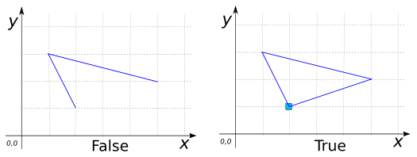

# ST_IsClosed

## Signature

```sql
BOOLEAN ST_IsClosed(GEOMETRY geom);
```

## Description

Returns `TRUE` if `geom` is a closed `LINESTRING` or `MULTILINESTRING`, null
otherwise. A `MULTILINESTRING` is closed if all its `LINESTRING`s are closed.

```{include} sfs-1-2-1.md
```

## Examples

```sql
SELECT ST_IsClosed('LINESTRING(2 1, 1 3, 5 2)');
-- Answer: FALSE

SELECT ST_IsClosed('LINESTRING(2 1, 1 3, 5 2, 2 1)');
-- Answer: TRUE
```



```sql
SELECT ST_IsClosed('MULTILINESTRING((0 2, 3 2, 3 6, 0 6, 0 1),
                                    (5 0, 7 0, 7 1, 5 1, 5 0))');
-- Answer: FALSE

SELECT ST_IsClosed('MULTILINESTRING((0 2, 3 2, 3 6, 0 6, 0 2),
                                    (5 0, 7 0, 7 1, 5 1, 5 0))');
-- Answer: TRUE
```

## See also

* [`ST_IsRing`](../ST_IsRing)
* <a href="https://github.com/orbisgis/h2gis/blob/master/h2gis-functions/src/main/java/org/h2gis/functions/spatial/properties/ST_IsClosed.java" target="_blank">Source code</a>
