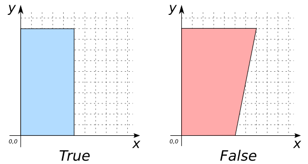

# ST_IsRectangle

## Signature

```sql
BOOLEAN ST_IsRectangle(GEOMETRY geom);
```

## Description

Returns true if `geom` is a rectangle.

## Examples

```sql
SELECT ST_IsRectangle('POLYGON((0 0, 10 0, 10 5, 0 5, 0 0))');
-- Answer:    TRUE

SELECT ST_IsRectangle('POLYGON((0 0, 10 0, 10 7, 0 5, 0 0))');
-- Answer:    FALSE
```



## See also

* <a href="https://github.com/orbisgis/h2gis/blob/master/h2gis-functions/src/main/java/org/h2gis/functions/spatial/properties/ST_IsRectangle.java" target="_blank">Source code</a>
