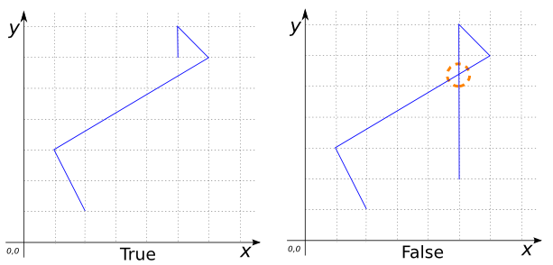

# ST_IsSimple

## Signature

```sql
BOOLEAN ST_IsSimple(GEOMETRY geom);
```

## Description

Returns true if `geom` is simple.

The SFS definition of simplicity follows the general rule that a Geometry is
simple if it has no points of self-tangency, self-intersection or other
anomalous points.

Simplicity is defined for each Geometry subclass as follows:

* Valid polygonal geometries are simple, since their rings must not
  self-intersect.
* Linear rings have the same semantics.
* Linear geometries are simple iff they do not self-intersect at points other
  than boundary points.
* Zero-dimensional geometries (points) are simple iff they have no repeated
  points.
* Empty Geometries are always simple.

```{include} sfs-1-2-1.md
```

## Examples

```sql
SELECT ST_IsSimple('POLYGON((0 0, 10 0, 10 6, 0 6, 0 0),
                            (1 1, 2 1, 2 5, 1 5, 1 1),
                            (8 5, 8 4, 9 4, 9 5, 8 5))');
-- Answer: TRUE

SELECT ST_IsSimple('MULTILINESTRING((0 2, 3 2, 3 6, 0 6, 0 2),
                                    (5 0, 7 0, 7 1, 5 1, 5 0))');
-- Answer: TRUE

SELECT ST_IsSimple('GEOMETRYCOLLECTION(
                      MULTIPOINT((4 4), (1 1), (1 0), (0 3)),
                      LINESTRING(2 6, 6 2),
                      POLYGON((1 2, 4 2, 4 6, 1 6, 1 2)))');
-- Answer: TRUE

SELECT ST_IsSimple('LINESTRING(2 1, 1 3, 6 6, 5 7, 5 6)');
-- Answer: TRUE

SELECT ST_IsSimple('LINESTRING(2 1, 1 3, 6 6, 5 7, 5 2)');
-- Answer: FALSE
```



## See also

* [`ST_IsValid`](../ST_IsValid)
* <a href="https://github.com/orbisgis/h2gis/blob/master/h2gis-functions/src/main/java/org/h2gis/functions/spatial/properties/ST_IsSimple.java" target="_blank">Source code</a>
