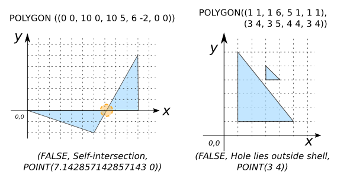
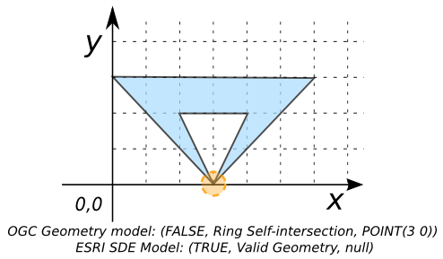

# ST_IsValidDetail

## Signatures

```sql
ARRAY ST_IsValidDetail(GEOMETRY geom);
ARRAY ST_IsValidDetail(GEOMETRY geom, INT selfTouchValid);
```

## Description

Returns an H2 `ARRAY` containing 3 elements describing whether `geom` is valid:

1. A `BOOLEAN` stating whether `geom` is valid or not
2. The reason why
3. The error location, or `NULL` if `geom` is valid

Optional variable `selfTouchValid` sets whether polygons using
**self-touching rings** to form holes are reported as valid. If this
flag is set, the following self-touching conditions are treated as
being valid:

* The shell ring self-touches to create a hole touching the shell
* A hole ring self-touches to create two holes touching at a point

The default of `0` (following the OGC SFS standard) is that this
condition is not valid. Set it to `1` to consider it valid (c.f.
ESRI SDE model).

## Examples

```sql
SELECT ST_IsValidDetail('POLYGON((210 440, 134 235, 145 233,
                                  310 200, 340 360, 210 440))');
-- Answer: (TRUE, Valid Geometry, NULL)

SELECT ST_IsValidDetail(
            'POLYGON((0 0 1, 10 0 1, 10 5 1, 6 -2 1, 0 0 1))');
-- Answer: (FALSE, Self-intersection, POINT(7.142857142857143 0 1))

SELECT ST_IsValidDetail('POLYGON((1 1, 1 6, 5 1, 1 1),
                                 (3 4, 3 5, 4 4, 3 4))');
-- Answer: (FALSE, Hole lies outside shell, POINT(3 4))
```

{align=center}

```sql
-- The next two examples show that the validation model we choose
-- is important.
SELECT ST_IsValidDetail(
            'POLYGON((3 0, 0 3, 6 3, 3 0, 4 2, 2 2, 3 0))', 0);
-- Answer: (FALSE, Ring Self-intersection, POINT(3 0))

SELECT ST_IsValidDetail(
            'POLYGON((3 0, 0 3, 6 3, 3 0, 4 2, 2 2, 3 0))', 1);
-- Answer: (TRUE, Valid Geometry, NULL)
```

{align=center}

## See also

* [`ST_IsValid`](../ST_IsValid), [`ST_IsValidReason`](../ST_IsValidReason)
* <a href="https://github.com/orbisgis/h2gis/blob/master/h2gis-functions/src/main/java/org/h2gis/functions/spatial/properties/ST_IsValidDetail.java" target="_blank">Source code</a>
* JTS [IsValidOp][jts]

[jts]: http://tsusiatsoftware.net/jts/javadoc/com/vividsolutions/jts/operation/valid/IsValidOp.html
