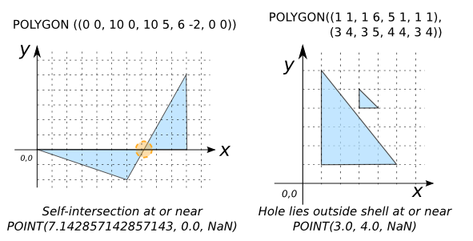
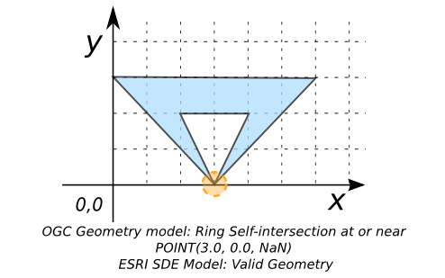

# ST_IsValidReason

## Signatures

```sql
VARCHAR ST_IsValidReason(GEOMETRY geom);
VARCHAR ST_IsValidReason(GEOMETRY geom, INT selfTouchValid);
```

## Description

Returns a string stating if a `geom` is valid or a reason why if it is not.





## Examples

```sql
SELECT ST_IsValidReason('POLYGON((210 440, 134 235, 145 233,
                                  310 200, 340 360, 210 440))');
-- Answer: Valid Geometry

SELECT ST_IsValidReason('POLYGON((0 0, 10 0, 10 5, 6 -2, 0 0))');
-- Answer: Self-intersection at or near
--         POINT(7.142857142857143, 0.0, NaN)

SELECT ST_IsValidReason('POLYGON((1 1, 1 6, 5 1, 1 1),
                                 (3 4, 3 5, 4 4, 3 4))', 0);
-- Answer: Hole lies outside shell at or near POINT(3.0, 4.0, NaN)
```

{align=center}

```sql
-- The next two examples show that the validation model we choose
-- is important.
SELECT ST_IsValidReason(
            'POLYGON((3 0, 0 3, 6 3, 3 0, 4 2, 2 2, 3 0))', 0);
-- Answer: Ring Self-intersection at or near POINT(3.0, 0.0, NaN)

SELECT ST_IsValidReason(
            'POLYGON((3 0, 0 3, 6 3, 3 0, 4 2, 2 2, 3 0))', 1);
-- Answer: Valid Geometry
```

{align=center}

## See also

* [`ST_IsValid`](../ST_IsValid), [`ST_IsValidDetail`](../ST_IsValidDetail)
* <a href="https://github.com/orbisgis/h2gis/blob/master/h2gis-functions/src/main/java/org/h2gis/functions/spatial/properties/ST_IsValidReason.java" target="_blank">Source code</a>
* JTS [IsValidOp][jts]

[jts]: http://tsusiatsoftware.net/jts/javadoc/com/vividsolutions/jts/operation/valid/IsValidOp.html
