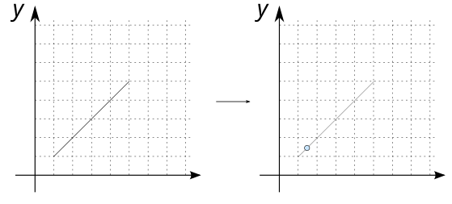
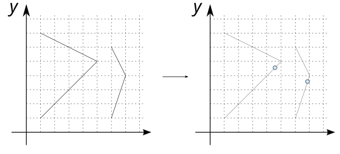

# ST_LineInterpolatePoint

## Signature

```sql
GEOMETRY ST_LineInterpolatePoint(Geometry geom, double start)
```

## Description

Returns a point interpolated along the input `geom`, starting at the given fractions. The returned geometry is a `POINT`.

Where:

* `geom` is a `LINESTRING` or a `MULTILINESTRING`
* `start` is the starting fraction (between 0 and 1). *e.g* `start` = `0.1` means that the first point will be placed at a distance equivalent to 10% of the total length of the line.

:::{warning}
Only `LINESTRING` or `MULTILINESTRING` are supported
:::

## Examples

### With `LINESTRING`

```sql
SELECT ST_LineInterpolatePoint('LINESTRING(1 1, 5 5)', 0.1);
-- Answer: POINT (1.4 1.4)
```
{align=center}

### With `MULTILINESTRING`

```sql
SELECT ST_LineInterpolatePoint('MULTILINESTRING((1 1, 5 5, 1 7), 
                                         (6 1, 7 4, 6 6))', 0.5);
-- Answer: MULTIPOINT ((4.581138830084189 4.581138830084189), 
--                     (6.853553390593274 3.5606601717798214))
```

{align=center}


## See also

* [`ST_LineSubstring`](../ST_LineSubstring)
* <a href="https://github.com/orbisgis/h2gis/blob/master/h2gis-functions/src/main/java/org/h2gis/functions/spatial/linear_referencing/ST_LineInterpolatePoint.java" target="_blank">Source code</a>
