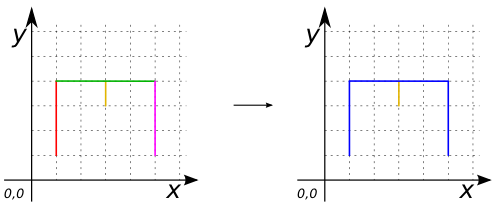

# ST_LineMerge

## Signature

```sql
MULTILINESTRING ST_LineMerge(GEOMETRY geom);
```

## Description

Merges a collection of `LINESTRING` elements in order to create a new collection of maximal-length `LINESTRING`s. 

If the user provide something else than `(MULTI)LINESTRING` it returns an `EMPTY MULTILINESTRING`.

## Examples

### Case with a `LINESTRING`

```sql
SELECT ST_LineMerge('LINESTRING (1 1, 1 4)') as THE_GEOM;
-- Answer: MULTILINESTRING ((1 1, 1 4)) 
```

### Case with a `MULTILINESTRING`

```sql
SELECT ST_LineMerge('MULTILINESTRING ((1 1, 1 4), 
  				      (1 4, 5 4), 
  				      (5 4, 5 1), 
  				      (3 3, 3 4))') as THE_GEOM;
-- Answer: MULTILINESTRING ((1 1, 1 4, 5 4, 5 1), 
--                          (3 3, 3 4)) 
```
{align=center}

### Case with mixed dimension geometries

```sql
SELECT ST_LineMerge('GEOMETRYCOLLECTION (
			LINESTRING (1 1, 1 4), 
			POLYGON ((2 4, 4 4, 4 2, 2 2, 2 4)))');
-- Answer: MULTILINESTRING EMPTY
```

## See also

* [`ST_Simplify`](../ST_Simplify)
* <a href="https://github.com/orbisgis/h2gis/blob/master/h2gis-functions/src/main/java/org/h2gis/functions/spatial/aggregate/ST_LineMerge.java" target="_blank">Source code</a>
