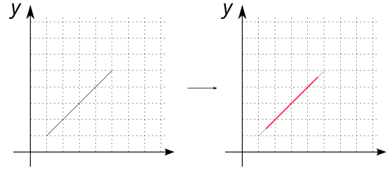
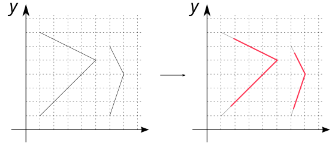

# ST_LineSubstring

## Signature

```sql
GEOMETRY ST_LineSubstring(Geometry geom, double start, double end)
```

## Description

Extract a section of the input `geom`, starting and ending at the given fractions. The returned geometry is a `(MULTI)LINESTRING`.

Where:

* `geom` is a `LINESTRING` or a `MULTILINESTRING`
* `start` is the starting fraction (between 0 and 1). *e.g* `start` = `0.1` means that the first point will be placed at a distance equivalent to 10% of the total length of the line.
* `end` is the ending fraction (between 0 and 1),
* `start` < `end`.
 

:::{warning}
Only `LINESTRING` or `MULTILINESTRING` are supported
:::

## Examples

### With `LINESTRING`

```sql
SELECT ST_LineSubstring('LINESTRING(1 1, 5 5)', 0.1, 0.9);
-- Answer: LINESTRING (1.4 1.4, 4.6 4.6)
```
{align=center}

### With `MULTILINESTRING`

```sql
SELECT ST_LineSubstring('MULTILINESTRING((1 1, 5 5, 1 7), 
                                         (6 1, 7 4, 6 6))', 0.1, 0.9);
-- Answer: MULTILINESTRING (
--         (1.716227766016838 1.716227766016838, 5 5, 1.9059644256269408 6.54701778718653), 
--         (6.170710678118655 1.5121320343559643, 7 4, 6.24142135623731 5.517157287525381))
```

{align=center}

### Where `start` > `end`

```sql
SELECT ST_LineSubstring('LINESTRING(1 1, 5 5)', 0.9, 0.1);
```
Answer: `SQL Error: Start fraction must be smaller than end fraction;`


## See also

* [`ST_LineInterpolatePoint`](../ST_LineInterpolatePoint)
* <a href="https://github.com/orbisgis/h2gis/blob/master/h2gis-functions/src/main/java/org/h2gis/functions/spatial/linear_referencing/ST_LineSubstring.java" target="_blank">Source code</a>
