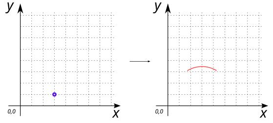
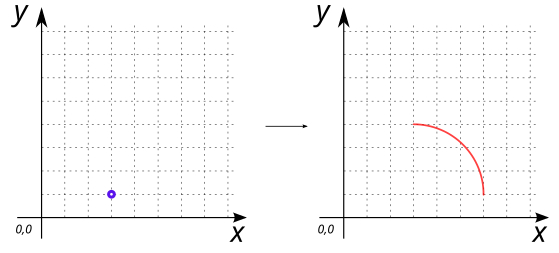

# ST_MakeArcLine

## Signature

```sql
GEOMETRY ST_MakeArcLine(POINT geom, DOUBLE distance, DOUBLE startAngle, DOUBLE angExtent);
```

## Description

Creates an elliptical arc, as a `LINESTRING`, centered at the given `POINT` (`geom`) with a `distance` from the center point, a starting angle (`startAngle` ) and an offset angle (`angExtent`) to define its size.

Where:

* The `distance` corresponds to the diameter of the circle used to produce the arc (exprimed in meters),
* Both `startAngle` and `angExtent` have to be exprimed in radians,
* The arc is always created in a counter-clockwise direction.

## Examples

```sql
SELECT ST_MakeArcLine('POINT (3 1)', 5, PI()/3, PI()/3);

-- Answer: LINESTRING (4.25 3.1650635094610964, 4.227028990058921 3.1781643320821744, 4.203920690523766 3.1910214446528764, 4.180677686931707 3.203633408618955, 4.157302579891656 3.215998812855304, 4.133797984793294 3.228116273823847, 4.110166531514436 3.23998443572834, 4.086410864126781 3.2516019706660635, 4.062533640600076 3.262967578776406, 4.038537532504716 3.274079988386296, 4.014425224712834 3.2849379561524894, 3.990199415097892 3.295540267200685, 3.965862814232822 3.3058857352614535, 3.9414181450867476 3.315973202802966, 3.916868142720316 3.3258015411605086, 3.8922155539796797 3.335369650662767, 3.867463137189156 3.3446764607548625, 3.8426136618426048 3.353720930118139, 3.8176699082935546 3.362502046786671, 3.7926346674441174 3.371018828260491, 3.7675107404327197 3.37927032161552, 3.742300938320687 3.3872556036101846, 3.717008081777726 3.3949737807887224, 3.6916350007663183 3.402423989581143, 3.6661845342250876 3.409605396399855, 3.640659529751157 3.416517197732933, 3.6150628432815335 3.423158620234019, 3.5893973387735683 3.429528920808854, 3.563665887884511 3.4356273866984184, 3.5378713696502095 3.4414533355586805, 3.512016670162977 3.4470061155369467, 3.4861046822486776 3.452285105344791, 3.4601383051430514 3.4572897143275716, 3.434120444167326 3.46201938253052, 3.4080540104031485 3.466473580761389, 3.381941920366868 3.4706518106496653, 3.355787095683213 3.4745536047023315, 3.3295924627584013 3.4781785263561726, 3.303360952452705 3.4815261700266205, 3.277095499752528 3.484596161153135, 3.250799043442013 3.4873881562411144, 3.2244745257742293 3.4899018429003252, 3.198124892141972 3.4921369398798556, 3.171753090748203 3.4940931970995868, 3.1453620722761904 3.4957703956781705, 3.118954789559356 3.49716834795752, 3.0925341972508957 3.4982868975238075, 3.0661032514931836 3.4991259192249653, 3.0396649095870205 3.4996853191846875, 3.013222129660744 3.499965034812934, 2.986777870339256 3.499965034812934, 2.9603350904129804 3.4996853191846875, 2.9338967485068173 3.4991259192249657, 2.907465802749105 3.4982868975238075, 2.8810452104406448 3.49716834795752, 2.854637927723811 3.4957703956781705, 2.8282469092517983 3.494093197099587, 2.801875107858029 3.492136939879856, 2.775525474225771 3.4899018429003252, 2.749200956557988 3.4873881562411144, 2.7229045002474725 3.484596161153135, 2.696639047547295 3.4815261700266205, 2.670407537241599 3.4781785263561726, 2.6442129043167872 3.474553604702332, 2.618058079633133 3.4706518106496653, 2.5919459895968524 3.466473580761389, 2.565879555832675 3.4620193825305203, 2.53986169485695 3.457289714327572, 2.5138953177513237 3.452285105344791, 2.4879833298370237 3.4470061155369467, 2.4621286303497913 3.441453335558681, 2.43633411211549 3.4356273866984184, 2.410602661226432 3.429528920808854, 2.384937156718467 3.4231586202340196, 2.359340470248844 3.416517197732933, 2.333815465774913 3.409605396399855, 2.3083649992336825 3.402423989581143, 2.282991918222275 3.3949737807887224, 2.257699061679314 3.387255603610185, 2.2324892595672816 3.37927032161552, 2.2073653325558835 3.3710188282604916, 2.1823300917064463 3.3625020467866715, 2.157386338157396 3.353720930118139, 2.132536862810844 3.3446764607548625, 2.107784446020321 3.335369650662767, 2.083131857279685 3.325801541160509, 2.0585818549132533 3.315973202802966, 2.034137185767179 3.3058857352614535, 2.0098005849021083 3.2955402672006855, 1.9855747752871662 3.28493795615249, 1.9614624674952845 3.2740799883862963, 1.9374663593999257 3.2629675787764065, 1.9135891358732204 3.2516019706660644, 1.8898334684855658 3.2399844357283403, 1.866202015206707 3.2281162738238476, 1.8426974201083448 3.2159988128553048, 1.8193223130682945 3.2036334086189555, 1.7960793094762344 3.191021444652877, 1.77297100994108 3.178164332082175, 1.7500000000000004 3.165063509461097)
```

{align=center}

```sql
SELECT ST_MakeArcLine('POINT (3 1)', 6, 0, PI()/2);

-- Answer: LINESTRING (6 1, 5.9996223830216255 1.0475978915044237, 5.998489627149555 1.095183800494203, 5.996602017549024 1.1427457474712268, 5.993960029415653 1.1902717589696934, 5.990564327855827 1.2377498705703653, 5.9864157677192535 1.285168129912548, 5.981515393383763 1.332514599703033, 5.975864438492386 1.3797773607212478, 5.969464325642798 1.4269445148198554, 5.962316666029183 1.4740041879200496, 5.9544232590366235 1.5209445330007911, 5.94578609178812 1.5677537330812306, 5.936407338644337 1.614420004195572, 5.926289360656221 1.660931598359622, 5.915434704970625 1.7072768065282817, 5.903846104189069 1.7534439615432378, 5.891526475679826 1.799421441070105, 5.8784789208434916 1.845197670524289, 5.864706724332222 1.8907611259848247, 5.850213353222836 1.9361003370954615, 5.8350024561440055 1.9812038899522648, 5.819077862357725 2.026060429977006, 5.8024435807953205 2.0706586647756158, 5.785103799048217 2.1149873669809827, 5.767062882313744 2.1590353770793858, 5.748325372296209 2.202791606219841, 5.728895986063555 2.246245039005659, 5.708779614859863 2.289384736267515, 5.687981322874007 2.3321998378173223, 5.666506345964771 2.3746795651822312, 5.644360090342746 2.416813224318048, 5.621548131209355 2.4585902083014064, 5.598076211353316 2.5, 5.573950239704931 2.541032174720219, 5.549176289848543 2.5816764028315076, 5.523760598493544 2.6219224523667926, 5.497709563904314 2.6617601915983307, 5.471029744289498 2.7011795915883123, 5.443727856151007 2.7401707287135944, 5.415810772593176 2.778723787163921, 5.387285521592496 2.8168290614130003, 5.358159284228362 2.8544769586618157, 5.3284393928752705 2.8916580012535675, 5.298133329356935 2.9283628290596178, 5.2672487230627745 2.964582201835855, 5.235793349027264 3.000307001548875, 5.2037751259726 3.0355282346713963, 5.171202114315211 3.070237034446336, 5.138082514136588 3.104424663118964, 5.104424663118964 3.1380825141365887, 5.070237034446336 3.1712021143152107, 5.035528234671396 3.2037751259725997, 5.000307001548875 3.235793349027264, 4.964582201835855 3.267248723062775, 4.928362829059618 3.298133329356934, 4.8916580012535675 3.3284393928752705, 4.854476958661816 3.3581592842283623, 4.816829061412999 3.387285521592496, 4.778723787163921 3.4158107725931757, 4.740170728713594 3.443727856151007, 4.701179591588312 3.471029744289498, 4.661760191598331 3.4977095639043143, 4.6219224523667926 3.5237605984935434, 4.581676402831507 3.549176289848543, 4.541032174720219 3.573950239704931, 4.5 3.598076211353316, 4.4585902083014055 3.6215481312093547, 4.416813224318048 3.6443600903427464, 4.374679565182231 3.6665063459647707, 4.332199837817322 3.6879813228740077, 4.289384736267515 3.7087796148598637, 4.246245039005659 3.728895986063555, 4.202791606219842 3.748325372296209, 4.159035377079386 3.7670628823137444, 4.114987366980983 3.7851037990482177, 4.070658664775616 3.80244358079532, 4.026060429977006 3.819077862357725, 3.9812038899522646 3.8350024561440055, 3.9361003370954615 3.8502133532228364, 3.8907611259848247 3.8647067243322217, 3.8451976705242887 3.878478920843492, 3.799421441070105 3.891526475679826, 3.753443961543238 3.9038461041890686, 3.7072768065282817 3.915434704970625, 3.6609315983596216 3.926289360656221, 3.614420004195572 3.936407338644336, 3.5677537330812306 3.9457860917881202, 3.520944533000791 3.954423259036624, 3.474004187920049 3.9623166660291833, 3.4269445148198554 3.969464325642798, 3.379777360721248 3.975864438492386, 3.332514599703033 3.9815153933837624, 3.285168129912548 3.9864157677192535, 3.237749870570365 3.990564327855827, 3.190271758969694 3.9939600294156534, 3.1427457474712264 3.9966020175490238, 3.095183800494203 3.998489627149555, 3.0475978915044237 3.999622383021625, 3 4)
```

{align=center}


## See also

* [`ST_MakeArcPolygon`](../ST_MakeArcPolygon), [`ST_MakeEllipse`](../ST_MakeEllipse)
* <a href="https://github.com/orbisgis/h2gis/blob/master/h2gis-functions/src/main/java/org/h2gis/functions/spatial/create/ST_MakeArcLine.java" target="_blank">Source code</a>
