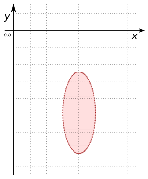

# ST_MakeEllipse

## Signature

```sql
POLYGON ST_MakeEllipse(POINT point, DOUBLE width, DOUBLE height);
```

## Description
Constructs an elliptical `POLYGON` with the given `width` and `height` centered at the given `point`. Each ellipse contains 100 line segments.

## Examples

```sql
SELECT ST_MakeEllipse('POINT(4 -5)', 2, 5);

-- Answer: POLYGON((5 -5, 4.998026728428272 -4.843023701176716, 4.9921147013144775 -4.686666916089239, 4.982287250728689 -4.531546713535689, 4.968583161128631 -4.378275282087863, 4.951056516295154 -4.227457514062632, 4.929776485888251 -4.079688618288305, 4.904827052466019 -3.9355517710873182, 4.8763066800438635 -3.7956158147457115, 4.844327925502015 -3.6604330125525086, 4.8090169943749475 -3.530536869268817, 4.770513242775789 -3.4064400256282754, 4.728968627421412 -3.2886322351782784, 4.684547105928688 -3.177578431446471, 4.637423989748689 -3.073716893060527, 4.587785252292473 -2.9774575140626314, 4.5358267949789965 -2.889180186244962, 4.481753674101715 -2.809233299890341, 4.425779291565073 -2.737932368834951, 4.3681245526846775 -2.6755587852793714, 4.3090169943749475 -2.6223587092621163, 4.248689887164855 -2.5785420971784223, 4.187381314585725 -2.5442818731782784, 4.125333233564304 -2.5197132467138053, 4.0627905195293135 -2.504933178929321, 4 -2.5, 3.9372094804706865 -2.504933178929321, 3.8746667664356957 -2.5197132467138057, 3.812618685414275 -2.5442818731782784, 3.751310112835145 -2.5785420971784223, 3.6909830056250525 -2.6223587092621163, 3.631875447315322 -2.6755587852793714, 3.574220708434927 -2.7379323688349513, 3.518246325898285 -2.8092332998903413, 3.464173205021003 -2.8891801862449626, 3.412214747707527 -2.9774575140626314, 3.3625760102513103 -3.073716893060527, 3.3154528940713113 -3.1775784314464715, 3.2710313725785882 -3.288632235178279, 3.2294867572242105 -3.4064400256282763, 3.1909830056250525 -3.5305368692688166, 3.1556720744979847 -3.6604330125525086, 3.1236933199561365 -3.795615814745712, 3.0951729475339804 -3.9355517710873187, 3.0702235141117487 -4.079688618288306, 3.0489434837048464 -4.227457514062632, 3.031416838871369 -4.378275282087863, 3.017712749271311 -4.531546713535689, 3.007885298685522 -4.68666691608924, 3.001973271571728 -4.843023701176717, 3 -5.000000000000001, 3.001973271571728 -5.156976298823284, 3.007885298685522 -5.313333083910761, 3.017712749271311 -5.468453286464312, 3.031416838871369 -5.621724717912137, 3.0489434837048464 -5.772542485937369, 3.0702235141117487 -5.920311381711696, 3.0951729475339804 -6.064448228912681, 3.1236933199561365 -6.2043841852542885, 3.155672074497985 -6.339566987447492, 3.1909830056250525 -6.469463130731183, 3.229486757224211 -6.5935599743717255, 3.2710313725785882 -6.711367764821722, 3.3154528940713113 -6.822421568553529, 3.3625760102513107 -6.926283106939474, 3.4122147477075266 -7.022542485937368, 3.4641732050210035 -7.110819813755038, 3.518246325898285 -7.190766700109659, 3.574220708434928 -7.262067631165049, 3.631875447315322 -7.324441214720629, 3.6909830056250525 -7.377641290737884, 3.7513101128351454 -7.421457902821578, 3.812618685414275 -7.455718126821722, 3.874666766435696 -7.480286753286195, 3.937209480470687 -7.4950668210706795, 4 -7.5, 4.0627905195293135 -7.4950668210706795, 4.125333233564304 -7.480286753286195, 4.187381314585725 -7.455718126821722, 4.248689887164855 -7.421457902821578, 4.3090169943749475 -7.377641290737884, 4.368124552684678 -7.324441214720628, 4.425779291565073 -7.262067631165049, 4.481753674101716 -7.190766700109658, 4.5358267949789965 -7.110819813755038, 4.587785252292473 -7.022542485937367, 4.63742398974869 -6.926283106939472, 4.684547105928688 -6.822421568553529, 4.728968627421412 -6.711367764821721, 4.770513242775789 -6.593559974371724, 4.8090169943749475 -6.469463130731182, 4.844327925502015 -6.3395669874474905, 4.8763066800438635 -6.2043841852542885, 4.90482705246602 -6.06444822891268, 4.929776485888252 -5.920311381711695, 4.951056516295154 -5.772542485937367, 4.968583161128631 -5.621724717912136, 4.982287250728689 -5.468453286464312, 4.9921147013144775 -5.313333083910759, 4.998026728428272 -5.156976298823283, 5 -5))
```

{align=center}

### Comparison with [`ST_Buffer`](../ST_Buffer)

```{include} makeellipse-buffer-cf.md
```

## See also

* [`ST_Buffer`](../ST_Buffer)
* <a href="https://github.com/orbisgis/h2gis/blob/master/h2gis-functions/src/main/java/org/h2gis/functions/spatial/create/ST_MakeEllipse.java" target="_blank">Source code</a>
