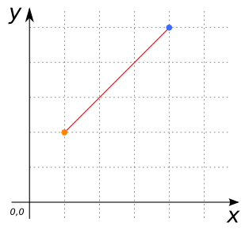
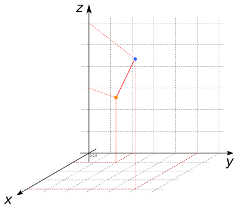
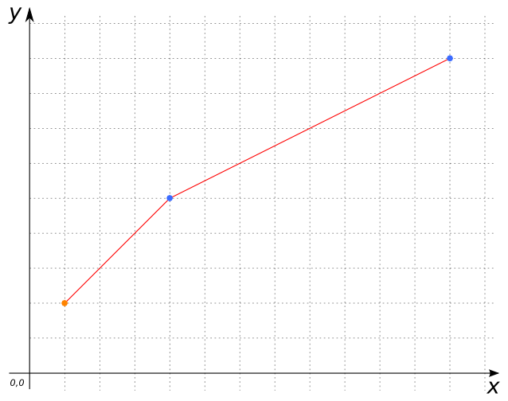
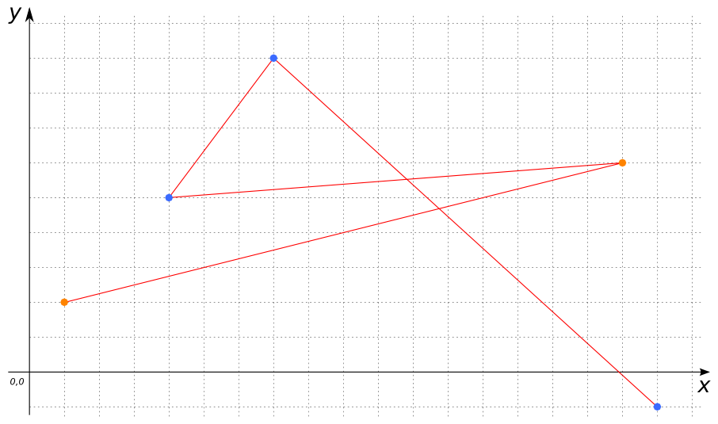
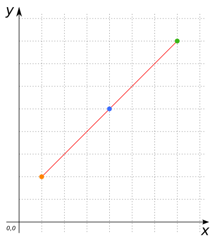

# ST_MakeLine

## Signature

```sql
LINESTRING ST_MakeLine(POINT pointA, POINT pointB, ...);
LINESTRING ST_MakeLine(POINT pointA, MULTIPOINT multipoint, ...);
LINESTRING ST_MakeLine(MULTIPOINT multipoint);
LINESTRING ST_MakeLine(MULTIPOINT multipointA, MULTIPOINT multipointB);
LINESTRING ST_MakeLine(GEOMETRYCOLLECTION points);
```

## Description

Constructs a `LINESTRING` from the given `POINT`s or `MULTIPOINT`s.

This function can be used as a scalar function, to draw a line between `POINT`s (at least 2), `POINT`s and `MULTIPOINT`s, `MULTIPOINT`s and `POINT`s, `MULTIPOINT`s and `MULTIPOINT`s or `GEOMETRYCOLLECTION`s.

It also can be used as an aggregative function in order to draw lines between values listed in a table.

## Examples

### Scalar function
```sql
SELECT ST_MakeLine('POINT(1 2)', 'POINT(4 5)');
-- Answer:     LINESTRING(1 2, 4 5)
```



```sql
SELECT ST_MakeLine('POINT(1 2 3)', 'POINT(4 5 6)');
-- Answer:     LINESTRING(1 2 3, 4 5 6)
```



```sql
SELECT ST_MakeLine('POINT(1 2)', 'MULTIPOINT(4 5, 12 9)');
-- Answer:     LINESTRING(1 2, 4 5, 12 9)
```



```sql
SELECT ST_MakeLine('MULTIPOINT(1 2, 17 6)', 'MULTIPOINT(4 5, 7 9, 18 -1)');
-- Answer:     LINESTRING(1 2, 17 6, 4 5, 7 9, 18 -1)
```



```sql
ST_MakeLine('POINT(1 2)', 'POINT(4 5)', 'POINT(7 8)');
-- Answer:     LINESTRING(1 2, 4 5, 7 8)
```



```sql
SELECT ST_MakeLine('MULTIPOINT(1 2, 3 4)');
-- Answer:     LINESTRING(1 2, 3 4)
```

### Aggregate function
```sql
CREATE TABLE input_table(point POINT);
INSERT INTO input_table VALUES
     ('POINT(1 2)'),
     ('POINT(3 4)'),
     ('POINT(5 6)'),
     ('POINT(7 8)'),
     ('POINT(9 10)');
SELECT ST_MakeLine(ST_Accum(point)) FROM input_table;
-- Answer:     LINESTRING(1 2, 3 4, 5 6, 7 8, 9 10)

CREATE TABLE input_table(point GEOMETRY);
INSERT INTO input_table VALUES
     ('POINT(5 5)'),
     ('MULTIPOINT(1 2, 7 9, 18 -4)'),
     ('POINT(3 4)'),
     ('POINT(99 3)');
SELECT ST_MakeLine(ST_Accum(point)) FROM input_table;
-- Answer:     LINESTRING(5 5, 1 2, 7 9, 18 -4, 3 4, 99 3)

CREATE TABLE input_table(multi_point MULTIPOINT);
INSERT INTO input_table VALUES
     ('MULTIPOINT(5 5, 1 2, 3 4, 99 3)'),
     ('MULTIPOINT(-5 12, 11 22, 34 41, 65 124)'),
     ('MULTIPOINT(1 12, 5 -21, 9 41, 32 124)');
SELECT ST_MakeLine(ST_Accum(multi_point)) FROM input_table;
-- Answer:     LINESTRING(5 5, 1 2, 3 4, 99 3, -5 12, 11 22,
--             34 41, 65 124, 1 12, 5 -21, 9 41, 32 124)
```

## See also

* <a href="https://github.com/orbisgis/h2gis/blob/master/h2gis-functions/src/main/java/org/h2gis/functions/spatial/create/ST_MakeLine.java" target="_blank">Source code</a>
