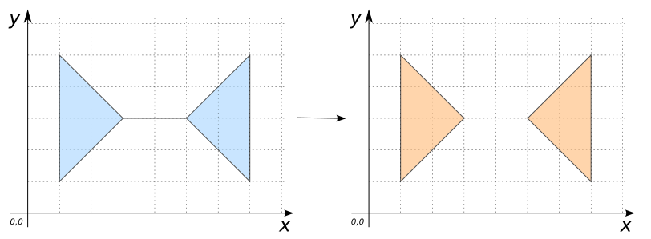
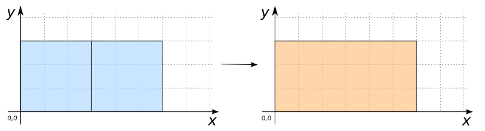
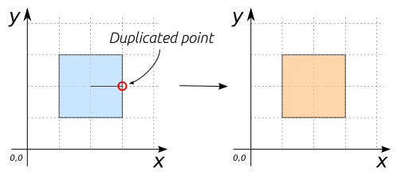
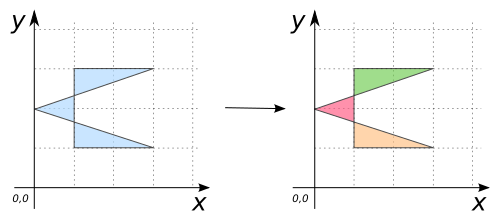
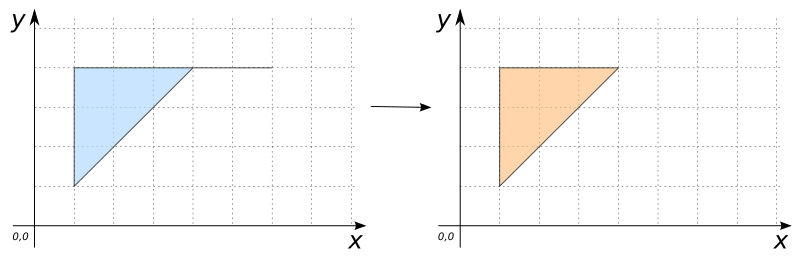
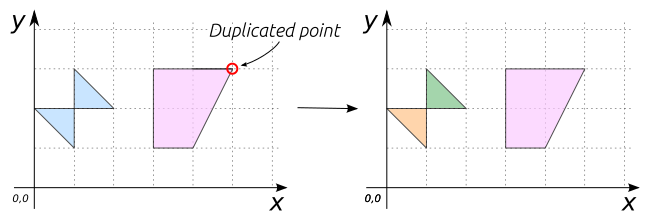
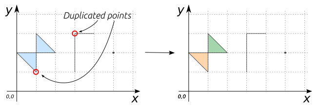

# ST_MakeValid

## Signatures

```sql
GEOMETRY ST_MakeValid(GEOMETRY geom);
GEOMETRY ST_MakeValid(GEOMETRY geom, 
                      BOOLEAN preserveGeomDim);
GEOMETRY ST_MakeValid(GEOMETRY geom, 
                      BOOLEAN preserveGeomDim, 
                      BOOLEAN preserveDuplicateCoord);
GEOMETRY ST_MakeValid(GEOMETRY geom, 
                      BOOLEAN preserveGeomDim, 
                      BOOLEAN preserveDuplicateCoord, 
                      BOOLEAN preserveCoordDim);
```

## Description

Repair an invalid `geometry`. 

Here, `geometry` can be (multi)`point`, (multi)`linestring`, (multi)`polygon` or `geometryCollection`.

### Parameter: preserveGeomDim

| Value | Description | Default value |
|:-:|:-:|:-:|
| `true` | Remove degenerated geometries from the result,<br>i.e geometries which dimension is lower than the input `geometry` | x |
| `false` | It is up to the client to filter degenerate geometries |  |

Note that:

* A multi-geometry will always produce a multi-geometry *(eventually empty or made of a single component)*.
* A simple `geometry` may produce a multi-geometry *(i.e polygon with self-intersection will generally produce a multi-polygon)*. In this case, it is up to the client to explode multi-geometries if needed.

:::{Warning}
- Linear geometries (dim = 1): duplicate coordinates are preserved as much as possible.
- Aeral geometries (dim = 2): duplicate coordinates are generally removed due to the use of overlay operations.
:::

### Parameter: preserveDuplicateCoord

| Value | Description | Default value |
|:-:|:-:|:-:|
| `true` | Preserve duplicate coordinates as much as possible.<br> Generally, duplicate coordinates can be preserved for linear geometries<br> but not for areal geometries (overlay operations used to repair polygons<br> remove duplicate points) |  x  |
| `false` | All duplicated coordinates are removed |  |


### Parameter: preserveCoordDim

| Value | Description | Default value |
|:-:|:-:|:-:|
| `true` | Preserves third and fourth ordinates | x |
| `false` | Preserves third ordinates but not fourth one |  |

:::{Warning}
Note that the fourth dimension is not yet supported in H2GIS. So for the moment, `preserveCoordDim` has no impact since third ordinates (`z`) will always be preserved.
:::

:::{Warning}
`ST_MakeValid` may add new points to node the original set of lines *(especially to make polygons valid)*. New points just have `x` and `y`. No interpolation is performed if original geometry is in `3D` or `4D`.</p>
:::

## Examples

### With Point

```sql
SELECT ST_MakeValid('POINT(0 0)');
-- Answer: POINT(0 0) 
```

Also works with z coordinates
```sql
SELECT ST_MakeValid('POINT(1 2 3)');
-- Answer: POINT(1 2 3) 
```

### With Linestring

```sql
SELECT ST_MakeValid('
           LINESTRING(0 0, 10 0, 20 0, 20 0, 30 0)');
-- Answer: LINESTRING(0 0, 10 0, 20 0, 20 0, 30 0) 
```

Same example but with `preserveDuplicateCoord` = `false`. So here duplicated coordinates are removed
```sql
SELECT ST_MakeValid('
           LINESTRING(0 0, 10 0, 20 0, 20 0, 30 0)', true, false);
-- Answer: LINESTRING(0 0, 10 0, 20 0, 30 0) 
```
Same example but with z coordinates
```sql
SELECT ST_MakeValid('
           LINESTRING(0 0 1, 10 0 2, 20 0 1, 20 0 1, 30 0 1)', 
           true,false);
-- Answer: LINESTRING(0 0 1, 10 0 2, 20 0 1, 30 0 1)
```

### Example with `preserveGeomDim`

True
```sql
SELECT ST_MakeValid('
           LINESTRING(1 1, 1 1)', true);
-- Answer: LINESTRING EMPTY 
```

False
```sql
SELECT ST_MakeValid('
           LINESTRING(1 1, 1 1)', false);
-- Answer: POINT (1 1)
```

### With Polygon

```sql
SELECT ST_MakeValid('
           POLYGON((1 5, 1 1, 3 3, 5 3, 7 1, 7 5, 5 3, 3 3, 1 5))');
-- Answer: MULTIPOLYGON(((3 3, 1 1, 1 5, 3 3)), 
--                      ((5 3, 7 5, 7 1, 5 3))) 
```

{align=center}

```sql
SELECT ST_MakeValid('
           MULTIPOLYGON(((0 0, 3 0, 3 3, 0 3, 0 0)), 
                        ((3 0, 6 0, 6 3, 3 3, 3 0)))', false);
-- Answer: MULTIPOLYGON(((3 0, 0 0, 0 3, 3 3, 6 3, 6 0, 3 0))) 
```

{align=center}

```sql
SELECT ST_MakeValid('
           POLYGON ((1 1, 1 3, 3 3, 3 2, 2 2, 3 2, 3 1, 1 1))');
-- Answer: POLYGON((3 2, 3 1, 1 1, 1 3, 3 3, 3 2)) 
```

{align=center}


```sql
SELECT ST_MakeValid('
           POLYGON ((1 1, 3 1, 0 2, 3 3, 1 3, 1 1))');
-- Answer: MULTIPOLYGON(
--         ((1 2.33, 1 1.66, 0 2, 1 2.33)), 
--         ((1 1.66, 3 1, 1 1, 1 1.66)), 
--         ((1 2.33, 1 3, 3 3, 1 2.33))) 
```

Same example but with z coordinates. Here, created nodes have no z information.
```sql
SELECT ST_MakeValid('
           POLYGON ((1 1 0, 3 1 1, 0 2 1, 3 3 0, 1 3 1, 1 1 0))');
-- Answer: MULTIPOLYGON (
--         ((1 2.33, 1 1.66, 0 2 1, 1 2.33)), 
--         ((1 1.66, 3 1 1, 1 1 0, 1 1.66)), 
--         ((1 2.33, 1 3 1, 3 3 0, 1 2.33))) 
```

{align=center}

```sql
SELECT ST_MakeValid('
           POLYGON((1 1, 1 4, 6 4, 4 4, 1 1))');
-- Answer: POLYGON((4 4, 1 1, 1 4, 4 4))
```

{align=center}

```sql
SELECT ST_MakeValid('
           MULTIPOLYGON(((1 1, 1 3, 2 2, 0 2, 1 1)), 
                        ((3 3, 3 1, 4 1, 5 3, 4 3, 5 3, 3 3)))');
-- Answer: MULTIPOLYGON(((1 2, 1 1, 0 2, 1 2)), 
--                      ((1 2, 1 3, 2 2, 1 2)), 
--                      ((5 3, 4 1, 3 1, 3 3, 4 3, 5 3)))
```

{align=center}


### With GeometryCollection

```sql
SELECT ST_MakeValid('
    GEOMETRYCOLLECTION (
           POLYGON ((1 1, 1 1, 1 3, 2 2, 0 2, 1 1)), 
           LINESTRING (3 1, 3 3, 3 3, 4 3), 
           POINT (5 2))');
-- Answer: GEOMETRYCOLLECTION (
--         POLYGON ((1 2, 1 1, 0 2, 1 2)), 
--         POLYGON ((1 2, 1 3, 2 2, 1 2)), 
--         LINESTRING (3 1, 3 3, 3 3, 4 3), 
--         POINT (5 2)) 
```

Same example but with `preserveDuplicateCoord` = `false`
```sql
SELECT ST_MakeValid('
    GEOMETRYCOLLECTION (
           POLYGON ((1 1, 1 1, 1 3, 2 2, 0 2, 1 1)), 
           LINESTRING (3 1, 3 3, 3 3, 4 3), 
           POINT (5 2))', true, false);
-- Answer: GEOMETRYCOLLECTION (
--         POLYGON ((1 2, 1 1, 0 2, 1 2)), 
--         POLYGON ((1 2, 1 3, 2 2, 1 2)), 
--         LINESTRING (3 1, 3 3, 4 3), 
--         POINT (5 2)) 
```

{align=center}


## See also

* <a href="https://github.com/orbisgis/h2gis/blob/master/h2gis-functions/src/main/java/org/h2gis/functions/spatial/clean/ST_MakeValid.java" target="_blank">Source code</a>
