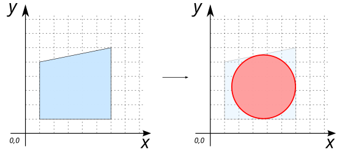
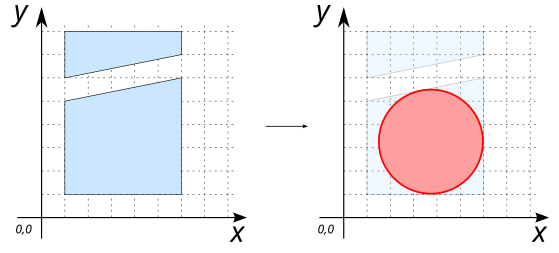
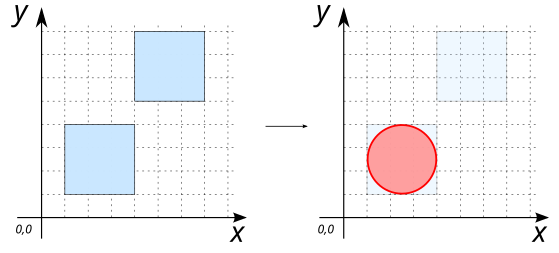
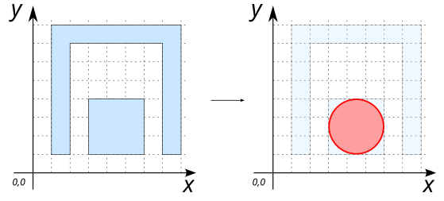
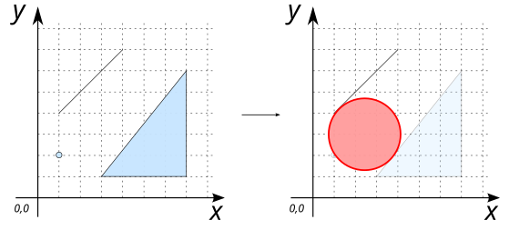

# ST_MaximumInscribedCircle

## Signature

```sql
POLYGON ST_MaximumInscribedCircle(Geometry geom);
```

## Description
Compute the largest empty circle that is contained within a (MULTI)POLYGON `geom` or the largest empty circle for a set of obstacle geometries (that may be any combination of point, linear and polygonal geometries). 

## Examples

### With `POLYGON`

```sql
SELECT ST_MaximumInscribedCircle('POLYGON((1 1, 6 1, 6 6, 1 5, 1 1))');

-- Answer: POLYGON ((5.997895672411477 3.25341796875, 5.954637312072178 2.814208465536505, 5.8265246255825485 2.391877537219978, 5.618480911637965 2.002655124529709, 5.338501173493059 1.6614988265069415, 4.997344875470292 1.3815190883620345, 4.608122462780022 1.173475374417451, 4.185791534463495 1.0453626879278222, 3.74658203125 1.0021043275885222, 3.307372528036505 1.0453626879278222, 2.885041599719978 1.173475374417451, 2.495819187029709 1.381519088362034, 2.1546628890069415 1.6614988265069413, 1.8746831508620343 2.002655124529709, 1.666639436917451 2.3918775372199774, 1.5385267504278222 2.8142084655365043, 1.4952683900885222 3.2534179687499996, 1.5385267504278222 3.6926274719634953, 1.666639436917451 4.114958400280022, 1.874683150862034 4.504180812970291, 2.154662889006941 4.845337110993059, 2.495819187029709 5.125316849137965, 2.885041599719976 5.3333605630825485, 3.3073725280365043 5.461473249572178, 3.7465820312499996 5.504731609911477, 4.185791534463495 5.461473249572178, 4.608122462780023 5.3333605630825485, 4.99734487547029 5.125316849137966, 5.338501173493058 4.845337110993059, 5.618480911637965 4.504180812970291, 5.8265246255825485 4.114958400280024, 5.954637312072178 3.6926274719634957, 5.997895672411477 3.25341796875))
```

{align=center}

### With `MULTIPOLYGON`

```sql
SELECT ST_MaximumInscribedCircle('MULTIPOLYGON(((1 1, 6 1, 6 6, 1 5, 1 1)), 
                                                ((1 6, 6 7, 6 8, 1 8, 1 6)))');

-- Answer: POLYGON ((6 3.2509765625, 5.956748116532662 2.8118328200711176, 5.828654611756363 2.389565125389129, 5.620642047223991 2.000400989150212, 5.340704229135735 1.6592957708642657, 4.9995990108497885 1.379357952776009, 4.610434874610871 1.1713453882436369, 4.188167179928882 1.0432518834673377, 3.7490234375 1, 3.3098796950711176 1.0432518834673377, 2.887612000389129 1.1713453882436369, 2.4984478641502124 1.3793579527760085, 2.157342645864266 1.6592957708642655, 1.8774048277760087 2.000400989150212, 1.6693922632436369 2.3895651253891286, 1.5412987584673377 2.8118328200711167, 1.498046875 3.2509765624999996, 1.5412987584673377 3.690120304928883, 1.6693922632436364 4.1123879996108705, 1.8774048277760085 4.501552135849788, 2.157342645864265 4.842657354135734, 2.498447864150212 5.122595172223991, 2.8876120003891277 5.330607736756363, 3.3098796950711167 5.458701241532662, 3.7490234374999996 5.501953125, 4.188167179928882 5.458701241532662, 4.610434874610871 5.330607736756363, 4.999599010849788 5.122595172223992, 5.340704229135734 4.842657354135735, 5.620642047223991 4.5015521358497885, 5.828654611756363 4.112387999610872, 5.956748116532662 3.6901203049288833, 6 3.2509765625))
```

{align=center}

### What if input POLYGON's have the same shape?

In this example, the two input POLYGON's are the same. In this case, the resulting circle will be place on the first POLYGON.

```sql
SELECT ST_MaximumInscribedCircle('MULTIPOLYGON(((1 1, 4 1, 4 4, 1 4, 1 1)), 
                                               ((4 5, 7 5, 7 8, 4 8, 4 5)))');
-- Answer: POLYGON ((4 2.5, 3.9711779206048456 2.2073645169758076, 3.88581929876693 1.9259748514523654, 3.747204418453818 1.6666446504705967, 3.5606601717798214 1.4393398282201788, 3.3333553495294037 1.2527955815461822, 3.074025148547635 1.11418070123307, 2.7926354830241924 1.0288220793951544, 2.5 1, 2.2073645169758076 1.0288220793951544, 1.9259748514523654 1.11418070123307, 1.6666446504705972 1.2527955815461818, 1.4393398282201788 1.4393398282201786, 1.252795581546182 1.6666446504705967, 1.11418070123307 1.9259748514523651, 1.0288220793951544 2.207364516975807, 1 2.5, 1.0288220793951544 2.7926354830241924, 1.1141807012330698 3.0740251485476344, 1.2527955815461818 3.333355349529403, 1.4393398282201786 3.560660171779821, 1.6666446504705967 3.747204418453818, 1.9259748514523645 3.88581929876693, 2.207364516975807 3.9711779206048456, 2.4999999999999996 4, 2.7926354830241924 3.9711779206048456, 3.074025148547635 3.88581929876693, 3.333355349529403 3.7472044184538182, 3.560660171779821 3.5606601717798214, 3.747204418453818 3.3333553495294033, 3.88581929876693 3.0740251485476353, 3.9711779206048456 2.792635483024193, 4 2.5))
```

{align=center}

### Big but long POLYGON compared to a more compact one?

In this example we can see that the are of input POLYGON's is not sufficient. The shape is also important.

```sql
SELECT ST_MaximumInscribedCircle('MULTIPOLYGON(((3 1, 6 1, 6 4, 3 4, 3 1)),
                                               ((1 1, 2 1, 2 7, 7 7, 7 1, 8 1, 8 8, 1 8, 1 1)))');

-- Answer: POLYGON ((6 2.50048828125, 5.9712435959159675 2.208519610849886, 5.886079476146042 1.927771132715332, 5.747780450052393 1.669031853415488, 5.561661271648813 1.4422449783511875, 5.334874396584512 1.2561257999476068, 5.076135117284668 1.117826773853958, 4.795386639150114 1.0326626540840327, 4.50341796875 1.00390625, 4.211449298349886 1.0326626540840327, 3.930700820215332 1.117826773853958, 3.6719615409154884 1.2561257999476065, 3.4451746658511873 1.4422449783511873, 3.2590554874476068 1.669031853415488, 3.120756461353958 1.9277711327153317, 3.0355923415840325 2.2085196108498857, 3.0068359375 2.50048828125, 3.0355923415840325 2.792456951650114, 3.120756461353958 3.073205429784668, 3.2590554874476068 3.3319447090845116, 3.4451746658511873 3.5587315841488127, 3.671961540915488 3.7448507625523932, 3.930700820215331 3.8831497886460413, 4.211449298349885 3.9683139084159675, 4.50341796875 3.9970703125, 4.795386639150114 3.9683139084159675, 5.076135117284668 3.8831497886460418, 5.334874396584512 3.7448507625523932, 5.561661271648813 3.5587315841488127, 5.747780450052393 3.331944709084512, 5.886079476146041 3.073205429784669, 5.9712435959159675 2.7924569516501148, 6 2.50048828125))
```
{align=center}


### With `GEOMETRYCOLLECTION`

```sql
SELECT ST_MaximumInscribedCircle('GEOMETRYCOLLECTION(
                        POINT(1 2),
                        LINESTRING(1 4, 4 7),
                        POLYGON((3 1, 7 1, 7 6, 3 1)))');

-- Answer: POLYGON ((4.11910933895815 2.998046875, 4.086309813298998 2.665027702349885, 3.989171703698439 2.3448062697454106, 3.8314279732327416 2.0496885072593183, 3.619140625 1.791015625, 3.360467742740682 1.5787282767672584, 3.0653499802545894 1.4209845463015611, 2.745128547650115 1.3238464367010017, 2.412109375 1.29104691104185, 2.079090202349885 1.3238464367010017, 1.7588687697454106 1.4209845463015611, 1.4637510072593185 1.5787282767672581, 1.205078125 1.791015625, 0.9927907767672581 2.0496885072593183, 0.8350470463015611 2.3448062697454106, 0.7379089367010017 2.6650277023498847, 0.7051094110418501 2.998046875, 0.7379089367010017 3.331066047650115, 0.8350470463015609 3.651287480254589, 0.9927907767672581 3.9464052427406813, 1.2050781249999998 4.205078125, 1.4637510072593183 4.417365473232742, 1.7588687697454097 4.575109203698439, 2.0790902023498843 4.672247313298998, 2.4121093749999996 4.70504683895815, 2.745128547650115 4.672247313298998, 3.06534998025459 4.575109203698439, 3.3604677427406813 4.417365473232742, 3.619140625 4.205078125, 3.8314279732327416 3.9464052427406817, 3.9891717036984384 3.6512874802545903, 4.086309813298998 3.3310660476501157, 4.11910933895815 2.998046875))
```
{align=center}


## See also

* [`ST_MinimumDiameter`](../ST_MinimumDiameter)
* <a href="https://github.com/orbisgis/h2gis/blob/master/h2gis-functions/src/main/java/org/h2gis/functions/spatial/create/ST_MaximumInscribedCircle.java" target="_blank">Source code</a>
