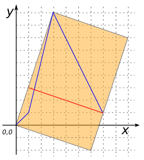
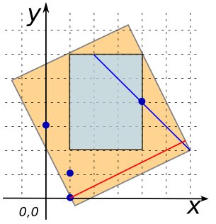

# ST_MinimumDiameter

## Signature

```sql
LINESTRING ST_MinimumDiameter(GEOMETRY geom);
```

## Description

Returns the minimum diameter of `geom`, defined to be the width of
the smallest band that contains the geometry, where a band is a
strip of the plane defined by two parallel lines.
This can be thought of as the smallest hole that the geometry can be
moved through, with a single rotation.

## Examples

```sql
SELECT ST_MinimumDiameter('POINT(395 278)');
-- Answer: LINESTRING(395 278, 395 278)
```

```sql
SELECT ST_MinimumDiameter('LINESTRING(0 0, 1 1, 3 9, 7 1)');
-- Answer: LINESTRING(1 3, 7 1)
```

{align=center}

```sql
SELECT ST_MinimumDiameter(
            'POLYGON((360 380, 230 150, 370 100, 510 100,
                      517 110, 650 390, 430 220, 360 380))');
-- Answer: LINESTRING(282.35 242.62, 517 110)
```

```sql
SELECT ST_MinimumDiameter(
            'GEOMETRYCOLLECTION(
                POLYGON((1 2, 4 2, 4 6, 1 6, 1 2)),
                LINESTRING(2 6, 6 2),
                MULTIPOINT((4 4), (1 1), (1 0), (0 3)))');
-- Answer: LINESTRING(5.8 2.4, 1 0)
```

{align=center}

## See also

* [`ST_MinimumRectangle`](../ST_MinimumRectangle)
* <a href="https://github.com/orbisgis/h2gis/blob/master/h2gis-functions/src/main/java/org/h2gis/functions/spatial/properties/ST_MinimumDiameter.java" target="_blank">Source code</a>
* JTS [MinimumDiameter#getDiameter][jts]

[jts]: http://tsusiatsoftware.net/jts/javadoc/com/vividsolutions/jts/algorithm/MinimumDiameter.html#getDiameter()
