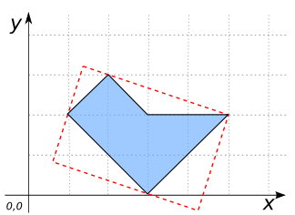

# ST_MinimumRectangle

## Signature

```sql
GEOMETRY ST_MinimumRectangle(GEOMETRY geom);
```

## Description

Returns the minimum rectangle enclosing `geom`.

## Examples

```sql
SELECT ST_MinimumRectangle('MULTIPOINT((8 3), (4 6))');
-- Answer: LINESTRING(8 3, 4 6)

SELECT ST_MinimumRectangle('POLYGON((1 2, 3 0, 5 2, 3 2, 2 3, 1 2))');
-- Answer: POLYGON((1.3999999999999997 3.1999999999999997,
--                  0.6 0.8,
--                  4.2 -0.3999999999999996,
--                  4.999999999999998 1.9999999999999991,
--                  1.3999999999999997 3.1999999999999997))
```



```sql
SELECT ST_MinimumRectangle('LINESTRING(1 2, 2 4, 5 5, 2 1, 6 1)');
-- Answer: POLYGON((6 1, 6 5, 1 5, 1 1, 6 1))

SELECT ST_MinimumRectangle('GEOMETRYCOLLECTION(
                               POLYGON((0 0, 3 -1, 1.5 2, 0 0)),
                               POLYGON((2 0, 3 3, 4 2, 2 0)),
                               POINT(5 6),
                               LINESTRING(1 1, 1 6))');
-- Answer: POLYGON((5 6,
--                  1.2352941176470589 6.9411764705882355,
--                  -0.5294117647058824 -0.1176470588235294,
--                  3.235294117647059 -1.0588235294117647,
--                  5 6))
```

### Comparison with [`ST_Envelope`](../ST_Envelope)



## See also

* [`ST_Envelope`](../ST_Envelope),
  [`ST_Extent`](../ST_Extent),
  [`ST_OctogonalEnvelope`](../ST_OctogonalEnvelope),
  [`ST_MinimumDiameter`](../ST_MinimumDiameter)
* <a href="https://github.com/orbisgis/h2gis/blob/master/h2gis-functions/src/main/java/org/h2gis/functions/spatial/create/ST_MinimumRectangle.java" target="_blank">Source code</a>
* JTS [MinimumDiameter#getMinimumRectangle][jts]

[jts]: http://tsusiatsoftware.net/jts/javadoc/com/vividsolutions/jts/algorithm/MinimumDiameter.html#getMinimumRectangle()
