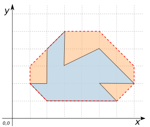
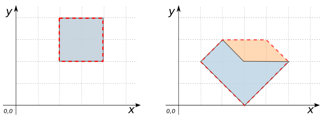
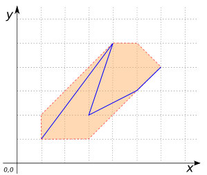
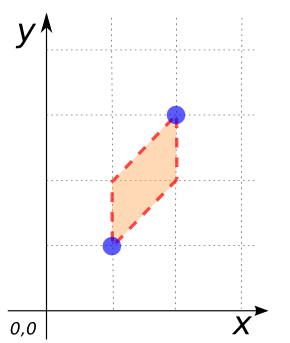

# ST_OctogonalEnvelope

## Signature

```sql
GEOMETRY ST_OctogonalEnvelope(GEOMETRY geom);
```

## Description

Returns the octogonal envelope of a Geometry.
The octogonal envelope of a Geometry is tight along the four
extremal rectilineal parallels and along the four extremal diagonal parallels.
The octogonal envelope may be degenerate to any extreme depending on the
Geometry (e.g. it may be a rectangle, a line, or a point).

## Examples

```sql
SELECT ST_OctogonalEnvelope('POLYGON((2 1, 1 2, 2 2, 2 4, 3 5, 3 3,
                                      5 5, 7 2, 5 2, 6 1, 2 1))');
-- Answer: POLYGON((1 2, 1 3, 3 5, 5 5, 7 3, 7 2, 6 1, 2 1, 1 2))
```

{align=center}

```sql
SELECT ST_OctogonalEnvelope('POLYGON((2 2, 2 4, 4 4, 4 2, 2 2))');
-- Answer: POLYGON((2 2, 2 4, 4 4, 4 2, 2 2))
```

```sql
SELECT ST_OctogonalEnvelope('POLYGON((1 2, 3 0, 5 2, 3 2, 2 3, 1 2))');
-- Answer: POLYGON((1 2, 2 3, 4 3, 5 2, 3 0, 1 2))
```

{align=center}

```sql
SELECT ST_OctogonalEnvelope('LINESTRING(1 1, 4 5, 3 2, 5 3, 6 4)');
-- Answer: POLYGON((1 1, 1 2, 4 5, 5 5, 6 4, 3 1, 1 1))
```

{align=center}

```sql
SELECT ST_OctogonalEnvelope('MULTIPOINT((1 1), (2 3))');
-- Answer: POLYGON((1 1, 1 2, 2 3, 2 2, 1 1))
```

{align=center}

```sql
SELECT ST_OctogonalEnvelope('POLYGON((170 350, 95 214, 220 120, 210 210,
                                      159 205, 170 240, 170 350))');
-- Answer: POLYGON((95 214, 95 275, 170 350, 220 300, 220 120, 189 120, 95 214))                
```

## See also

* [`ST_Envelope`](../ST_Envelope),
  [`ST_Extent`](../ST_Extent),
  [`ST_EstimatedExtent`](../ST_EstimatedExtent),
  [`ST_MinimumRectangle`](../ST_MinimumRectangle),
* <a href="https://github.com/orbisgis/h2gis/blob/master/h2gis-functions/src/main/java/org/h2gis/functions/spatial/create/ST_OctogonalEnvelope.java" target="_blank">Source code</a>
* JTS [OctogonalEnvelope](http://tsusiatsoftware.net/jts/javadoc/com/vividsolutions/jts/geom/OctagonalEnvelope.html)
