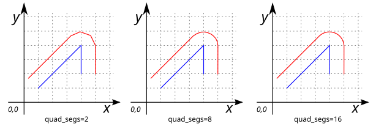

# ST_OffSetCurve

## Signatures

```sql
GEOMETRY ST_OffSetCurve(GEOMETRY geom, DOUBLE distance);
GEOMETRY ST_OffSetCurve(GEOMETRY geom, DOUBLE distance, VARCHAR param);
```

## Description

Return an offset line or collection of lines at a given `distance` and side from an input geometry (`geom`).

The `distance` is given in projection units.

The optional third parameter (`param`) can either specify the number of segments used to approximate a quarter circle or a `VARCHAR` list of space-separated `key=value` pairs:

| `key`=`value` | Description | Default |
|-|-|-|
| `quad_segs`=`#` | number of segments to approximate a quarter circle | 8 |
| `join`=`round` / `mitre` / `bevel` | join style | `round` |
| `mitre_limit`=`#.#` | mitre ratio limit (only affects mitered join style) | 5 |


## Examples

```sql
SELECT ST_OffSetCurve('LINESTRING (1 1, 4 4)', 1);
-- Answer: LINESTRING (0.2928932188134524 1.7071067811865475, 3.2928932188134525 4.707106781186548)
```
{align=center}

```sql
SELECT ST_OffSetCurve('LINESTRING (1 1, 4 4)', -1);
-- Answer: LINESTRING (1.7071067811865475 0.2928932188134524, 4.707106781186548 3.2928932188134525)
```

{align=center}

```sql
SELECT ST_OffSetCurve('MULTILINESTRING ((1 1, 4 4), (1 4, 4 2))', 1);
-- Answer: MULTILINESTRING ((0.2928932188134524 1.7071067811865475, 3.2928932188134525 4.707106781186548), 
--                          (1.5547001962252291 4.832050294337844, 4.554700196225229 2.8320502943378436))
```

{align=center}

### Changing the number of segments

```sql
SELECT ST_OffSetCurve('LINESTRING (1 1, 4 4, 4 2)', 1, 'quad_segs=2 join=round');
-- Answer: LINESTRING (0.2928932188134524 1.7071067811865475, 3.2928932188134525 4.707106781186548, 4 5, 4.707106781186548 4.707106781186548, 5 4, 5 2)
```

```sql
SELECT ST_OffSetCurve('LINESTRING (1 1, 4 4, 4 2)', 1, 'quad_segs=8 join=round');
-- Answer: LINESTRING (0.2928932188134524 1.7071067811865475, 3.2928932188134525 4.707106781186548, 3.444429766980398 4.831469612302546, 3.6173165676349104 4.923879532511287, 3.804909677983872 4.98078528040323, 4 5, 4.195090322016128 4.98078528040323, 4.38268343236509 4.923879532511287, 4.555570233019602 4.831469612302545, 4.707106781186548 4.707106781186548, 4.831469612302545 4.555570233019602, 4.923879532511287 4.38268343236509, 4.98078528040323 4.195090322016129, 5 4, 5 2)
```

```sql
SELECT ST_OffSetCurve('LINESTRING (1 1, 4 4, 4 2)', 1, 'quad_segs=16 join=round');
-- Answer: LINESTRING (0.2928932188134524 1.7071067811865475, 3.2928932188134525 4.707106781186548, 3.3656067158363547 4.773010453362737, 3.444429766980398 4.831469612302546, 3.528603263174002 4.881921264348355, 3.6173165676349104 4.923879532511287, 3.709715322745538 4.956940335732209, 3.804909677983872 4.98078528040323, 3.9019828596704396 4.995184726672197, 4 5, 4.098017140329561 4.995184726672197, 4.195090322016128 4.98078528040323, 4.290284677254462 4.956940335732209, 4.38268343236509 4.923879532511287, 4.471396736825998 4.881921264348355, 4.555570233019602 4.831469612302545, 4.634393284163646 4.773010453362737, 4.707106781186548 4.707106781186548, 4.773010453362737 4.634393284163646, 4.831469612302545 4.555570233019602, 4.881921264348355 4.471396736825998, 4.923879532511287 4.38268343236509, 4.956940335732209 4.290284677254462, 4.98078528040323 4.195090322016129, 4.995184726672197 4.098017140329561, 5 4, 5 2)
```

{align=center}

### Changing the join style

```sql
SELECT ST_OffSetCurve('LINESTRING (1 1, 4 4, 4 2)', 1, 'join=round');
-- Answer: LINESTRING (0.2928932188134524 1.7071067811865475, 3.2928932188134525 4.707106781186548, 3.444429766980398 4.831469612302546, 3.6173165676349104 4.923879532511287, 3.804909677983872 4.98078528040323, 4 5, 4.195090322016128 4.98078528040323, 4.38268343236509 4.923879532511287, 4.555570233019602 4.831469612302545, 4.707106781186548 4.707106781186548, 4.831469612302545 4.555570233019602, 4.923879532511287 4.38268343236509, 4.98078528040323 4.195090322016129, 5 4, 5 2)
```

```sql
SELECT ST_OffSetCurve('LINESTRING (1 1, 4 4, 4 2)', 1, 'join=mitre');
-- Answer: LINESTRING (0.2928932188134524 1.7071067811865475, 5 6.414213562373096, 5 2)
```

```sql
SELECT ST_OffSetCurve('LINESTRING (1 1, 4 4, 4 2)', 1, 'join=bevel');
-- Answer: LINESTRING (0.2928932188134524 1.7071067811865475, 3.2928932188134525 4.707106781186548, 5 4, 5 2)
```

{align=center}

### Changing the mitre ratio limit

```sql
SELECT ST_OffSetCurve('LINESTRING (1 1, 4 4, 4 2)', 1, 'join=mitre mitre_limit=1');
-- Answer: LINESTRING (0.2928932188134524 1.7071067811865475, 3.7653668647301792 5.179580427103275, 5 4.668178637919299, 5 2)
```

```sql
SELECT ST_OffSetCurve('LINESTRING (1 1, 4 4, 4 2)', 1, 'join=mitre mitre_limit=2');
-- Answer: LINESTRING (0.2928932188134524 1.7071067811865475, 4.5307337294603585 5.944947291833454, 5 5.750570838211694, 5 2)
```

```sql
SELECT ST_OffSetCurve('LINESTRING (1 1, 4 4, 4 2)', 1, 'join=mitre mitre_limit=3');
-- Answer: LINESTRING (0.2928932188134524 1.7071067811865475, 5 6.414213562373096, 5 2)
```

{align=center}

## See also
* [`ST_Buffer`](../ST_Buffer), [`ST_SideBuffer`](../ST_SideBuffer), [`ST_RingSideBuffer`](../ST_RingSideBuffer),
  [`ST_RingBuffer`](../ST_RingBuffer)
* <a href="https://github.com/orbisgis/h2gis/blob/master/h2gis-functions/src/main/java/org/h2gis/functions/spatial/buffer/ST_OffSetCurve.java" target="_blank">Source code</a>
