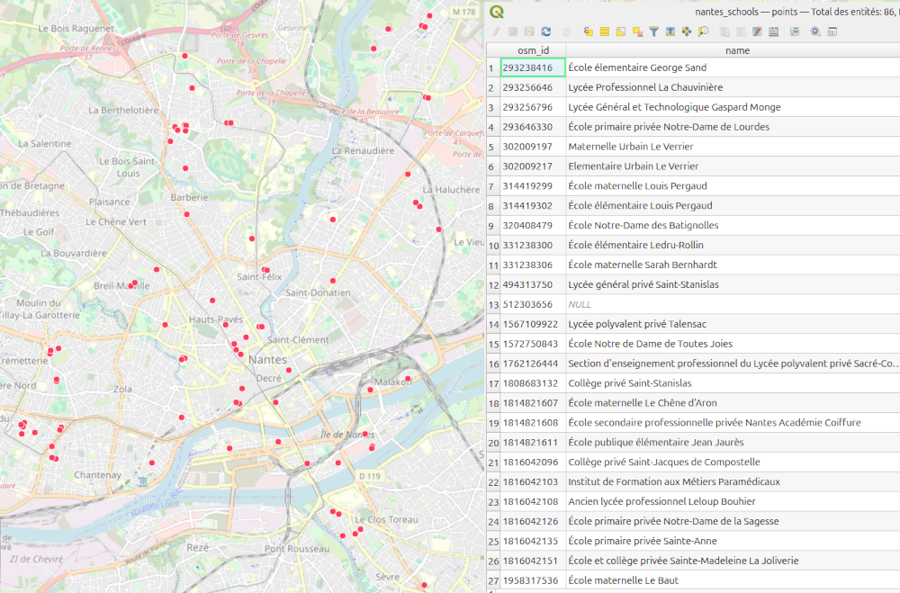

# ST_OverpassDownloader

## Signatures

```sql
ST_OverpassDownloader(VARCHAR query, VARCHAR path);
ST_OverpassDownloader(VARCHAR query, VARCHAR path, BOOLEAN delete);
ST_OverpassDownloader(VARCHAR query, VARCHAR path, BOOLEAN delete, VARCHAR network);
```

## Description

Extract [OSM][wiki] data from [Overpass API](https://wiki.openstreetmap.org/wiki/Overpass_API) server and save the result into an `.osm` file which the place and the name are defined in the `path`. If the `delete` parameter is equal to `true`, then the `.osm` file will be overwritten if it already exists.

Where:

* `query` : the Overpass query, as string,
* `path` : the path of the file to store the result,
* `delete` : a boolean to delete the file if exist
* `network` : network options as `'proxyhost=? proxyport=? endpoint=?'`

## Examples

In the example below, we want to collect all the schools from the city of [Nantes](https://www.openstreetmap.org/relation/59874#map=12/47.2382/-1.5604) (West of France, which unique identifier is the INSEE code = 44109). The result will be saved in the `nantes_schools.geojson` file.

```sql
SELECT ST_OverpassDownloader('area ["admin_level"="8"] ["ref:INSEE"="44109"];
                              node ["amenity"="school"] (area);
                              out geom;', 
                             '/home/user/nantes_schools.geojson', true);
```

Now you can open the resulting `nantes_schools.geojson` file in your favorite GIS app. You should see the data below

{align=center}

## See also

 [`OSMRead`](../OSMRead), [`ST_OSMMapLink`](../ST_OSMMapLink), [`ST_OSMDownloader`](../ST_OSMDownloader), [`ST_AsOverpassBbox`](../ST_AsOverpassBbox)
* <a href="https://github.com/orbisgis/h2gis/blob/master/h2gis-functions/src/main/java/org/h2gis/functions/io/overpass/ST_OverpassDownloader.java" target="_blank">Source code</a>

[wiki]: http://wiki.openstreetmap.org/wiki/OSM_XML
