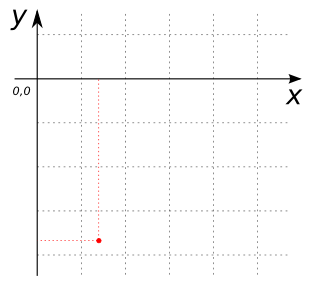
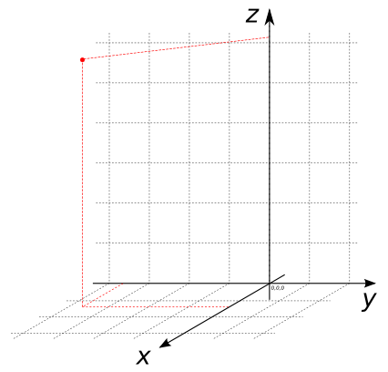

# ST_Point

## Signatures

```sql
POINT ST_Point(DOUBLE x, DOUBLE y);
POINT ST_Point(DOUBLE x, DOUBLE y, DOUBLE z);
```

## Description

Constructs a `POINT` from `x` and `y` (and possibly `z`).

<div class="note warning">
  <h5>This function is an alias for the <a href="/docs/1.4.0/ST_MakePoint">ST_MakePoint</a> function.</h5>
</div>


## Examples

```sql
SELECT ST_Point(1.4, -3.7);
-- Answer:     POINT(1.4 -3.7)
```

{align=center}

```sql
SELECT ST_Point(1.4, -3.7, 6.2);
-- Answer:     POINT(1.4 -3.7 6.2)
```

{align=center}

## See also

* [`ST_MakePoint`](../ST_MakePoint)

* <a href="https://github.com/orbisgis/h2gis/blob/master/h2gis-functions/src/main/java/org/h2gis/functions/spatial/create/ST_Point.java" target="_blank">Source code</a>

