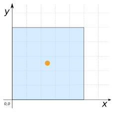
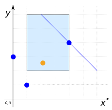

# ST_PointOnSurface

## Signature

```sql
POINT ST_InteriorPoint(GEOMETRY geom);
```

## Description

Returns an interior point of `geom`, if it possible to calculate such a point.
Otherwise, returns a point on the boundary of `geom`.

The point returned is always the same for the same input Geometry.

```{include} sfs-1-2-1.md
```

## Examples

```sql
SELECT ST_PointOnSurface('POINT(1 5)');
-- Answer: POINT(1 5)
```

```sql
SELECT ST_PointOnSurface('MULTIPOINT((4 4), (1 1), (1 0), (0 3)))');
-- Answer: POINT(1 1)
```

```sql
SELECT ST_PointOnSurface('LINESTRING(-1 5, 0 10)');
-- Answer: POINT(0 10)
```

```sql
SELECT ST_PointOnSurface('POLYGON((0 0, 0 5, 5 5, 5 0, 0 0))');
-- Answer: POINT(2.5 2.5)
```

{align=center}

```sql
SELECT ST_PointOnSurface('GEOMETRYCOLLECTION(
                             POLYGON((1 2, 4 2, 4 6, 1 6, 1 2)),
                             LINESTRING(2 6, 6 2),
                             MULTIPOINT((4 4), (1 1), (0 3)))');
-- Answer: POINT(2.5 4)
```

{align=center}

### Comparison with [`ST_Centroid`](../ST_Centroid)

```sql
CREATE TABLE input(geom GEOMETRY);
INSERT INTO input VALUES (
    'POLYGON((0 0, 5 0, 5 1, 1 1, 1 4, 5 4, 5 5, 0 5, 0 0))');
SELECT ST_PointOnSurface(geom) POINT,
       ST_Centroid(geom) CENTROID FROM input;
```

Answer:
|      POINT      |            CENTROID            |
|-----------------|--------------------------------|
| POINT(0.5 2.5)  | POINT(2.0384615384615383 2.5)  |

{align=center}

## See also

* [`ST_Centroid`](../ST_Centroid)
* <a href="https://github.com/orbisgis/h2gis/blob/master/h2gis-functions/src/main/java/org/h2gis/functions/spatial/properties/ST_PointOnSurface.java" target="_blank">Source code</a>
