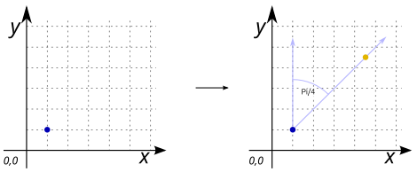

# ST_Project

## Signature

```sql
GEOMETRY ST_Project(GEOMETRY geom, DOUBLE distance, DOUBLE azimuth);
```

## Description

Returns a point, projected from a point (`geom`) to a geoid using a given `distance` and `azimuth` (bearing) when the input `geom` is in [WGS84](https://spatialreference.org/ref/epsg/4326/) (SRID = 4326). Otherwise project the point in cartesian plan.

Where:

* `distance` is given in meters,
* `azimuth` is given in radians and measured clockwise from true north.

## Examples

### Case where `SRID`=`4326`

```sql
SELECT ST_Project('SRID=4326;POINT(0 0)'::GEOMETRY, 100000, radians(405.0));
-- or
SELECT ST_Project(ST_SetSRID('POINT(0 0)', 4326), 100000, radians(405.0));

-- Answer: POINT (0.6352310291255375 0.6394723347291976)
```

With `z` coordinate
```sql
SELECT ST_Project(ST_SetSRID('POINTZ(0 0 10)', 4326), 100000, radians(405.0));

-- Answer: POINT Z(0.6352310291255375 0.6394723347291976 10)
```

### Case with no `SRID`

```sql
SELECT ST_Project('POINT(1 1)', 5, PI()/4);

-- Answer: POINT (4.535533905932738 4.535533905932738)
```

{align=center}


## See also

* [`ST_ProjectPoint`](../ST_ProjectPoint)
* <a href="https://github.com/orbisgis/h2gis/blob/master/h2gis-functions/src/main/java/org/h2gis/functions/spatial/snap/ST_Project.java" target="_blank">Source code</a>
