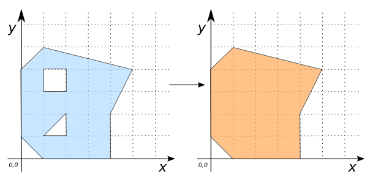

# ST_RemoveHoles

## Signature

```sql
GEOMETRY ST_RemoveHoles(GEOMETRY geom);
```

## Description

Removes all holes in `geom`.
Returns `geom` untouched if it contains no holes.
Returns `NULL` if `geom` is not a `POLYGON` or `MULTIPOLYGON`.

## Examples

```sql
SELECT ST_RemoveHoles(
            'POLYGON((1 5, 0 4, 0 1, 1 0, 4 0, 4 2, 5 4, 5 4, 1 5),
                     (1 3, 1 4, 2 4, 2 3, 1 3),
                     (2 2, 1 1, 2 1, 2 2))');
-- Answer:   POLYGON((1 5, 0 4, 0 1, 1 0, 4 0, 4 2, 5 4, 5 4, 1 5))
```

{align=center}

### Non-examples

With no holes to remove:
```sql
SELECT ST_RemoveHoles(
          'POLYGON((1 5, 0 4, 0 1, 1 0, 4 0, 4 2, 5 4, 5 4, 1 5))');
-- Answer: POLYGON((1 5, 0 4, 0 1, 1 0, 4 0, 4 2, 5 4, 5 4, 1 5))
```

Returns NULL for POINTS:
```sql
SELECT ST_RemoveHoles('POINT(1 5)');
-- Answer: NULL
```

## See also

* <a href="https://github.com/orbisgis/h2gis/blob/master/h2gis-functions/src/main/java/org/h2gis/functions/spatial/edit/ST_RemoveHoles.java" target="_blank">Source code</a>
