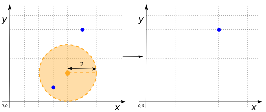
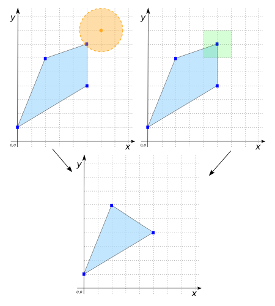
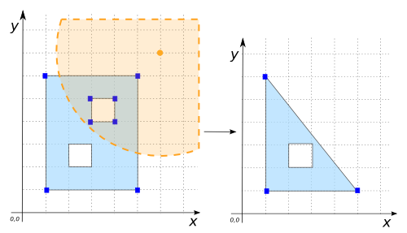
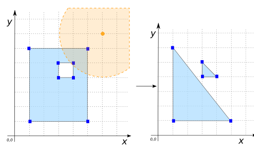
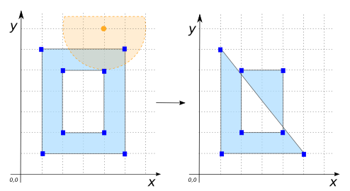
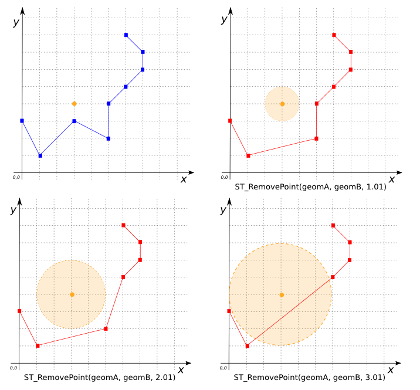

# ST_RemovePoints

## Signature

```sql
GEOMETRY ST_RemovePoints(GEOMETRY geom, POLYGON poly);
```

## Description

Remove all coordinates of `geom` located within `poly`.
Returns `NULL` if all coordinates are removed.

:::{Warning}
**May produce invalid Geometries. Use with caution**
:::

```{include} type-warning_geometrycollection.md
```

## Examples

```sql
SELECT ST_RemovePoints('MULTIPOINT((5 5), (3 1))',
                      ST_Buffer('POINT(4 2)', 2));
-- Answer: MULTIPOINT((5 5))
```

{align=center}

In the following two examples, we get the same result whether we use `ST_Buffer` or a POLYGON:
```sql
SELECT ST_RemovePoints('POLYGON((0 1, 5 4, 5 7, 2 6, 0 1))',
                      ST_Buffer('POINT(6 8)', 1.5));
-- Answer: POLYGON((0 1, 5 4, 2 6, 0 1))
```

```sql
SELECT ST_RemovePoints('POLYGON((0 1, 5 4, 5 7, 2 6, 0 1))',
                      'POLYGON((4 8, 6 8, 6 6, 4 6, 4 8))');
-- Answer: POLYGON((0 1, 5 4, 2 6, 0 1))
```

{align=center}

### POLYGON with holes

```sql
SELECT ST_RemovePoints('POLYGON((1 1, 1 6, 5 6, 5 1, 1 1),
                               (3 4, 3 5, 4 5, 4 4, 3 4),
                               (2 3, 3 3, 3 2, 2 2, 2 3))',
                       ST_Buffer('POINT(6 7)', 4.5));
-- Answer: POLYGON((1 1, 1 6, 5 1, 1 1), (2 3, 3 3, 3 2, 2 2, 2 3))
```

{align=center}

A hole is converted to a POLYGON:
```sql
SELECT ST_RemovePoints('POLYGON((1 1, 1 6, 5 6, 5 1, 1 1),
                               (3 4, 3 5, 4 5, 4 4, 3 4))',
                    ST_Buffer('POINT(6 7)', 3));
-- Answer: POLYGON((1 1, 1 6, 5 1, 1 1), (3 4, 3 5, 4 4, 3 4))
```

{align=center}

Here the resulting POLYGON is not valid:
```sql
SELECT ST_RemovePoints('POLYGON((1 1, 1 6, 5 6, 5 1, 1 1),
                               (2 2, 2 5, 4 5, 4 2, 2 2))',
                      ST_Buffer('POINT(4 7)', 2));
-- Answer: POLYGON((1 1, 1 6, 5 1, 1 1), (2 2, 2 5, 4 5, 4 2, 2 2))
```

{align=center}

In the following four examples, we use larger and larger buffers:
```sql
SELECT ST_RemovePoints(
            'LINESTRING(0 3, 1 1, 3 3, 5 2, 5 4,
                        6 5, 7 6, 7 7, 6 8)',
            ST_Buffer('POINT(3 4)', 1.01));
-- Answer:   LINESTRING(0 3, 1 1,      5 2, 5 4,
--                      6 5, 7 6, 7 7, 6 8)
```

```sql
SELECT ST_RemovePoints(
            'LINESTRING(0 3, 1 1, 3 3, 5 2, 5 4,
                        6 5, 7 6, 7 7, 6 8)',
            ST_Buffer('POINT(3 4)', 2.01));
-- Answer:   LINESTRING(0 3, 1 1,      5 2,
--                      6 5, 7 6, 7 7, 6 8)
```

```sql
SELECT ST_RemovePoints(
            'LINESTRING(0 3, 1 1, 3 3, 5 2, 5 4,
                        6 5, 7 6, 7 7, 6 8)',
            ST_Buffer('POINT(3 4)', 3.01));
-- Answer:   LINESTRING(0 3, 1 1,
--                      6 5, 7 6, 7 7, 6 8)
```

Here all points are removed:
```sql
SELECT ST_RemovePoints(
            'LINESTRING(0 3, 1 1, 3 3, 5 2, 5 4,
                        6 5, 7 6, 7 7, 6 8)',
            ST_Buffer('POINT(3 4)', 6));
-- Answer: NULL
```

{align=center}

## See also

* [`ST_AddPoint`](../ST_AddPoint), [`ST_RemoveRepeatedPoints`](../ST_RemoveRepeatedPoints),
[`ST_RemoveHoles`](../ST_RemoveHoles)
* <a href="https://github.com/orbisgis/h2gis/blob/master/h2gis-functions/src/main/java/org/h2gis/functions/spatial/edit/ST_RemovePoints.java" target="_blank">Source code</a>
