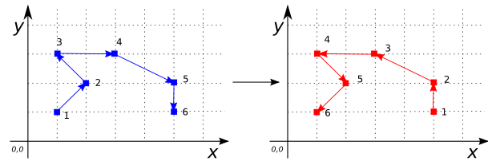
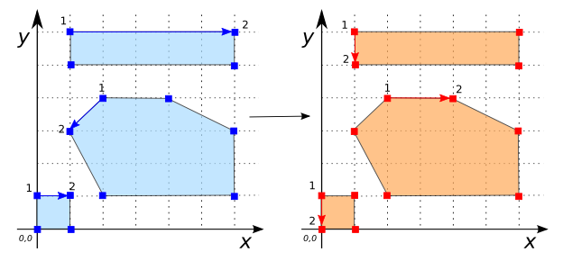

# ST_Reverse

## Signature

```sql
GEOMETRY ST_Reverse(GEOMETRY geom);
```

## Description

Returns `geom` with its vertex order reversed.

<div class="note warning">
    <h5>Component order for <code>GEOMETRYCOLLECTION</code>s depends
    on the type.</h5>
    <p>For <code>MULTIPOINT</code>s and
    <code>MULTILINESTRING</code>s, each component Geometry is
    reversed, and the order of these Geometries is also reversed.
    For <code>GEOMETRYCOLLECTION</code>s and
    <code>MULTIPOLYGON</code>s, component Geometries are reversed
    but their order is not. This is due to the implementation in
    JTS.</p>
</div>

## Examples

```sql
SELECT ST_Reverse('MULTIPOINT((4 4), (1 1), (1 0), (0 3))');
-- Answer:         MULTIPOINT((0 3), (1 0), (1 1), (4 4))

SELECT ST_Reverse('LINESTRING(1 1, 2 2, 1 3, 3 3, 5 2, 5 1)');
-- Answer:         LINESTRING(5 1, 5 2, 3 3, 1 3, 2 2, 1 1)
```

{align=center}

```sql
SELECT ST_Reverse(
            'MULTILINESTRING((10 260, 150 290, 186 406, 286 286),
                             (120 120, 130 125, 142 129,
                              360 160, 357 170, 380 340),
                             (1 1, 5 5))');
-- Answer:   MULTILINESTRING((5 5, 1 1),
--                           (380 340, 357 170, 360 160,
--                            142 129, 130 125, 120 120),
--                           (286 286, 186 406, 150 290, 10 260))

SELECT ST_Reverse('POLYGON((2 4, 1 3, 2 1, 6 1, 6 3, 4 4, 2 4))');
-- Answer:         POLYGON((2 4, 4 4, 6 3, 6 1, 2 1, 1 3, 2 4))

SELECT ST_Reverse(
            'MULTIPOLYGON(((2 4, 1 3, 2 1, 6 1, 6 3, 4 4, 2 4)),
                          ((1 6, 6 6, 6 5, 1 5, 1 6)),
                          ((0 1, 1 1, 1 0, 0 0, 0 1)))');
-- Answer:   MULTIPOLYGON(((2 4, 4 4, 6 3, 6 1, 2 1, 1 3, 2 4)),
--                        ((1 6, 1 5, 6 5, 6 6, 1 6)),
--                        ((0 1, 0 0, 1 0, 1 1, 0 1)))
```

{align=center}

```sql
SELECT ST_Reverse('GEOMETRYCOLLECTION(
                      POLYGON((1 2, 4 2, 4 6, 1 6, 1 2)),
                      LINESTRING(2 6, 6 2))');
-- Answer:         GEOMETRYCOLLECTION(
--                    POLYGON((1 2, 1 6, 4 6, 4 2, 1 2)),
--                    LINESTRING(6 2, 2 6))
```

## See also

* [`ST_Reverse3DLine`](../ST_Reverse3DLine)
* <a href="https://github.com/orbisgis/h2gis/blob/master/h2gis-functions/src/main/java/org/h2gis/functions/spatial/edit/ST_Reverse.java" target="_blank">Source code</a>
* JTS [Geometry#reverse][jts]

[jts]: http://tsusiatsoftware.net/jts/javadoc/com/vividsolutions/jts/geom/Geometry.html#reverse()
