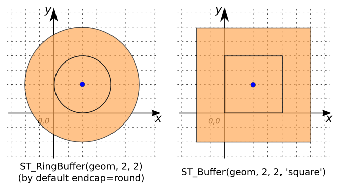
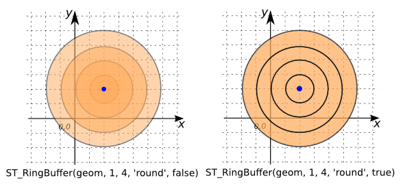
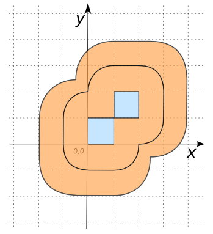

# ST_RingBuffer

## Signatures

```sql
GEOMETRY ST_RingBuffer(GEOMETRY geom, DOUBLE bufferSize,
                       INT numBuffer);
GEOMETRY ST_RingBuffer(GEOMETRY geom, DOUBLE bufferSize,
                       INT numBuffer, VARCHAR endCapStyle);
GEOMETRY ST_RingBuffer(GEOMETRY geom, DOUBLE bufferSize,
                       INT numBuffer, VARCHAR endCapStyle,
                       BOOLEAN doDifference);
```

## Description

Returns a `MULTIPOLYGON` of `numBuffer` buffers centered at `geom`
and of size increasing by `bufferSize`.
Supported `endCapStyle`s are `round` (default) and `square`.
By default, creates rings. To obtain superimposed `POLYGON`s, set
`doDifference=FALSE`.

```{include} type-warning_geometrycollection.md
```


## Examples

```sql
SELECT ST_RingBuffer('POINT(2 2)', 2, 2);
-- Answer: MULTIPOLYGON(((4 2, 3.961570560806461 1.6098193559677436, 3.8477590650225735 1.2346331352698203, 3.6629392246050907 0.8888595339607956, 3.414213562373095 0.5857864376269051, 3.1111404660392044 0.3370607753949095, 2.7653668647301797 0.1522409349774265, 2.390180644032257 0.0384294391935391, 2 0, 1.6098193559677436 0.0384294391935391, 1.2346331352698205 0.1522409349774265, 0.8888595339607961 0.3370607753949093, 0.5857864376269051 0.5857864376269049, 0.3370607753949093 0.8888595339607956, 0.1522409349774263 1.2346331352698212, 0.0384294391935389 1.6098193559677445, 0 2.0000000000000013, 0.0384294391935396 2.3901806440322586, 0.1522409349774274 2.765366864730182, 0.3370607753949111 3.111140466039207, 0.5857864376269073 3.4142135623730976, 0.8888595339607985 3.6629392246050925, 1.2346331352698243 3.847759065022575, 1.6098193559677478 3.9615705608064617, 2.000000000000005 4, 2.3901806440322617 3.96157056080646, 2.765366864730185 3.8477590650225713, 3.1111404660392097 3.662939224605087, 3.4142135623731 3.4142135623730905, 3.6629392246050942 3.1111404660391986, 3.8477590650225766 2.7653668647301726, 3.9615705608064626 2.390180644032249, 4 2)), ((6 2, 5.923141121612922 1.219638711935487, 5.695518130045147 0.4692662705396409, 5.325878449210181 -0.2222809320784087, 4.82842712474619 -0.8284271247461898, 4.222280932078409 -1.325878449210181, 3.5307337294603593 -1.695518130045147, 2.780361288064513 -1.9231411216129217, 2.0000000000000004 -2, 1.2196387119354872 -1.9231411216129217, 0.4692662705396411 -1.695518130045147, -0.2222809320784078 -1.3258784492101814, -0.8284271247461898 -0.8284271247461903, -1.3258784492101814 -0.2222809320784087, -1.6955181300451474 0.4692662705396422, -1.9231411216129222 1.219638711935489, -2 2.000000000000003, -1.9231411216129208 2.7803612880645168, -1.6955181300451452 3.530733729460364, -1.3258784492101778 4.222280932078414, -0.8284271247461854 4.828427124746195, -0.2222809320784029 5.325878449210185, 0.4692662705396484 5.69551813004515, 1.2196387119354957 5.9231411216129235, 2.0000000000000098 6, 2.7803612880645234 5.92314112161292, 3.53073372946037 5.6955181300451425, 4.222280932078419 5.325878449210174, 4.8284271247462 4.828427124746181, 5.3258784492101885 4.222280932078397, 5.695518130045153 3.530733729460345, 5.923141121612925 2.7803612880644977, 6 2), (4 2, 3.9615705608064626 2.390180644032249, 3.8477590650225766 2.7653668647301726, 3.6629392246050942 3.1111404660391986, 3.4142135623731 3.4142135623730905, 3.1111404660392097 3.662939224605087, 2.765366864730185 3.8477590650225713, 2.3901806440322617 3.96157056080646, 2.000000000000005 4, 1.6098193559677478 3.9615705608064617, 1.2346331352698243 3.847759065022575, 0.8888595339607985 3.6629392246050925, 0.5857864376269073 3.4142135623730976, 0.3370607753949111 3.111140466039207, 0.1522409349774274 2.765366864730182, 0.0384294391935396 2.3901806440322586, 0 2.0000000000000013, 0.0384294391935389 1.6098193559677445, 0.1522409349774263 1.2346331352698212, 0.3370607753949093 0.8888595339607956, 0.5857864376269051 0.5857864376269049, 0.8888595339607961 0.3370607753949093, 1.2346331352698205 0.1522409349774265, 1.6098193559677436 0.0384294391935391, 2 0, 2.390180644032257 0.0384294391935391, 2.7653668647301797 0.1522409349774265, 3.1111404660392044 0.3370607753949095, 3.414213562373095 0.5857864376269051, 3.6629392246050907 0.8888595339607956, 3.8477590650225735 1.2346331352698203, 3.961570560806461 1.6098193559677436, 4 2)))

SELECT ST_RingBuffer('POINT(2 2)', 2, 2, 'square');
-- Answer: MULTIPOLYGON(((4 4, 4 0, 0 0, 0 4, 4 4)),
--                      ((6 6, 6 -2, -2 -2, -2 6, 6 6),
--                       (4 4, 0 4, 0 0, 4 0, 4 4)))

```



```sql
SELECT ST_RingBuffer('POINT(2 2)', 1, 4, 'round', FALSE);
-- Answer: MULTIPOLYGON(((3 2, 2.9807852804032304 1.8049096779838718, 2.923879532511287 1.6173165676349102, 2.8314696123025453 1.4444297669803978, 2.7071067811865475 1.2928932188134525, 2.555570233019602 1.1685303876974547, 2.3826834323650896 1.0761204674887133, 2.1950903220161284 1.0192147195967696, 2 1, 1.8049096779838718 1.0192147195967696, 1.6173165676349104 1.0761204674887133, 1.444429766980398 1.1685303876974547, 1.2928932188134525 1.2928932188134525, 1.1685303876974547 1.4444297669803978, 1.076120467488713 1.6173165676349106, 1.0192147195967696 1.8049096779838723, 1 2.000000000000001, 1.0192147195967698 2.1950903220161293, 1.0761204674887137 2.382683432365091, 1.1685303876974555 2.5555702330196035, 1.2928932188134536 2.707106781186549, 1.4444297669803992 2.8314696123025462, 1.6173165676349122 2.9238795325112874, 1.804909677983874 2.980785280403231, 2.0000000000000027 3, 2.195090322016131 2.98078528040323, 2.3826834323650923 2.9238795325112856, 2.555570233019605 2.8314696123025436, 2.7071067811865497 2.7071067811865452, 2.831469612302547 2.5555702330195995, 2.9238795325112883 2.382683432365086, 2.9807852804032313 2.1950903220161244, 3 2)), ((4 2, 3.961570560806461 1.6098193559677436, 3.8477590650225735 1.2346331352698203, 3.6629392246050907 0.8888595339607956, 3.414213562373095 0.5857864376269051, 3.1111404660392044 0.3370607753949095, 2.7653668647301797 0.1522409349774265, 2.390180644032257 0.0384294391935391, 2 0, 1.6098193559677436 0.0384294391935391, 1.2346331352698205 0.1522409349774265, 0.8888595339607961 0.3370607753949093, 0.5857864376269051 0.5857864376269049, 0.3370607753949093 0.8888595339607956, 0.1522409349774263 1.2346331352698212, 0.0384294391935389 1.6098193559677445, 0 2.0000000000000013, 0.0384294391935396 2.3901806440322586, 0.1522409349774274 2.765366864730182, 0.3370607753949111 3.111140466039207, 0.5857864376269073 3.4142135623730976, 0.8888595339607985 3.6629392246050925, 1.2346331352698243 3.847759065022575, 1.6098193559677478 3.9615705608064617, 2.000000000000005 4, 2.3901806440322617 3.96157056080646, 2.765366864730185 3.8477590650225713, 3.1111404660392097 3.662939224605087, 3.4142135623731 3.4142135623730905, 3.6629392246050942 3.1111404660391986, 3.8477590650225766 2.7653668647301726, 3.9615705608064626 2.390180644032249, 4 2)), ((5 2, 4.942355841209691 1.4147290339516152, 4.77163859753386 0.8519497029047307, 4.494408836907636 0.3332893009411935, 4.121320343559643 -0.1213203435596424, 3.666710699058807 -0.4944088369076356, 3.1480502970952697 -0.77163859753386, 2.585270966048385 -0.9423558412096913, 2 -1, 1.4147290339516154 -0.9423558412096913, 0.8519497029047307 -0.77163859753386, 0.3332893009411941 -0.494408836907636, -0.1213203435596424 -0.1213203435596428, -0.494408836907636 0.3332893009411935, -0.7716385975338604 0.8519497029047316, -0.9423558412096917 1.414729033951617, -1 2.000000000000002, -0.9423558412096904 2.5852709660483875, -0.7716385975338591 3.1480502970952724, -0.4944088369076334 3.66671069905881, -0.1213203435596393 4.1213203435596455, 0.3332893009411979 4.494408836907638, 0.8519497029047363 4.771638597533863, 1.4147290339516219 4.942355841209693, 2.0000000000000075 5, 2.585270966048393 4.9423558412096895, 3.1480502970952773 4.771638597533856, 3.6667106990588145 4.49440883690763, 4.12132034355965 4.121320343559635, 4.494408836907642 3.6667106990587977, 4.771638597533864 3.148050297095259, 4.942355841209693 2.5852709660483733, 5 2)), ((6 2, 5.923141121612922 1.219638711935487, 5.695518130045147 0.4692662705396409, 5.325878449210181 -0.2222809320784087, 4.82842712474619 -0.8284271247461898, 4.222280932078409 -1.325878449210181, 3.5307337294603593 -1.695518130045147, 2.780361288064513 -1.9231411216129217, 2.0000000000000004 -2, 1.2196387119354872 -1.9231411216129217, 0.4692662705396411 -1.695518130045147, -0.2222809320784078 -1.3258784492101814, -0.8284271247461898 -0.8284271247461903, -1.3258784492101814 -0.2222809320784087, -1.6955181300451474 0.4692662705396422, -1.9231411216129222 1.219638711935489, -2 2.000000000000003, -1.9231411216129208 2.7803612880645168, -1.6955181300451452 3.530733729460364, -1.3258784492101778 4.222280932078414, -0.8284271247461854 4.828427124746195, -0.2222809320784029 5.325878449210185, 0.4692662705396484 5.69551813004515, 1.2196387119354957 5.9231411216129235, 2.0000000000000098 6, 2.7803612880645234 5.92314112161292, 3.53073372946037 5.6955181300451425, 4.222280932078419 5.325878449210174, 4.8284271247462 4.828427124746181, 5.3258784492101885 4.222280932078397, 5.695518130045153 3.530733729460345, 5.923141121612925 2.7803612880644977, 6 2)))

SELECT ST_RingBuffer('POINT(2 2)', 1, 4, 'round');
SELECT ST_RingBuffer('POINT(2 2)', 1, 4, 'round', TRUE);
-- Answer: MULTIPOLYGON(((3 2, 2.9807852804032304 1.8049096779838718, 2.923879532511287 1.6173165676349102, 2.8314696123025453 1.4444297669803978, 2.7071067811865475 1.2928932188134525, 2.555570233019602 1.1685303876974547, 2.3826834323650896 1.0761204674887133, 2.1950903220161284 1.0192147195967696, 2 1, 1.8049096779838718 1.0192147195967696, 1.6173165676349104 1.0761204674887133, 1.444429766980398 1.1685303876974547, 1.2928932188134525 1.2928932188134525, 1.1685303876974547 1.4444297669803978, 1.076120467488713 1.6173165676349106, 1.0192147195967696 1.8049096779838723, 1 2.000000000000001, 1.0192147195967698 2.1950903220161293, 1.0761204674887137 2.382683432365091, 1.1685303876974555 2.5555702330196035, 1.2928932188134536 2.707106781186549, 1.4444297669803992 2.8314696123025462, 1.6173165676349122 2.9238795325112874, 1.804909677983874 2.980785280403231, 2.0000000000000027 3, 2.195090322016131 2.98078528040323, 2.3826834323650923 2.9238795325112856, 2.555570233019605 2.8314696123025436, 2.7071067811865497 2.7071067811865452, 2.831469612302547 2.5555702330195995, 2.9238795325112883 2.382683432365086, 2.9807852804032313 2.1950903220161244, 3 2)), ((4 2, 3.961570560806461 1.6098193559677436, 3.8477590650225735 1.2346331352698203, 3.6629392246050907 0.8888595339607956, 3.414213562373095 0.5857864376269051, 3.1111404660392044 0.3370607753949095, 2.7653668647301797 0.1522409349774265, 2.390180644032257 0.0384294391935391, 2 0, 1.6098193559677436 0.0384294391935391, 1.2346331352698205 0.1522409349774265, 0.8888595339607961 0.3370607753949093, 0.5857864376269051 0.5857864376269049, 0.3370607753949093 0.8888595339607956, 0.1522409349774263 1.2346331352698212, 0.0384294391935389 1.6098193559677445, 0 2.0000000000000013, 0.0384294391935396 2.3901806440322586, 0.1522409349774274 2.765366864730182, 0.3370607753949111 3.111140466039207, 0.5857864376269073 3.4142135623730976, 0.8888595339607985 3.6629392246050925, 1.2346331352698243 3.847759065022575, 1.6098193559677478 3.9615705608064617, 2.000000000000005 4, 2.3901806440322617 3.96157056080646, 2.765366864730185 3.8477590650225713, 3.1111404660392097 3.662939224605087, 3.4142135623731 3.4142135623730905, 3.6629392246050942 3.1111404660391986, 3.8477590650225766 2.7653668647301726, 3.9615705608064626 2.390180644032249, 4 2), (3 2, 2.9807852804032313 2.1950903220161244, 2.9238795325112883 2.382683432365086, 2.831469612302547 2.5555702330195995, 2.7071067811865497 2.7071067811865452, 2.555570233019605 2.8314696123025436, 2.3826834323650923 2.9238795325112856, 2.195090322016131 2.98078528040323, 2.0000000000000027 3, 1.804909677983874 2.980785280403231, 1.6173165676349122 2.9238795325112874, 1.4444297669803992 2.8314696123025462, 1.2928932188134536 2.707106781186549, 1.1685303876974555 2.5555702330196035, 1.0761204674887137 2.382683432365091, 1.0192147195967698 2.1950903220161293, 1 2.000000000000001, 1.0192147195967696 1.8049096779838723, 1.076120467488713 1.6173165676349106, 1.1685303876974547 1.4444297669803978, 1.2928932188134525 1.2928932188134525, 1.444429766980398 1.1685303876974547, 1.6173165676349104 1.0761204674887133, 1.8049096779838718 1.0192147195967696, 2 1, 2.1950903220161284 1.0192147195967696, 2.3826834323650896 1.0761204674887133, 2.555570233019602 1.1685303876974547, 2.7071067811865475 1.2928932188134525, 2.8314696123025453 1.4444297669803978, 2.923879532511287 1.6173165676349102, 2.9807852804032304 1.8049096779838718, 3 2)), ((5 2, 4.942355841209691 1.4147290339516152, 4.77163859753386 0.8519497029047307, 4.494408836907636 0.3332893009411935, 4.121320343559643 -0.1213203435596424, 3.666710699058807 -0.4944088369076356, 3.1480502970952697 -0.77163859753386, 2.585270966048385 -0.9423558412096913, 2 -1, 1.4147290339516154 -0.9423558412096913, 0.8519497029047307 -0.77163859753386, 0.3332893009411941 -0.494408836907636, -0.1213203435596424 -0.1213203435596428, -0.494408836907636 0.3332893009411935, -0.7716385975338604 0.8519497029047316, -0.9423558412096917 1.414729033951617, -1 2.000000000000002, -0.9423558412096904 2.5852709660483875, -0.7716385975338591 3.1480502970952724, -0.4944088369076334 3.66671069905881, -0.1213203435596393 4.1213203435596455, 0.3332893009411979 4.494408836907638, 0.8519497029047363 4.771638597533863, 1.4147290339516219 4.942355841209693, 2.0000000000000075 5, 2.585270966048393 4.9423558412096895, 3.1480502970952773 4.771638597533856, 3.6667106990588145 4.49440883690763, 4.12132034355965 4.121320343559635, 4.494408836907642 3.6667106990587977, 4.771638597533864 3.148050297095259, 4.942355841209693 2.5852709660483733, 5 2), (4 2, 3.9615705608064626 2.390180644032249, 3.8477590650225766 2.7653668647301726, 3.6629392246050942 3.1111404660391986, 3.4142135623731 3.4142135623730905, 3.1111404660392097 3.662939224605087, 2.765366864730185 3.8477590650225713, 2.3901806440322617 3.96157056080646, 2.000000000000005 4, 1.6098193559677478 3.9615705608064617, 1.2346331352698243 3.847759065022575, 0.8888595339607985 3.6629392246050925, 0.5857864376269073 3.4142135623730976, 0.3370607753949111 3.111140466039207, 0.1522409349774274 2.765366864730182, 0.0384294391935396 2.3901806440322586, 0 2.0000000000000013, 0.0384294391935389 1.6098193559677445, 0.1522409349774263 1.2346331352698212, 0.3370607753949093 0.8888595339607956, 0.5857864376269051 0.5857864376269049, 0.8888595339607961 0.3370607753949093, 1.2346331352698205 0.1522409349774265, 1.6098193559677436 0.0384294391935391, 2 0, 2.390180644032257 0.0384294391935391, 2.7653668647301797 0.1522409349774265, 3.1111404660392044 0.3370607753949095, 3.414213562373095 0.5857864376269051, 3.6629392246050907 0.8888595339607956, 3.8477590650225735 1.2346331352698203, 3.961570560806461 1.6098193559677436, 4 2)), ((6 2, 5.923141121612922 1.219638711935487, 5.695518130045147 0.4692662705396409, 5.325878449210181 -0.2222809320784087, 4.82842712474619 -0.8284271247461898, 4.222280932078409 -1.325878449210181, 3.5307337294603593 -1.695518130045147, 2.780361288064513 -1.9231411216129217, 2.0000000000000004 -2, 1.2196387119354872 -1.9231411216129217, 0.4692662705396411 -1.695518130045147, -0.2222809320784078 -1.3258784492101814, -0.8284271247461898 -0.8284271247461903, -1.3258784492101814 -0.2222809320784087, -1.6955181300451474 0.4692662705396422, -1.9231411216129222 1.219638711935489, -2 2.000000000000003, -1.9231411216129208 2.7803612880645168, -1.6955181300451452 3.530733729460364, -1.3258784492101778 4.222280932078414, -0.8284271247461854 4.828427124746195, -0.2222809320784029 5.325878449210185, 0.4692662705396484 5.69551813004515, 1.2196387119354957 5.9231411216129235, 2.0000000000000098 6, 2.7803612880645234 5.92314112161292, 3.53073372946037 5.6955181300451425, 4.222280932078419 5.325878449210174, 4.8284271247462 4.828427124746181, 5.3258784492101885 4.222280932078397, 5.695518130045153 3.530733729460345, 5.923141121612925 2.7803612880644977, 6 2), (5 2, 4.942355841209693 2.5852709660483733, 4.771638597533864 3.148050297095259, 4.494408836907642 3.6667106990587977, 4.12132034355965 4.121320343559635, 3.6667106990588145 4.49440883690763, 3.1480502970952773 4.771638597533856, 2.585270966048393 4.9423558412096895, 2.0000000000000075 5, 1.4147290339516219 4.942355841209693, 0.8519497029047363 4.771638597533863, 0.3332893009411979 4.494408836907638, -0.1213203435596393 4.1213203435596455, -0.4944088369076334 3.66671069905881, -0.7716385975338591 3.1480502970952724, -0.9423558412096904 2.5852709660483875, -1 2.000000000000002, -0.9423558412096917 1.414729033951617, -0.7716385975338604 0.8519497029047316, -0.494408836907636 0.3332893009411935, -0.1213203435596424 -0.1213203435596428, 0.3332893009411941 -0.494408836907636, 0.8519497029047307 -0.77163859753386, 1.4147290339516154 -0.9423558412096913, 2 -1, 2.585270966048385 -0.9423558412096913, 3.1480502970952697 -0.77163859753386, 3.666710699058807 -0.4944088369076356, 4.121320343559643 -0.1213203435596424, 4.494408836907636 0.3332893009411935, 4.77163859753386 0.8519497029047307, 4.942355841209691 1.4147290339516152, 5 2)))
```



```sql
SELECT ST_RingBuffer('LINESTRING(-10 10, 10 10)', 10, 3);
-- Answer: MULTIPOLYGON(((10 20, 11.950903220161283 19.807852804032304, 13.826834323650898 19.238795325112868, 15.555702330196024 18.314696123025453, 17.071067811865476 17.071067811865476, 18.314696123025453 15.555702330196022, 19.238795325112868 13.826834323650898, 19.807852804032304 11.950903220161283, 20 10, 19.807852804032304 8.049096779838717, 19.238795325112868 6.173165676349102, 18.314696123025453 4.444297669803979, 17.071067811865476 2.9289321881345254, 15.55570233019602 1.6853038769745474, 13.826834323650894 0.7612046748871304, 11.950903220161276 0.1921471959676939, 10 0, -10 0, -11.950903220161287 0.1921471959676975, -13.826834323650903 0.7612046748871357, -15.555702330196022 1.6853038769745474, -17.071067811865476 2.9289321881345254, -18.314696123025456 4.44429766980398, -19.238795325112868 6.173165676349104, -19.807852804032304 8.049096779838717, -20 10.000000000000002, -19.807852804032304 11.950903220161287, -19.238795325112868 13.8268343236509, -18.314696123025453 15.555702330196022, -17.071067811865476 17.071067811865476, -15.55570233019602 18.314696123025453, -13.826834323650893 19.238795325112868, -11.950903220161276 19.807852804032308, -10 20, 10 20)), ((10 30, 13.901806440322567 29.61570560806461, 17.653668647301796 28.477590650225736, 21.111404660392047 26.629392246050905, 24.14213562373095 24.14213562373095, 26.629392246050905 21.111404660392044, 28.477590650225736 17.653668647301796, 29.61570560806461 13.901806440322565, 30 10, 29.61570560806461 6.098193559677435, 28.477590650225736 2.346331352698204, 26.629392246050905 -1.1114046603920418, 24.14213562373095 -4.142135623730949, 21.11140466039204 -6.629392246050905, 17.65366864730179 -8.47759065022574, 13.901806440322552 -9.615705608064612, 10 -10, -10 -10, -13.901806440322574 -9.615705608064605, -17.653668647301807 -8.477590650225729, -21.111404660392044 -6.629392246050905, -24.142135623730955 -4.142135623730949, -26.62939224605091 -1.11140466039204, -28.477590650225736 2.346331352698207, -29.61570560806461 6.098193559677433, -30 10.000000000000002, -29.61570560806461 13.901806440322572, -28.477590650225736 17.6536686473018, -26.629392246050905 21.111404660392044, -24.14213562373095 24.14213562373095, -21.11140466039204 26.629392246050905, -17.653668647301785 28.47759065022574, -13.90180644032255 29.615705608064612, -10 30, 10 30), (10 20, -10 20, -11.950903220161276 19.807852804032308, -13.826834323650893 19.238795325112868, -15.55570233019602 18.314696123025453, -17.071067811865476 17.071067811865476, -18.314696123025453 15.555702330196022, -19.238795325112868 13.8268343236509, -19.807852804032304 11.950903220161287, -20 10.000000000000002, -19.807852804032304 8.049096779838717, -19.238795325112868 6.173165676349104, -18.314696123025456 4.44429766980398, -17.071067811865476 2.9289321881345254, -15.555702330196022 1.6853038769745474, -13.826834323650903 0.7612046748871357, -11.950903220161287 0.1921471959676975, -10 0, 10 0, 11.950903220161276 0.1921471959676939, 13.826834323650894 0.7612046748871304, 15.55570233019602 1.6853038769745474, 17.071067811865476 2.9289321881345254, 18.314696123025453 4.444297669803979, 19.238795325112868 6.173165676349102, 19.807852804032304 8.049096779838717, 20 10, 19.807852804032304 11.950903220161283, 19.238795325112868 13.826834323650898, 18.314696123025453 15.555702330196022, 17.071067811865476 17.071067811865476, 15.555702330196024 18.314696123025453, 13.826834323650898 19.238795325112868, 11.950903220161283 19.807852804032304, 10 20)), ((10 40, 15.85270966048385 39.42355841209691, 21.480502970952696 37.7163859753386, 26.667106990588067 34.944088369076354, 31.213203435596427 31.213203435596423, 34.944088369076354 26.667106990588067, 37.7163859753386 21.480502970952692, 39.42355841209691 15.852709660483846, 40 10, 39.42355841209691 4.147290339516153, 37.7163859753386 -1.4805029709526938, 34.94408836907636 -6.6671069905880636, 31.213203435596427 -11.213203435596423, 26.667106990588064 -14.944088369076361, 21.48050297095268 -17.71638597533861, 15.85270966048383 -19.423558412096916, 10 -20, -10 -20, -15.85270966048386 -19.42355841209691, -21.48050297095271 -17.716385975338596, -26.667106990588067 -14.944088369076358, -31.21320343559643 -11.213203435596423, -34.94408836907637 -6.66710699058806, -37.71638597533861 -1.4805029709526902, -39.42355841209691 4.147290339516149, -40 10.000000000000004, -39.42355841209691 15.852709660483859, -37.7163859753386 21.4805029709527, -34.94408836907636 26.667106990588067, -31.213203435596423 31.213203435596427, -26.66710699058806 34.94408836907636, -21.480502970952678 37.71638597533861, -15.852709660483827 39.42355841209692, -10 40, 10 40), (10 30, -10 30, -13.90180644032255 29.615705608064612, -17.653668647301785 28.47759065022574, -21.11140466039204 26.629392246050905, -24.14213562373095 24.14213562373095, -26.629392246050905 21.111404660392044, -28.477590650225736 17.6536686473018, -29.61570560806461 13.901806440322572, -30 10.000000000000002, -29.61570560806461 6.098193559677433, -28.477590650225736 2.346331352698207, -26.62939224605091 -1.11140466039204, -24.142135623730955 -4.142135623730949, -21.111404660392044 -6.629392246050905, -17.653668647301807 -8.477590650225729, -13.901806440322574 -9.615705608064605, -10 -10, 10 -10, 13.901806440322552 -9.615705608064612, 17.65366864730179 -8.47759065022574, 21.11140466039204 -6.629392246050905, 24.14213562373095 -4.142135623730949, 26.629392246050905 -1.1114046603920418, 28.477590650225736 2.346331352698204, 29.61570560806461 6.098193559677435, 30 10, 29.61570560806461 13.901806440322565, 28.477590650225736 17.653668647301796, 26.629392246050905 21.111404660392044, 24.14213562373095 24.14213562373095, 21.111404660392047 26.629392246050905, 17.653668647301796 28.477590650225736, 13.901806440322567 29.61570560806461, 10 30)))

SELECT ST_RingBuffer('MULTIPOINT((4 4), (1 1), (1 0), (0 3))',
                      10, 3);
-- Answer: MULTIPOLYGON(((-0.3353892766961435 12.966967039467251, 0.1731656763491212 13.238795325112875, 2.0490967798387394 13.807852804032308, 4.000000000000025 14, 5.950903220161309 13.807852804032299, 7.826834323650925 13.238795325112857, 9.555702330196048 12.314696123025435, 11.071067811865499 11.07106781186545, 12.314696123025472 9.555702330195993, 13.238795325112882 7.826834323650862, 13.807852804032311 5.950903220161244, 14 4, 13.807852804032304 2.0490967798387176, 13.238795325112868 0.1731656763491021, 12.314696123025453 -1.5557023301960218, 11.071067811865476 -3.0710678118654746, 10.268174031194146 -3.729985708950674, 10.238795325112868 -3.826834323650898, 9.314696123025453 -5.555702330196022, 8.071067811865476 -7.071067811865475, 6.555702330196023 -8.314696123025453, 4.826834323650898 -9.238795325112868, 2.9509032201612833 -9.807852804032304, 1.0000000000000007 -10, -0.9509032201612819 -9.807852804032304, -2.826834323650897 -9.238795325112868, -4.55570233019602 -8.314696123025453, -6.071067811865475 -7.0710678118654755, -7.314696123025453 -5.555702330196022, -8.238795325112868 -3.8268343236508944, -8.807852804032306 -1.9509032201612773, -8.84622766013533 -1.5612767675472887, -9.238795325112868 -0.8268343236508944, -9.807852804032306 1.0490967798387227, -10 3.0000000000000075, -9.807852804032303 4.950903220161292, -9.238795325112862 6.826834323650909, -8.314696123025445 8.555702330196034, -7.071067811865463 10.071067811865486, -5.555702330196008 11.314696123025463, -3.826834323650879 12.238795325112875, -1.9509032201612606 12.807852804032308, -0.3353892766961435 12.966967039467251)), ((-2.860160190497949 22.718298809011564, 0.0981935596774788 23.615705608064616, 4.00000000000005 24, 7.901806440322618 23.615705608064598, 11.65366864730185 22.477590650225714, 15.111404660392097 20.62939224605087, 18.142135623730997 18.1421356237309, 20.629392246050944 15.111404660391987, 22.477590650225764 11.653668647301725, 23.615705608064623 7.9018064403224875, 24 4, 23.61570560806461 0.0981935596774353, 22.477590650225736 -3.653668647301796, 20.629392246050905 -7.1114046603920436, 18.157454731513546 -10.123469236888994, 17.629392246050905 -11.111404660392044, 15.142135623730951 -14.14213562373095, 12.111404660392045 -16.629392246050905, 8.653668647301796 -18.477590650225736, 4.9018064403225665 -19.61570560806461, 1.0000000000000013 -20, -2.901806440322564 -19.61570560806461, -6.653668647301794 -18.477590650225736, -10.11140466039204 -16.629392246050905, -13.14213562373095 -14.142135623730951, -15.629392246050905 -11.111404660392044, -17.477590650225736 -7.653668647301789, -18.269580317591405 -5.042828607953158, -18.477590650225736 -4.653668647301789, -19.615705608064612 -0.9018064403225545, -20 3.000000000000015, -19.615705608064605 6.901806440322584, -18.477590650225725 10.653668647301817, -16.62939224605089 14.111404660392068, -14.142135623730926 17.142135623730972, -11.111404660392015 19.629392246050926, -7.653668647301758 21.47759065022575, -3.901806440322521 22.615705608064616, -2.860160190497949 22.718298809011564), (-0.3353892766961435 12.966967039467251, -1.9509032201612606 12.807852804032308, -3.826834323650879 12.238795325112875, -5.555702330196008 11.314696123025463, -7.071067811865463 10.071067811865486, -8.314696123025445 8.555702330196034, -9.238795325112862 6.826834323650909, -9.807852804032303 4.950903220161292, -10 3.0000000000000075, -9.807852804032306 1.0490967798387227, -9.238795325112868 -0.8268343236508944, -8.84622766013533 -1.5612767675472887, -8.807852804032306 -1.9509032201612773, -8.238795325112868 -3.8268343236508944, -7.314696123025453 -5.555702330196022, -6.071067811865475 -7.0710678118654755, -4.55570233019602 -8.314696123025453, -2.826834323650897 -9.238795325112868, -0.9509032201612819 -9.807852804032304, 1.0000000000000007 -10, 2.9509032201612833 -9.807852804032304, 4.826834323650898 -9.238795325112868, 6.555702330196023 -8.314696123025453, 8.071067811865476 -7.071067811865475, 9.314696123025453 -5.555702330196022, 10.238795325112868 -3.826834323650898, 10.268174031194146 -3.729985708950674, 11.071067811865476 -3.0710678118654746, 12.314696123025453 -1.5557023301960218, 13.238795325112868 0.1731656763491021, 13.807852804032304 2.0490967798387176, 14 4, 13.807852804032311 5.950903220161244, 13.238795325112882 7.826834323650862, 12.314696123025472 9.555702330195993, 11.071067811865499 11.07106781186545, 9.555702330196048 12.314696123025435, 7.826834323650925 13.238795325112857, 5.950903220161309 13.807852804032299, 4.000000000000025 14, 2.0490967798387394 13.807852804032308, 0.1731656763491212 13.238795325112875, -0.3353892766961435 12.966967039467251)), ((-4.81106341065921 32.52615161304387, -1.8527096604837814 33.423558412096924, 4.000000000000075 34, 9.852709660483928 33.423558412096895, 15.480502970952774 31.716385975338568, 20.667106990588145 28.944088369076304, 25.213203435596498 25.213203435596355, 28.944088369076418 20.66710699058798, 31.716385975338646 15.480502970952589, 33.42355841209694 9.85270966048373, 34 4, 33.42355841209691 -1.852709660483847, 31.716385975338603 -7.480502970952694, 28.944088369076358 -12.667106990588067, 26.472150854539002 -15.679171567085014, 25.944088369076358 -16.667106990588067, 22.213203435596427 -21.213203435596423, 17.667106990588067 -24.944088369076358, 12.480502970952696 -27.716385975338603, 6.85270966048385 -29.423558412096913, 1.0000000000000018 -30, -4.852709660483846 -29.423558412096913, -10.480502970952692 -27.716385975338603, -15.66710699058806 -24.94408836907636, -20.213203435596423 -21.213203435596427, -23.94408836907636 -16.667106990588067, -26.716385975338607 -11.480502970952683, -27.508375642704273 -8.869662931604065, -27.716385975338607 -8.480502970952683, -29.423558412096916 -2.852709660483832, -30 3.000000000000023, -29.423558412096906 8.852709660483876, -27.71638597533859 14.480502970952728, -24.944088369076333 19.667106990588103, -21.21320343559639 24.213203435596462, -16.66710699058802 27.944088369076386, -11.480502970952637 30.716385975338625, -5.852709660483781 32.423558412096924, -4.81106341065921 32.52615161304387), (-2.860160190497949 22.718298809011564, -3.901806440322521 22.615705608064616, -7.653668647301758 21.47759065022575, -11.111404660392015 19.629392246050926, -14.142135623730926 17.142135623730972, -16.62939224605089 14.111404660392068, -18.477590650225725 10.653668647301817, -19.615705608064605 6.901806440322584, -20 3.000000000000015, -19.615705608064612 -0.9018064403225545, -18.477590650225736 -4.653668647301789, -18.269580317591405 -5.042828607953158, -17.477590650225736 -7.653668647301789, -15.629392246050905 -11.111404660392044, -13.14213562373095 -14.142135623730951, -10.11140466039204 -16.629392246050905, -6.653668647301794 -18.477590650225736, -2.901806440322564 -19.61570560806461, 1.0000000000000013 -20, 4.9018064403225665 -19.61570560806461, 8.653668647301796 -18.477590650225736, 12.111404660392045 -16.629392246050905, 15.142135623730951 -14.14213562373095, 17.629392246050905 -11.111404660392044, 18.157454731513546 -10.123469236888994, 20.629392246050905 -7.1114046603920436, 22.477590650225736 -3.653668647301796, 23.61570560806461 0.0981935596774353, 24 4, 23.615705608064623 7.9018064403224875, 22.477590650225764 11.653668647301725, 20.629392246050944 15.111404660391987, 18.142135623730997 18.1421356237309, 15.111404660392097 20.62939224605087, 11.65366864730185 22.477590650225714, 7.901806440322618 23.615705608064598, 4.00000000000005 24, 0.0981935596774788 23.615705608064616, -2.860160190497949 22.718298809011564)))

SELECT ST_RingBuffer('MULTIPOLYGON(((0 1, 1 1, 1 0, 0 0, 0 1)),
                                   ((1 2, 2 2, 2 1, 1 1, 1 2)))',
                     1, 2);
-- Answer: MULTIPOLYGON(((-1 1, -0.9807852804032304 1.1950903220161286, -0.9238795325112867 1.3826834323650898, -0.8314696123025453 1.5555702330196022, -0.7071067811865475 1.7071067811865475, -0.555570233019602 1.8314696123025453, -0.3826834323650897 1.9238795325112867, -0.1950903220161282 1.9807852804032304, 0 2, 0.0192147195967696 2.1950903220161284, 0.0761204674887133 2.38268343236509, 0.1685303876974546 2.555570233019602, 0.2928932188134525 2.7071067811865475, 0.444429766980398 2.8314696123025453, 0.6173165676349103 2.923879532511287, 0.8049096779838718 2.9807852804032304, 1 3, 2 3, 2.1950903220161284 2.9807852804032304, 2.3826834323650896 2.923879532511287, 2.555570233019602 2.8314696123025453, 2.7071067811865475 2.7071067811865475, 2.8314696123025453 2.555570233019602, 2.923879532511287 2.3826834323650896, 2.9807852804032304 2.1950903220161284, 3 2, 3 1, 2.9807852804032304 0.8049096779838718, 2.923879532511287 0.6173165676349102, 2.8314696123025453 0.4444297669803978, 2.7071067811865475 0.2928932188134525, 2.555570233019602 0.1685303876974548, 2.3826834323650896 0.0761204674887133, 2.1950903220161284 0.0192147195967696, 2 0, 1.9807852804032304 -0.1950903220161282, 1.9238795325112867 -0.3826834323650898, 1.8314696123025453 -0.5555702330196022, 1.7071067811865475 -0.7071067811865475, 1.5555702330196022 -0.8314696123025452, 1.3826834323650898 -0.9238795325112867, 1.1950903220161284 -0.9807852804032304, 1 -1, 0 -1, -0.1950903220161287 -0.9807852804032303, -0.3826834323650903 -0.9238795325112865, -0.5555702330196022 -0.8314696123025452, -0.7071067811865477 -0.7071067811865475, -0.8314696123025455 -0.555570233019602, -0.9238795325112868 -0.3826834323650897, -0.9807852804032304 -0.1950903220161284, -1 0, -1 1), (1 1, 0 1, 0 0, 1 0, 1 1), (1 1, 2 1, 2 2, 1 2, 1 1)), ((-2 1, -1.9615705608064609 1.3901806440322573, -1.8477590650225735 1.7653668647301797, -1.6629392246050907 2.1111404660392044, -1.414213562373095 2.414213562373095, -1.111140466039204 2.6629392246050907, -0.8190596652332814 2.819059665233281, -0.6629392246050907 3.1111404660392044, -0.4142135623730949 3.414213562373095, -0.1111404660392039 3.6629392246050907, 0.2346331352698206 3.8477590650225735, 0.6098193559677436 3.961570560806461, 1 4, 2 4, 2.390180644032257 3.961570560806461, 2.7653668647301797 3.8477590650225735, 3.1111404660392044 3.6629392246050907, 3.414213562373095 3.414213562373095, 3.6629392246050907 3.1111404660392044, 3.8477590650225735 2.7653668647301797, 3.961570560806461 2.3901806440322564, 4 2, 4 1, 3.961570560806461 0.6098193559677435, 3.8477590650225735 0.2346331352698204, 3.6629392246050907 -0.1111404660392044, 3.414213562373095 -0.4142135623730949, 3.1111404660392044 -0.6629392246050905, 2.819059665233281 -0.8190596652332813, 2.6629392246050907 -1.1111404660392044, 2.414213562373095 -1.414213562373095, 2.1111404660392044 -1.6629392246050905, 1.7653668647301797 -1.8477590650225735, 1.3901806440322566 -1.9615705608064609, 1 -2, 0 -2, -0.3901806440322573 -1.9615705608064606, -0.7653668647301807 -1.847759065022573, -1.1111404660392044 -1.6629392246050905, -1.4142135623730954 -1.414213562373095, -1.662939224605091 -1.111140466039204, -1.8477590650225737 -0.7653668647301793, -1.9615705608064609 -0.3901806440322567, -2 0, -2 1), (-1 1, -1 0, -0.9807852804032304 -0.1950903220161284, -0.9238795325112868 -0.3826834323650897, -0.8314696123025455 -0.555570233019602, -0.7071067811865477 -0.7071067811865475, -0.5555702330196022 -0.8314696123025452, -0.3826834323650903 -0.9238795325112865, -0.1950903220161287 -0.9807852804032303, 0 -1, 1 -1, 1.1950903220161284 -0.9807852804032304, 1.3826834323650898 -0.9238795325112867, 1.5555702330196022 -0.8314696123025452, 1.7071067811865475 -0.7071067811865475, 1.8314696123025453 -0.5555702330196022, 1.9238795325112867 -0.3826834323650898, 1.9807852804032304 -0.1950903220161282, 2 0, 2.1950903220161284 0.0192147195967696, 2.3826834323650896 0.0761204674887133, 2.555570233019602 0.1685303876974548, 2.7071067811865475 0.2928932188134525, 2.8314696123025453 0.4444297669803978, 2.923879532511287 0.6173165676349102, 2.9807852804032304 0.8049096779838718, 3 1, 3 2, 2.9807852804032304 2.1950903220161284, 2.923879532511287 2.3826834323650896, 2.8314696123025453 2.555570233019602, 2.7071067811865475 2.7071067811865475, 2.555570233019602 2.8314696123025453, 2.3826834323650896 2.923879532511287, 2.1950903220161284 2.9807852804032304, 2 3, 1 3, 0.8049096779838718 2.9807852804032304, 0.6173165676349103 2.923879532511287, 0.444429766980398 2.8314696123025453, 0.2928932188134525 2.7071067811865475, 0.1685303876974546 2.555570233019602, 0.0761204674887133 2.38268343236509, 0.0192147195967696 2.1950903220161284, 0 2, -0.1950903220161282 1.9807852804032304, -0.3826834323650897 1.9238795325112867, -0.555570233019602 1.8314696123025453, -0.7071067811865475 1.7071067811865475, -0.8314696123025453 1.5555702330196022, -0.9238795325112867 1.3826834323650898, -0.9807852804032304 1.1950903220161286, -1 1)))
```



## See also

* [`ST_Buffer`](../ST_Buffer)
* <a href="https://github.com/orbisgis/h2gis/blob/master/h2gis-functions/src/main/java/org/h2gis/functions/spatial/create/ST_RingBuffer.java" target="_blank">Source code</a>
