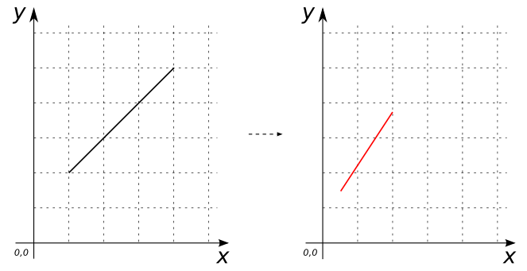

# ST_Scale

## Signatures

```sql
GEOMETRY ST_Scale(GEOMETRY geom, DOUBLE xFactor, DOUBLE yFactor);
GEOMETRY ST_Scale(GEOMETRY geom, DOUBLE xFactor, DOUBLE yFactor, DOUBLE zFactor);
```

## Description

Scales `geom` Geometry by multiplying the ordinates by the indicated scale
factors. If `zFactor` is omitted and `geom` contains a z-coordinate, it
is left untouched.

## Examples

```sql
SELECT ST_Scale('LINESTRING(1 2, 4 5)'::Geometry, 0.5, 0.75);
-- Answer:    LINESTRING(0.5 1.5, 2 3.75)
```

{align=center}

```sql
SELECT ST_Scale('LINESTRING(1 2, 4 5)'::Geometry, 0.5, 0.75, 1.2);
-- Answer:    LINESTRING(0.5 1.5, 2 3.75)
```
```sql
SELECT ST_Scale('LINESTRING(1 2, 4 5)'::Geometry, 0.0, -1.0, 2.0);
-- Answer:    LINESTRING(0 -2, 0 -5)
```
```sql
SELECT ST_Scale('LINESTRING(1 2 3, 4 5 6)'::Geometry, 0.5, 0.75);
-- Answer:    LINESTRING(0.5 1.5 3, 2 3.75 6)
```
```sql
SELECT ST_Scale('LINESTRING(1 2 3, 4 5 6)'::Geometry, 0.5, 0.75, 1.2);
-- Answer:    LINESTRING(0.5 1.5 3.6, 2 3.75 7.2)
```
```sql
SELECT ST_Scale('LINESTRING(1 2 3, 4 5 6)'::Geometry, 0.0, -1.0, 2.0);
-- Answer:    LINESTRING(0 -2 6, 0 -5 12)
```

## See also

* <a href="https://github.com/orbisgis/h2gis/blob/master/h2gis-functions/src/main/java/org/h2gis/functions/spatial/affine_transformations/ST_Scale.java" target="_blank">Source code</a>
