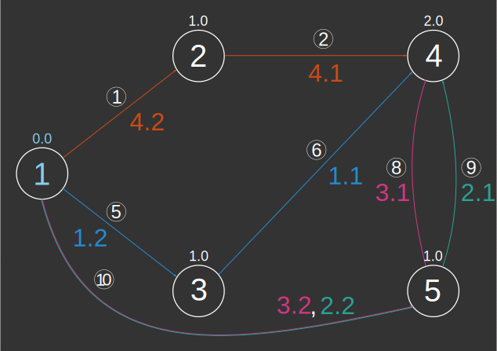
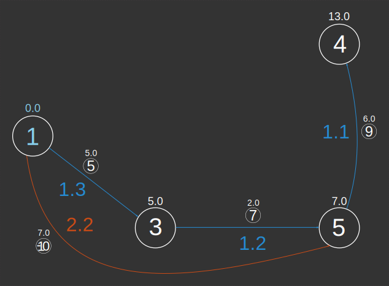
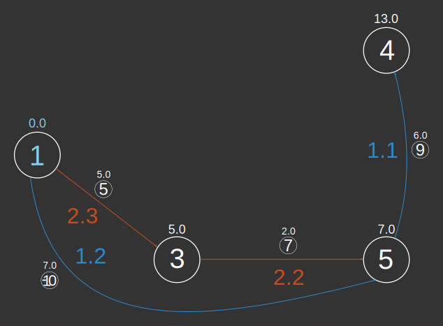

# ST_ShortestPath

## Signatures

```sql
-- Input type:
--     TABLE[EDGE_ID, START_NODE, END_NODE[, w][, eo][, THE_GEOM]]
-- Return type:
--     TABLE[[THE_GEOM, ]EDGE_ID, PATH_ID, PATH_EDGE_ID,
--           SOURCE, DESTINATION, WEIGHT]
ST_ShortestPath('INPUT_EDGES', 'o[ - eo]'[, 'w'], s, d);
```

## Description

Calculates the shortest path(s) from source vertex `s` to
destination vertex `d`.

<div class="note info">
  <h5>A note about path numbering.</h5>
  <p>
  <ul>
  <li> Multiple shortest paths are distinguished by
  <code>PATH_ID</code>, while <code>EDGE_ID</code> indicates the ID
  in the input table.  </li>
  <li> Path numbering is <b>not unique</b>. We use a recursive
  algorithm to number shortest path edges. We start at the
  destination vertex and work our way back to the source vertex,
  each time incrementing <code>PATH_EDGE_ID</code> by 1. If at any
  point we reach the source vertex, we increment
  <code>PATH_ID</code> by 1 since we will be numbering a new
  shortest path. As a consequence, <code>PATH_EDGE_ID</code> always
  indicates the number of edges in this shortest path before
  reaching the destination vertex.  </li>
  </ul>
  </p>
</div>


### Input parameters

| Variable      | Meaning                                                                                                                                                                                                                                                                                                                 |
|---------------|-------------------------------------------------------------------------------------------------------------------------------------------------------------------------------------------------------------------------------------------------------------------------------------------------------------------------|
| `INPUT_EDGES` | Table containing integer columns `EDGE_ID`, `START_NODE` and `END_NODE`; <br>and optionally a weight column `w` (if the graph is weighted) and/or an edge <br> orientation column `eo` (required if global orientation is not `undirected`).<br> If it contains a Geometry column, this column will be returned in the output table. |
| `o`           | Global orientation string: `directed`, `reversed` or `undirected`                                                                                                                                                                                                                                                       |
| `eo`          | Edge orientation column name indicating individual edge orientations:<br> `1` (directed), `-1` (reversed) or `0` (undirected);<br> required if global orientation is `directed` or `reversed`                                                                                                                                   |
| `w`           | Edge weights column name                                                                                                                                                                                                                                                                                                |
| `s`           | Source vertex id                                                                                                                                                                                                                                                                                                        |
| `d`           | Destination vertex id                                                                                                                                                                                                                                                                                                   |

## Examples

In the following examples, we will use the geometrical data below as input.

```sql
DROP TABLE IF EXISTS INPUT;
CREATE TABLE INPUT(THE_GEOM LINESTRING,
                   ID INT AUTO_INCREMENT PRIMARY KEY,
                   WEIGHT DOUBLE,
                   EDGE_ORIENTATION INT);
INSERT INTO INPUT VALUES
    ('LINESTRING (0 1, 1 2)', DEFAULT, 10.0, 1),
    ('LINESTRING (1 2, 2 2)', DEFAULT, 1.0, -1),
    ('LINESTRING (1 2, 0.75 1, 1 0)', DEFAULT, 2.0,  1),
    ('LINESTRING (1 0, 1.25 1, 1 2)', DEFAULT, 3.0,  1),
    ('LINESTRING (0 1, 1 0)', DEFAULT, 5.0,  1),
    ('LINESTRING (1 0, 2 2)', DEFAULT, 9.0,  1),
    ('LINESTRING (1 0, 2 0)', DEFAULT, 2.0,  1),
    ('LINESTRING (2 2, 1.75 1, 2 0)', DEFAULT, 4.0,  1),
    ('LINESTRING (2 0, 2.25 1, 2 2)', DEFAULT, 6.0,  1),
    ('LINESTRING (2 0, 0 1)', DEFAULT, 7.0,  0),
    ('LINESTRING (3 0, 3 1)', DEFAULT, 1.0, 1),
    ('LINESTRING (3 1, 3 2)', DEFAULT, 2.0, 1);
```

{align=center}


We call `ST_Graph` on this input table in order to construct the node and edge tables. We give an illustration of the resulting graph. Note that we can call this function on any table containing integer columns `EDGE_ID`, `START_NODE` and `END_NODE`.
```sql
DROP TABLE IF EXISTS INPUT_NODES;
DROP TABLE IF EXISTS INPUT_EDGES;
CALL ST_Graph('INPUT');
SELECT * FROM INPUT_EDGES;
```
Gives:

| EDGE_ID | START_NODE | END_NODE |
|---------|------------|----------|
|       1 |          1 |        2 |
|       2 |          2 |        4 |
|       3 |          2 |        3 |
|       4 |          3 |        2 |
|       5 |          1 |        3 |
|       6 |          3 |        4 |
|       7 |          3 |        5 |
|       8 |          4 |        5 |
|       9 |          5 |        4 |
|      10 |          5 |        1 |
|      11 |          6 |        7 |
|      12 |          7 |        8 |


{align=center}

### Undirected unweighted

We have just enough information to consider an unweighted undirected graph. Notice there are four shortest paths from
vertex 1 to vertex 4. You may have a different numbering when you execute this request.

```sql
SELECT * FROM ST_ShortestPath('INPUT_EDGES', 'undirected', 1, 4);
```

|EDGE_ID |PATH_ID |PATH_EDGE_ID | SOURCE | DESTINATION | WEIGHT |
|--------|--------|-------------|--------|-------------|--------|
|      6 |      1 |           1 |      3 |           4 |    1.0 |
|      5 |      1 |           2 |      1 |           3 |    1.0 |
|      9 |      2 |           1 |      5 |           4 |    1.0 |
|     10 |      2 |           2 |      1 |           5 |    1.0 |
|      8 |      3 |           1 |      5 |           4 |    1.0 |
|     10 |      3 |           2 |      1 |           5 |    1.0 |
|      2 |      4 |           1 |      2 |           4 |    1.0 |
|      1 |      4 |           2 |      1 |           2 |    1.0 |


{align=center}

### Directed Weighted

If we want to take edge orientations and weights into account, we have to recover that information from the original input table.
Notice that edge 2 is reversed and edge 10 is bidirectional (represented by edges 10 and -10 in opposite directions).

```sql
DROP TABLE IF EXISTS EDGES_EO_W;
CREATE TABLE EDGES_EO_W(EDGE_ID INT PRIMARY KEY,
                        START_NODE INT,
                        END_NODE INT,
                        WEIGHT DOUBLE,
                        EDGE_ORIENTATION INT) AS
    SELECT B.EDGE_ID,
           B.START_NODE,
           B.END_NODE,
           A.WEIGHT,
           A.EDGE_ORIENTATION
    FROM INPUT A, INPUT_EDGES B
    WHERE A.ID=B.EDGE_ID;
SELECT * FROM EDGES_EO_W;
```

| EDGE_ID | START_NODE | END_NODE | WEIGHT | EDGE_ORIENTATION |
|---------|------------|----------|--------|------------------|
|       1 |          1 |        2 |   10.0 |                1 |
|       2 |          2 |        4 |    1.0 |               -1 |
|       3 |          2 |        3 |    2.0 |                1 |
|       4 |          3 |        2 |    3.0 |                1 |
|       5 |          1 |        3 |    5.0 |                1 |
|       6 |          3 |        4 |    9.0 |                1 |
|       7 |          3 |        5 |    2.0 |                1 |
|       8 |          4 |        5 |    4.0 |                1 |
|       9 |          5 |        4 |    6.0 |                1 |
|      10 |          5 |        1 |    7.0 |                0 |
|      11 |          6 |        7 |    1.0 |                1 |
|      12 |          7 |        8 |    2.0 |                1 |


{align=center}


Now we may consider a directed weighted graph. Again, notice this is not really a "tree" in the mathematical sense since there are two shortest paths from vertex 1 to vertex 5. We illustrate the two possible numberings of these paths.

```sql
SELECT * FROM ST_ShortestPath('EDGES_EO_W',
        'directed - EDGE_ORIENTATION', 'WEIGHT', 1, 4);
```
Numbering 1:
|EDGE_ID |PATH_ID |PATH_EDGE_ID | SOURCE | DESTINATION | WEIGHT |
|--------|--------|-------------|--------|-------------|--------|
|      9 |      1 |           1 |      5 |           4 |    6.0 |
|      7 |      1 |           2 |      3 |           5 |    2.0 |
|      5 |      1 |           3 |      1 |           3 |    5.0 |
|    -10 |      2 |           2 |      1 |           5 |    7.0 |


{align=center}


Numbering 2:
|EDGE_ID |PATH_ID |PATH_EDGE_ID | SOURCE | DESTINATION | WEIGHT |
|--------|--------|-------------|--------|-------------|--------|
|      9 |      1 |           1 |      5 |           4 |    6.0 |
|    -10 |      1 |           2 |      1 |           5 |    7.0 |
|      7 |      2 |           2 |      3 |           5 |    2.0 |
|      5 |      2 |           3 |      1 |           3 |    5.0 |


{align=center}

### Unreachable vertices

If the destination vertex is unreachable from the source vertex, a table with a single line is returned:

```sql
SELECT * FROM ST_ShortestPath('INPUT_EDGES', 'undirected', 1, 6);
```

|EDGE_ID |PATH_ID |PATH_EDGE_ID |SOURCE |DESTINATION | WEIGHT   |
|--------|--------|-------------|-------|------------|----------|
|     -1 |     -1 |          -1 |     1 |          6 | Infinity |


### Including Geometries

To include Geometries in the result, there are two methods. 

**METHOD 1**: Include Geometries in the input table.

```sql
DROP TABLE IF EXISTS EDGES_EO_W_GEOM;
CREATE TABLE EDGES_EO_W_GEOM(EDGE_ID INT PRIMARY KEY,
                             START_NODE INT,
                             END_NODE INT,
                             EDGE_ORIENTATION INT,
                             WEIGHT DOUBLE,
                             THE_GEOM GEOMETRY) AS
    SELECT B.EDGE_ID,
           B.START_NODE,
           B.END_NODE,
           A.EDGE_ORIENTATION,
           A.WEIGHT,
           A.THE_GEOM
    FROM INPUT A, INPUT_EDGES B
    WHERE A.ID=B.EDGE_ID;
```

The input table's Geometries are automatically returned in the result.

```sql
SELECT * FROM ST_ShortestPath('EDGES_EO_W_GEOM', 
        'directed - EDGE_ORIENTATION', 'weight', 1, 4);
```

| THE_GEOM                      | EDGE_ID | PATH_ID | PATH_EDGE_ID | SOURCE | DESTINATION | WEIGHT |
|-------------------------------|---------|---------|--------------|--------|-------------|--------|
| LINESTRING (2 0, 2.25 1, 2 2) |       9 |       1 |            1 |      5 |           4 |    6.0 |
| LINESTRING (1 0, 2 0)         |       7 |       1 |            2 |      3 |           5 |    2.0 |
| LINESTRING (0 1, 1 0)         |       5 |       1 |            3 |      1 |           3 |    5.0 |
| LINESTRING (2 0, 0 1)         |     -10 |       2 |            2 |      1 |           5 |    7.0 |


**METHOD 2**: Recover Geometries after calculation.
Notice the call to the ABS function (edge ids could be negative). We get the same result.
```sql
SELECT A.THE_GEOM,
       B.EDGE_ID,
       B.PATH_ID,
       B.PATH_EDGE_ID,
       B.SOURCE,
       B.DESTINATION,
       B.WEIGHT
FROM INPUT A,
     (SELECT * FROM ST_ShortestPath('EDGES_EO_W_GEOM',
        'directed - EDGE_ORIENTATION', 'weight', 1, 4)) B
WHERE A.ID=ABS(B.EDGE_ID);
```

| THE_GEOM                      | EDGE_ID | PATH_ID | PATH_EDGE_ID | SOURCE | DESTINATION | WEIGHT |
|-------------------------------|---------|---------|--------------|--------|-------------|--------|
| LINESTRING (2 0, 2.25 1, 2 2) |       9 |       1 |            1 |      5 |           4 |    6.0 |
| LINESTRING (1 0, 2 0)         |       7 |       1 |            2 |      3 |           5 |    2.0 |
| LINESTRING (0 1, 1 0)         |       5 |       1 |            3 |      1 |           3 |    5.0 |
| LINESTRING (2 0, 0 1)         |     -10 |       2 |            2 |      1 |           5 |    7.0 |


### Exercises

1. Check that the sum of the weights of the edges in the path
   returned by `ST_ShortestPath` is equal to the path length
   returned by [`ST_ShortestPathLength`](../ST_ShortestPathLength).
   Watch out for multiple shortest paths!

## See also

* [`ST_ShortestPathLength`](../ST_ShortestPathLength),
  [`ST_ShortestPathTree`](../ST_ShortestPathTree)
* <a href="https://github.com/orbisgis/h2gis/blob/master/h2gis-network/src/main/java/org/h2gis/network/functions/ST_ShortestPath.java" target="_blank">Source code</a>
