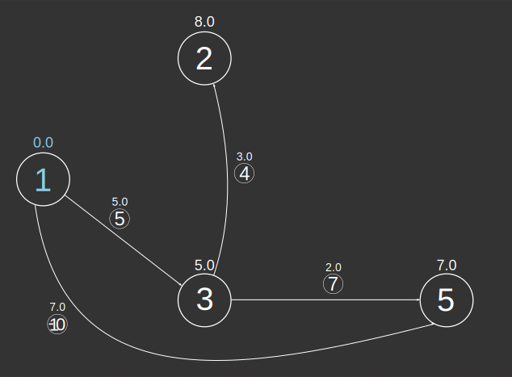

# ST_ShortestPathTree

## Signatures

```sql
-- Input type:
--     TABLE[EDGE_ID, START_NODE, END_NODE[, w][, eo][, THE_GEOM]]
-- Return type:
--     TABLE[[THE_GEOM, ]EDGE_ID, SOURCE, DESTINATION, WEIGHT]
ST_ShortestPathTree('INPUT_EDGES', 'o[ - eo]'[, 'w'], s)
ST_ShortestPathTree('INPUT_EDGES', 'o[ - eo]'[, 'w'], s, r)
```

## Description

Calculates the [shortest path tree][wiki] (SPT) from a given vertex
of a graph using Dijkstra's algorithm.

:::{note}
**The result may not technically be a [tree][tree]**

If there are multiple shortest paths, they are all returned
:::

:::{hint}
**Edges are not returned in any particular order**

The SPT is composed of many edges, but their order is not important.
:::

:::{hint}
**The SPT is confined to the same (strongly) connected component as the source vertex**

That is, it includes only vertices reachable from the source vertex. See [`ST_ConnectedComponents`](../ST_ConnectedComponents)
:::


### Input parameters

| Variable      | Meaning                                                                                                                                                                                                                                                                                                                 |
|---------------|-------------------------------------------------------------------------------------------------------------------------------------------------------------------------------------------------------------------------------------------------------------------------------------------------------------------------|
| `INPUT_EDGES` | Table containing integer columns `EDGE_ID`, `START_NODE` and `END_NODE`;<br> and optionally a weight column `w` (if the graph is weighted) and/or an edge <br> orientation column `eo` (required if global orientation is not `undirected`).<br> If it contains a Geometry column, this column will be returned in the output table. |
| `o`           | Global orientation string: `directed`, `reversed` or `undirected`                                                                                                                                                                                                                                                       |
| `eo`          | Edge orientation column name indicating individual edge orientations:<br> `1` (directed), `-1` (reversed) or `0` (undirected);<br> required if global orientation is `directed` or `reversed`                                                                                                                                   |
| `w`           | Edge weights column name                                                                                                                                                                                                                                                                                                |
| `s`           | Source vertex id                                                                                                                                                                                                                                                                                                        |
| `r`           | Radius by which to limit the search (a `DOUBLE`)                                                                                                                                                                                                                                                                        |

## Examples

In the following examples, we will use the geometrical data below as input.

```sql
DROP TABLE IF EXISTS INPUT;
CREATE TABLE INPUT(THE_GEOM LINESTRING,
                   ID INT AUTO_INCREMENT PRIMARY KEY,
                   WEIGHT DOUBLE,
                   EDGE_ORIENTATION INT);
INSERT INTO INPUT VALUES
    ('LINESTRING (0 1, 1 2)', DEFAULT, 10.0, 1),
    ('LINESTRING (1 2, 2 2)', DEFAULT, 1.0, -1),
    ('LINESTRING (1 2, 0.75 1, 1 0)', DEFAULT, 2.0,  1),
    ('LINESTRING (1 0, 1.25 1, 1 2)', DEFAULT, 3.0,  1),
    ('LINESTRING (0 1, 1 0)', DEFAULT, 5.0,  1),
    ('LINESTRING (1 0, 2 2)', DEFAULT, 9.0,  1),
    ('LINESTRING (1 0, 2 0)', DEFAULT, 2.0,  1),
    ('LINESTRING (2 2, 1.75 1, 2 0)', DEFAULT, 4.0,  1),
    ('LINESTRING (2 0, 2.25 1, 2 2)', DEFAULT, 6.0,  1),
    ('LINESTRING (2 0, 0 1)', DEFAULT, 7.0,  0),
    ('LINESTRING (3 0, 3 1)', DEFAULT, 1.0, 1),
    ('LINESTRING (3 1, 3 2)', DEFAULT, 2.0, 1);
```

{align=center}


We call `ST_Graph` on this input table in order to construct the node and edge tables. We give an illustration of the resulting graph. Note that we can call this function on any table containing integer columns `EDGE_ID`, `START_NODE` and `END_NODE`.
```sql
DROP TABLE IF EXISTS INPUT_NODES;
DROP TABLE IF EXISTS INPUT_EDGES;
CALL ST_Graph('INPUT');
SELECT * FROM INPUT_EDGES;
```

| EDGE_ID | START_NODE | END_NODE |
|---------|------------|----------|
|       1 |          1 |        2 |
|       2 |          2 |        4 |
|       3 |          2 |        3 |
|       4 |          3 |        2 |
|       5 |          1 |        3 |
|       6 |          3 |        4 |
|       7 |          3 |        5 |
|       8 |          4 |        5 |
|       9 |          5 |        4 |
|      10 |          5 |        1 |
|      11 |          6 |        7 |
|      12 |          7 |        8 |

{align=center}

### Undirected unweighted

We have just enough information to consider an unweighted undirected graph. Notice this is not really a "tree" in the
mathematical sense since there are four shortest paths from vertex 1 to vertex 4.

```sql
SELECT * FROM ST_ShortestPathTree('INPUT_EDGES', 'undirected', 1);
```

| EDGE_ID | SOURCE | DESTINATION | WEIGHT |
|---------|--------|-------------|--------|
|       1 |      1 |           2 |    1.0 |
|       9 |      5 |           4 |    1.0 |
|       6 |      3 |           4 |    1.0 |
|       2 |      2 |           4 |    1.0 |
|       8 |      5 |           4 |    1.0 |
|       5 |      1 |           3 |    1.0 |
|      10 |      1 |           5 |    1.0 |


{align=center}

### Directed Weighted

If we want to take edge orientations and weights into account, we have to recover that information from the original input table.
Notice that edge 2 is reversed and edge 10 is bidirectional (represented by edges 10 and -10 in opposite directions).

```sql
DROP TABLE IF EXISTS EDGES_EO_W;
CREATE TABLE EDGES_EO_W(EDGE_ID INT PRIMARY KEY,
                        START_NODE INT,
                        END_NODE INT,
                        WEIGHT DOUBLE,
                        EDGE_ORIENTATION INT) AS
    SELECT B.EDGE_ID,
           B.START_NODE,
           B.END_NODE,
           A.WEIGHT,
           A.EDGE_ORIENTATION
    FROM INPUT A, INPUT_EDGES B
    WHERE A.ID=B.EDGE_ID;
SELECT * FROM EDGES_EO_W;
```

| EDGE_ID | START_NODE | END_NODE | WEIGHT | EDGE_ORIENTATION |
|---------|------------|----------|--------|------------------|
|       1 |          1 |        2 |   10.0 |                1 |
|       2 |          2 |        4 |    1.0 |               -1 |
|       3 |          2 |        3 |    2.0 |                1 |
|       4 |          3 |        2 |    3.0 |                1 |
|       5 |          1 |        3 |    5.0 |                1 |
|       6 |          3 |        4 |    9.0 |                1 |
|       7 |          3 |        5 |    2.0 |                1 |
|       8 |          4 |        5 |    4.0 |                1 |
|       9 |          5 |        4 |    6.0 |                1 |
|      10 |          5 |        1 |    7.0 |                0 |
|      11 |          6 |        7 |    1.0 |                1 |
|      12 |          7 |        8 |    2.0 |                1 |


{align=center}

Now we may consider a directed weighted graph. Again, notice this is not really a "tree" in the mathematical sense since there are two shortest paths from vertex 1 to vertex 5.

```sql
SELECT * FROM ST_ShortestPathTree('EDGES_EO_W',
        'directed - EDGE_ORIENTATION', 'WEIGHT', 1);
```

| EDGE_ID | SOURCE | DESTINATION | WEIGHT |
|---------|--------|-------------|--------|
|       4 |      3 |           2 |    3.0 |
|       9 |      5 |           4 |    6.0 |
|       5 |      1 |           3 |    5.0 |
|     -10 |      1 |           5 |    7.0 |
|       7 |      3 |           5 |    2.0 |

{align=center}

### Including Geometries

To include Geometries in the result, there are two methods. 

**METHOD 1**: Include Geometries in the input table.

```sql
DROP TABLE IF EXISTS EDGES_EO_W_GEOM;
CREATE TABLE EDGES_EO_W_GEOM(EDGE_ID INT PRIMARY KEY,
                             START_NODE INT,
                             END_NODE INT,
                             EDGE_ORIENTATION INT,
                             WEIGHT DOUBLE,
                             THE_GEOM GEOMETRY) AS
    SELECT B.EDGE_ID,
           B.START_NODE,
           B.END_NODE,
           A.EDGE_ORIENTATION,
           A.WEIGHT,
           A.THE_GEOM
    FROM INPUT A, INPUT_EDGES B
    WHERE A.ID=B.EDGE_ID;
```

The input table's Geometries are automatically returned in the result.

```sql
SELECT * FROM ST_ShortestPathTree('EDGES_EO_W_GEOM',
        'directed - EDGE_ORIENTATION', 'weight', 1);
```
| THE_GEOM                      | EDGE_ID | SOURCE | DESTINATION | WEIGHT |
|-------------------------------|---------|--------|-------------|--------|
| LINESTRING (1 0, 1.25 1, 1 2) |       4 |      3 |           2 |    3.0 |
| LINESTRING (2 0, 2.25 1, 2 2) |       9 |      5 |           4 |    6.0 |
| LINESTRING (0 1, 1 0)         |       5 |      1 |           3 |    5.0 |
| LINESTRING (2 0, 0 1)         |     -10 |      1 |           5 |    7.0 |
| LINESTRING (1 0, 2 0)         |       7 |      3 |           5 |    2.0 |


**METHOD 2**: Recover Geometries after calculation.

Notice the call to the ABS function (edge ids could be negative). We get the same result.
```sql
SELECT A.THE_GEOM,
       B.EDGE_ID,
       B.SOURCE,
       B.DESTINATION,
       B.WEIGHT
FROM INPUT A,
     (SELECT * FROM ST_ShortestPathTree('EDGES_EO_W',
                 'directed - EDGE_ORIENTATION', 'weight', 1)) B
WHERE A.ID=ABS(B.EDGE_ID);
```

| THE_GEOM                      | EDGE_ID | SOURCE | DESTINATION | WEIGHT |
|-------------------------------|---------|--------|-------------|--------|
| LINESTRING (1 0, 1.25 1, 1 2) |       4 |      3 |           2 |    3.0 |
| LINESTRING (2 0, 2.25 1, 2 2) |       9 |      5 |           4 |    6.0 |
| LINESTRING (0 1, 1 0)         |       5 |      1 |           3 |    5.0 |
| LINESTRING (2 0, 0 1)         |     -10 |      1 |           5 |    7.0 |
| LINESTRING (1 0, 2 0)         |       7 |      3 |           5 |    2.0 |


### Limiting by search radius

Notice that now edge 9 is no longer a part of the SPT since d(1, 4)=13.0 > 8.5.
```sql
SELECT * FROM ST_ShortestPathTree('EDGES_EO_W',
        'directed - EDGE_ORIENTATION', 'WEIGHT', 1, 8.5);
```
| EDGE_ID | SOURCE | DESTINATION | WEIGHT |
|---------|--------|-------------|--------|
|       4 |      3 |           2 |    3.0 |
|       5 |      1 |           3 |    5.0 |
|       7 |      3 |           5 |    2.0 |
|     -10 |      1 |           5 |    7.0 |


{align=center}

### Exercises

1. Try doing similar calculations for
    * an unweighted directed graph
    * a weighted undirected graph
    * a weighted reversed graph
2. Find a source vertex and a graph configuration such that the SPT
   returned by `ST_ShortestPathTree` is in fact a tree.

## See also

* [`ST_ShortestPath`](../ST_ShortestPath),
  [`ST_ShortestPathLength`](../ST_ShortestPathLength),
  [`ST_ConnectedComponents`](../ST_ConnectedComponents)
* <a href="https://github.com/orbisgis/h2gis/blob/master/h2gis-network/src/main/java/org/h2gis/network/functions/ST_ShortestPathTree.java" target="_blank">Source code</a>

[wiki]: http://en.wikipedia.org/wiki/Shortest-path_tree
[tree]: http://en.wikipedia.org/wiki/Tree_(graph_theory)