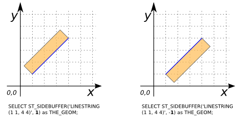
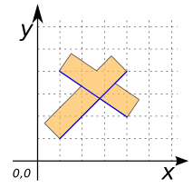
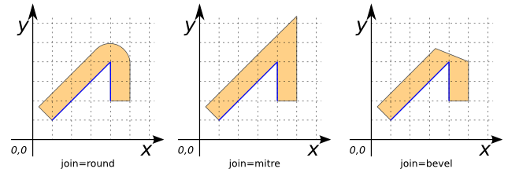

# ST_SideBuffer

## Signatures

```sql
GEOMETRY ST_SideBuffer(GEOMETRY geom, DOUBLE bufferSize);
GEOMETRY ST_SideBuffer(GEOMETRY geom, DOUBLE bufferSize, VARCHAR bufferStyle);
```

## Description
Return a buffer at a given distance on only one side of each input lines of the `geom`.

The buffer size (`bufferSize`) is given in projection units.

The optional third parameter can either specify the number of segments used to
approximate a quarter circle or a `VARCHAR` list of
space-separated `key=value` pairs:

| `key`=`value` | Description | Default |
|-|-|-|
| `quad_segs`=`#` | number of segments to approximate a quarter circle | 8 |
| `join`=`round` / `mitre` / `bevel` | join style | `round` |
| `mitre_limit`=`#.#` | mitre ratio limit (only affects mitered join style) | 5 |

The end cap style for single-sided buffers is always ignored, and forced to the equivalent of 'flat' (Synonym of 'butt').

## Examples

```sql
SELECT ST_SideBuffer('LINESTRING (1 1, 4 4)', 1) as THE_GEOM;
-- Answer: POLYGON ((4 4, 1 1, 0.2928932188134524 1.7071067811865475, 3.2928932188134525 4.707106781186548, 4 4))
```
```sql
SELECT ST_SideBuffer('LINESTRING (1 1, 4 4)', -1) as THE_GEOM;
-- Answer: POLYGON ((1 1, 4 4, 4.707106781186548 3.2928932188134525, 1.7071067811865475 0.2928932188134524, 1 1))
```

{align=center}

```sql
SELECT ST_SideBuffer('MULTILINESTRING ((1 1, 4 4), (1 4, 4 2))', 1) as THE_GEOM;
-- Answer: POLYGON ((1.951471862576143 3.365685424949238, 1 4, 1.5547001962252291 4.832050294337844, 2.6725821176689406 4.0867956800420355, 3.2928932188134525 4.707106781186548, 4 4, 3.5211102550927977 3.5211102550927977, 4.554700196225229 2.8320502943378436, 4 2, 2.8 2.8, 1 1, 0.2928932188134524 1.7071067811865475, 1.951471862576143 3.365685424949238))
```

{align=center}

```sql
SELECT ST_SideBuffer('LINESTRING (1 1, 4 4, 4 2)', 1, 'join=round') as THE_GEOM;
-- Answer: POLYGON ((4 2, 4 4, 1 1, 0.2928932188134524 1.7071067811865475, 3.2928932188134525 4.707106781186548, 3.444429766980398 4.831469612302545, 3.6173165676349104 4.923879532511287, 3.804909677983872 4.98078528040323, 4 5, 4.195090322016128 4.98078528040323, 4.38268343236509 4.923879532511287, 4.555570233019602 4.831469612302545, 4.707106781186548 4.707106781186548, 4.831469612302545 4.555570233019602, 4.923879532511287 4.38268343236509, 4.98078528040323 4.195090322016129, 5 4, 5 2, 4 2)) 
```

```sql
SELECT ST_SideBuffer('LINESTRING (1 1, 4 4, 4 2)', 1, 'join=mitre') as THE_GEOM;
-- Answer: POLYGON ((4 2, 4 4, 1 1, 0.2928932188134524 1.7071067811865475, 5 6.414213562373096, 5 2, 4 2))
```

```sql
SELECT ST_SideBuffer('LINESTRING (1 1, 4 4, 4 2)', 1, 'join=bevel') as THE_GEOM;
-- Answer: POLYGON ((4 2, 4 4, 1 1, 0.2928932188134524 1.7071067811865475, 3.2928932188134525 4.707106781186548, 5 4, 5 2, 4 2))
```

{align=center}

```sql
SELECT ST_SideBuffer('LINESTRING (1 1, 4 4, 4 2)', 1, 
                           'join=mitre mitre_limit=1') as THE_GEOM;
-- Answer: POLYGON ((4 2, 4 4, 1 1, 0.2928932188134524 1.7071067811865475, 3.8123572904470766 5.1601163554696505, 4.953009574283103 4.687642709552923, 5 2, 4 2))
```

```sql
SELECT ST_SideBuffer('LINESTRING (1 1, 4 4, 4 2)', 1, 
                           'join=mitre mitre_limit=2') as THE_GEOM;
-- Answer: POLYGON ((4 2, 4 4, 1 1, 0.2928932188134524 1.7071067811865475, 4.54859411340544 5.937549278574211, 4.982139616054918 5.757968851470936, 5 2, 4 2)) 
```

```sql
SELECT ST_SideBuffer('LINESTRING (1 1, 4 4, 4 2)', 1, 
                           'join=mitre mitre_limit=3') as THE_GEOM;
-- Answer: POLYGON ((4 2, 4 4, 1 1, 0.2928932188134524 1.7071067811865475, 5 6.414213562373096, 5 2, 4 2)) 
```

{align=center}

## See also
* [`ST_Buffer`](../ST_Buffer),
  [`ST_RingSideBuffer`](../ST_RingSideBuffer),
  [`ST_RingBuffer`](../ST_RingBuffer),
  [`ST_OffSetCurve`](../ST_OffSetCurve)
* <a href="https://github.com/orbisgis/h2gis/blob/master/h2gis-functions/src/main/java/org/h2gis/functions/spatial/buffer/ST_SideBuffer.java" target="_blank">Source code</a>
