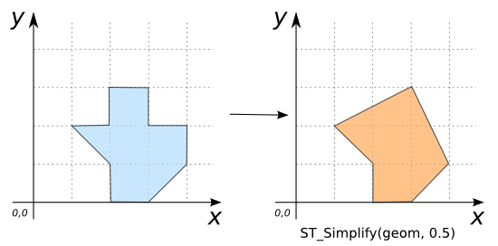
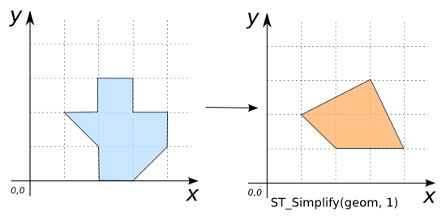
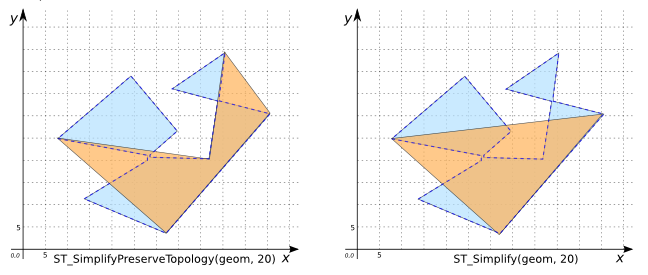

# ST_Simplify

## Signature

```sql
GEOMETRY ST_Simplify(GEOMETRY geom, DOUBLE distance);
```

## Description

Simplifies `geom` using the [Douglas-Peuker](http://en.wikipedia.org/wiki/Ramer%E2%80%93Douglas%E2%80%93Peucker_algorithm) algorithm with a distance tolerance of `distance`. 
Ensures that resulting polygonal geometries are valid.

:::{note}
**The Douglas-Peucker algorithm does not preserve topology.**
To preserve the topology, use [`ST_SimplifyPreserveTopology`](./ST_SimplifyPreserveTopology).
But note that `ST_Simplify` is significantly faster.
:::

## Examples

```sql
SELECT ST_Simplify('POLYGON((2 1, 1 2, 2 2, 2 3, 3 3, 3 2,
                             4 2, 4 1, 3 0, 2 0, 2 1))',
                    0.5)
-- Answer: POLYGON((2 1, 1 2, 3 3, 4 1, 3 0, 2 0, 2 1))
```

{align=center}

```sql
SELECT ST_Simplify('POLYGON((2 1, 1 2, 2 2, 2 3, 3 3, 3 2,
                             4 2, 4 1, 3 0, 2 0, 2 1))',
                    1)
-- Answer:POLYGON((2 1, 1 2, 3 3, 4 1, 2 1))
```

{align=center}

If the distance tolerance is too large, the Geometry may be oversimplified:
```sql
SELECT ST_Simplify('POLYGON((2 1, 1 2, 2 2, 2 3, 3 3, 3 2,
                             4 2, 4 1, 3 0, 2 0, 2 1))',
                    2)
-- Answer: POLYGON EMPTY
```

POINTs and MULTIPOINTs cannot be further simplified:
```sql
SELECT ST_Simplify('MULTIPOINT((190 300), (10 11))', 
                    4);
-- Answer: MULTIPOINT((190 300), (10 11))
```

Simplify a LINESTRING:
```sql
SELECT ST_Simplify('LINESTRING(250 250, 280 290, 300 230, 340 300,
                               360 260, 440 310, 470 360, 604 286)',
                   40);
-- Answer: LINESTRING(250 250, 280 290, 300 230, 470 360, 604 286)
```

### Comparison with [`ST_SimplifyPreserveTopology`](../ST_SimplifyPreserveTopology)

```sql
CREATE TABLE INPUT_TABLE(geom GEOMETRY);
INSERT INTO INPUT_TABLE VALUES (
    'POLYGON((8 25, 28 22, 28 20, 15 11, 33 3, 56 30,
              46 33, 46 34, 47 44, 35 36, 45 33, 43 19,
              29 21, 29 22, 35 26, 24 39, 8 25))');
```

Notice that the result of `ST_SimplifyPreserveTopology` contains more vertices than the result of `ST_Simplify`. In general, it will contain enough to ensure validity.

```sql
SELECT ST_SimplifyPreserveTopology(geom, 20) SPT,
       ST_Simplify(geom, 20) S FROM INPUT_TABLE;
```

Answer:
|               SPT              |            S          |
|--------------------------------|-----------------------|
| POLYGON((8 25, 33 3, 56 30, 47 44, 43 19, 8 25))   | POLYGON((8 25, 56 30, 33 3, 8 25))|

{align=center}

```sql
CREATE TABLE INPUT_TABLE(geom GEOMETRY);
INSERT INTO INPUT_TABLE VALUES (
    'POLYGON((5 7, 2 5, 5 4, 13 4, 18 7, 16 11, 7 9, 11 7, 5 7),
             (13 8, 13 6, 14 6, 15 9, 13 8))');
```

Here `ST_SimplifyPreserveTopology` keeps the hole whereas `ST_Simplify` removes it:

```sql
SELECT ST_SimplifyPreserveTopology(geom, 3) SPT,
       ST_Simplify(geom, 3) S FROM INPUT_TABLE;
```

Answer:
|              SPT            |              S             |
|-----------------------------|----------------------------|
| POLYGON((5 7, 2 5, 13 4, 18 7, 16 11, 5 7),<br> (13 8, 13 6, 14 6, 15 9, 13 8)) | POLYGON((5 7, 16 11, 18 7, 2 5, 5 7))|

{align=center}

## See also

* [`ST_SimplifyPreserveTopology`](../ST_SimplifyPreserveTopology)
* <a href="https://github.com/orbisgis/h2gis/blob/master/h2gis-functions/src/main/java/org/h2gis/functions/spatial/generalize/ST_Simplify.java" target="_blank">Source code</a>
* JTS [DouglasPeuckerSimplifier#simplify](http://tsusiatsoftware.net/jts/javadoc/com/vividsolutions/jts/simplify/DouglasPeuckerSimplifier.html#simplify)
