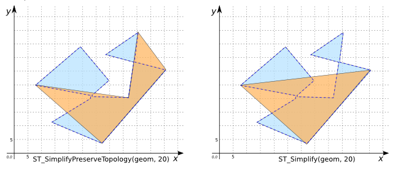
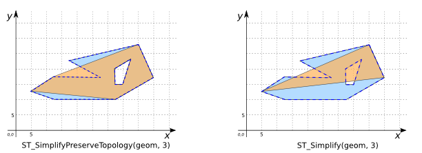

# ST_SimplifyPreserveTopology

## Signature

```sql
GEOMETRY ST_SimplyPreserveTopology(GEOMETRY geom, DOUBLE distance);
```

## Description

Simplifies `geom` with a distance tolerance of `distance` ensuring that the result is a valid geometry (if the input is) having the same dimension and number of components as the input, and with the components having the same topological relationship.
Uses a maximum-distance difference algorithm similar to the [Douglas-Peuker](http://en.wikipedia.org/wiki/Ramer%E2%80%93Douglas%E2%80%93Peucker_algorithm) algorithm.

If the input is a `POLYGON` or a `MULTIPOLYGON`:

* The result has the same number of shells and holes as the input,
  with the same topological structure
* The result rings touch at **no more** than the number of touching
  points in the input (although they may touch at fewer points).
  The key implication of this statement is that if the input is
  topologically valid, so is the simplified output.

For linear geometries, if the input does not contain any
intersecting line segments, this property will be preserved in the
output.

For all geometry types, the result will contain enough vertices to
ensure validity.  For polygons and closed linear geometries, the
result will have at least 4 vertices; for open linestrings the
result will have at least 2 vertices.

All geometry types are handled. Empty and point geometries are returned unchanged.

:::{warning}
**KNOWN BUGS**

If a small hole is very near an edge, it is possible for the edge to be moved by a relatively large tolerance value and end
up with the hole outside the result shell. Similarly, it is possible for a small polygon component to end up inside a nearby
larger polygon. A workaround is to test for this situation in post-processing and remove any invalid holes or polygons.
:::

## Examples

The following three examples use the same input POLYGON.

### With `distance` = 10

```sql
SELECT ST_SimplyPreserveTopology(
           POLYGON((8 25, 28 22, 28 20, 15 11, 33 3, 56 30, 46 33, 46 34, 47 44, 35 36, 
                    45 33, 43 19, 29 21, 29 22, 35 26, 24 39, 8 25)), 10);

-- Answer: POLYGON((8 25, 28 22, 28 20, 15 11, 33 3, 56 30, 46 33, 46 34, 47 44, 35 36, 
         45 33, 43 19, 29 21, 29 22, 35 26, 24 39, 8 25))
```
### With `distance` = 20

```sql
SELECT ST_SimplyPreserveTopology(
           POLYGON((8 25, 28 22, 28 20, 15 11, 33 3, 56 30, 46 33, 46 34, 47 44, 35 36, 
                    45 33, 43 19, 29 21, 29 22, 35 26, 24 39, 8 25)), 20);

-- Answer: POLYGON((8 25, 33 3, 56 30, 47 44, 43 19, 8 25))
```

### With `distance` = 30

```sql
SELECT ST_SimplyPreserveTopology(
           POLYGON((8 25, 28 22, 28 20, 15 11, 33 3, 56 30, 46 33, 46 34, 47 44, 35 36, 
                    45 33, 43 19, 29 21, 29 22, 35 26, 24 39, 8 25)), 30);

-- Answer: POLYGON((8 25, 33 3, 56 30, 47 44, 8 25))
```

{align=center}

POINTs and MULTIPOINTs cannot be further simplified:
```sql
SELECT ST_SimplifyPreserveTopology(
            'MULTIPOINT((190 300), (10 11))', 4);
-- Answer:   MULTIPOINT((190 300), (10 11))
```

Simplify a LINESTRING:
```sql
SELECT ST_SimplifyPreserveTopology(
            'LINESTRING(250 250, 280 290, 300 230, 340 300, 360 260,
                        440 310, 470 360, 604 286)',
            40);
-- Answer:   LINESTRING(250 250, 280 290, 300 230, 470 360, 604 286)
```

### Comparison with [`ST_Simplify`](../ST_Simplify)

```sql
CREATE TABLE INPUT_TABLE(geom GEOMETRY);
INSERT INTO INPUT_TABLE VALUES (
    'POLYGON((8 25, 28 22, 28 20, 15 11, 33 3, 56 30,
              46 33, 46 34, 47 44, 35 36, 45 33, 43 19,
              29 21, 29 22, 35 26, 24 39, 8 25))');
```

Notice that the result of `ST_SimplifyPreserveTopology` contains more vertices than the result of `ST_Simplify`. In general, it will contain enough to ensure validity.

```sql
SELECT ST_SimplifyPreserveTopology(geom, 20) SPT,
       ST_Simplify(geom, 20) S FROM INPUT_TABLE;
```

Answer:
|               SPT              |            S          |
|--------------------------------|-----------------------|
| POLYGON((8 25, 33 3, 56 30, 47 44, 43 19, 8 25))   | POLYGON((8 25, 56 30, 33 3, 8 25))|

{align=center}

```sql
CREATE TABLE INPUT_TABLE(geom GEOMETRY);
INSERT INTO INPUT_TABLE VALUES (
    'POLYGON((5 7, 2 5, 5 4, 13 4, 18 7, 16 11, 7 9, 11 7, 5 7),
             (13 8, 13 6, 14 6, 15 9, 13 8))');
```

Here `ST_SimplifyPreserveTopology` keeps the hole whereas `ST_Simplify` removes it:

```sql
SELECT ST_SimplifyPreserveTopology(geom, 3) SPT,
       ST_Simplify(geom, 3) S FROM INPUT_TABLE;
```

Answer:
|              SPT            |              S             |
|-----------------------------|----------------------------|
| POLYGON((5 7, 2 5, 13 4, 18 7, 16 11, 5 7),<br> (13 8, 13 6, 14 6, 15 9, 13 8)) | POLYGON((5 7, 16 11, 18 7, 2 5, 5 7))|

{align=center}

## See also

* [`ST_Simplify`](../ST_Simplify)
* <a href="https://github.com/orbisgis/h2gis/blob/master/h2gis-functions/src/main/java/org/h2gis/functions/spatial/generalize/ST_SimplifyPreserveTopology.java" target="_blank">Source code</a>
* JTS [DouglasPeuckerSimplifier#simplify](http://tsusiatsoftware.net/jts/javadoc/com/vividsolutions/jts/simplify/DouglasPeuckerSimplifier.html#simplify)
