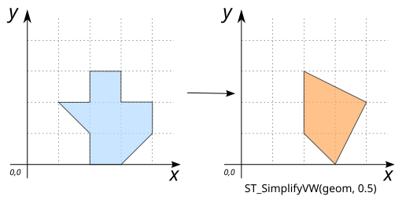

# ST_SimplifyVW

## Signature

```sql
GEOMETRY ST_SimplifyVW(GEOMETRY geom, DOUBLE distance);
```

## Description

Simplifies `geom` using the [Visvalingam-Whyatt](https://en.wikipedia.org/wiki/Visvalingam%E2%80%93Whyatt_algorithm) algorithm with a distance tolerance (`distance`).

Ensures that resulting polygonal geometries are valid.

:::{note}
**The Visvalingam-Whyatt algorithm does not preserve topology.**
To preserve the topology, use [`ST_SimplifyPreserveTopology`](./ST_SimplifyPreserveTopology).
But note that `ST_SimplifyVW` is significantly faster.
:::

## Examples

### With `LINESTRING`

```sql
SELECT ST_SimplifyVW('LINESTRING(1 1, 3 2, 1 2, 2 3, 1 4, 4 3, 4 1)', 1.5);

-- Answer: LINESTRING (1 1, 2 3, 4 3, 4 1)
```
{align=center}

```sql
SELECT ST_SimplifyVW('LINESTRING(1 1, 3 2, 1 2, 2 3, 1 4, 4 3, 4 1)', 2);

-- Answer: LINESTRING (1 1, 4 3, 4 1)
```

{align=center}

### With `POLYGON`

```sql
SELECT ST_SimplifyVW('POLYGON((2 1, 1 2, 2 2, 2 3, 3 3, 3 2, 4 2, 4 1, 3 0, 2 0, 2 1))', 0.5);

-- Answer: POLYGON ((2 1, 2 3, 4 2, 3 0, 2 1))
```

{align=center}

### With `MULTIPOLYGON`

```sql
SELECT ST_SimplifyVW('MULTIPOLYGON(((2 1, 1 2, 2 2, 2 3, 3 3, 3 2, 4 2, 4 1, 3 0, 2 0, 2 1)), 
                                   ((1 3, 0 4, 3 4, 1 3.5, 1 3)))', 0.5);

-- Answer: MULTIPOLYGON (((2 1, 2 3, 4 2, 3 0, 2 1)), ((1 3, 0 4, 3 4, 1 3)))
```

{align=center}


### With a large `distance`

If the distance tolerance is too large (compared to the geometry), the Geometry may be oversimplified:
```sql
SELECT ST_SimplifyVW('POLYGON((2 1, 1 2, 2 2, 2 3, 3 3, 3 2, 4 2, 4 1, 3 0, 2 0, 2 1))', 2);

-- Answer: GEOMETRYCOLLECTION EMPTY
```

### With `(MULTI)POINT`

`POINT`s and `MULTIPOINT`s cannot be further simplified:

```sql
SELECT ST_SimplifyVW('POINT(190 300)', 1);

-- Answer: Error
```

## See also

* [`ST_Simplify`](../ST_Simplify), [`ST_SimplifyPreserveTopology`](../ST_SimplifyPreserveTopology)
* <a href="https://github.com/orbisgis/h2gis/blob/master/h2gis-functions/src/main/java/org/h2gis/functions/spatial/generalize/ST_SimplifyVW.java" target="_blank">Source code</a>

