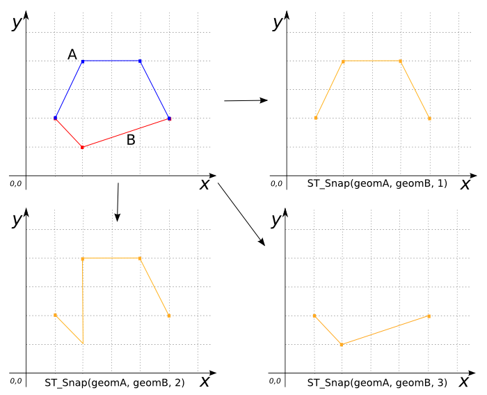
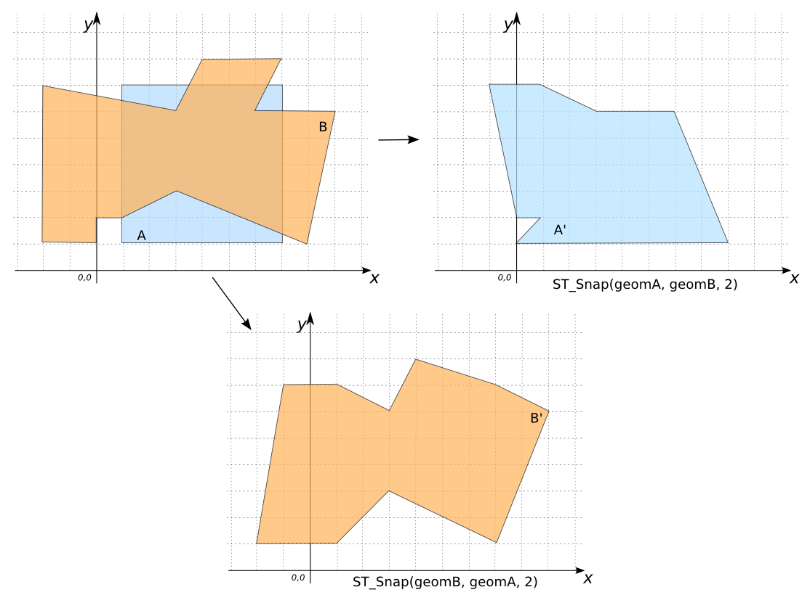

# ST_Snap

## Signature

```sql
GEOMETRY ST_Snap(GEOMETRY geomA, GEOMETRY geomB,
                 DOUBLE snapTolerance);
```

## Description

Snaps `geomA` and `geomB` together with the given `snapTolerance`.

## Examples

```sql
-- The following three examples use the same input Geometries:
SELECT ST_Snap('LINESTRING(1 2, 2 4, 4 4, 5 2)',
               'LINESTRING(5 2, 2 1, 1 2)', 1);
-- Answer:     LINESTRING(1 2, 2 4, 4 4, 5 2)

SELECT ST_Snap('LINESTRING(1 2, 2 4, 4 4, 5 2)',
               'LINESTRING(5 2, 2 1, 1 2)', 2);
-- Answer:     LINESTRING(1 2, 2 1, 2 4, 4 4, 5 2)

SELECT ST_Snap('LINESTRING(1 2, 2 4, 4 4, 5 2)',
               'LINESTRING(5 2, 2 1, 1 2)', 3);
-- Answer:     LINESTRING(1 2, 1 2, 2 1, 5 2, 5 2)
```



```sql
-- The following two examples use the same input Geometries in
-- reverse order:
SELECT ST_Snap('POLYGON((1 1, 1 7, 7 7, 7 1, 1 1))',
               'POLYGON((3 3, 1 2, 0 2, 0 1, -2 1, -1 7, 3 6,
                         4 8, 7 8, 6 6, 9 6, 8 1, 8 1, 3 3))',
               2);
-- Answer: POLYGON((0 1, 1 2, 0 2, -1 7, 1 7, 3 6, 6 6, 8 1, 0 1))

SELECT ST_Snap('POLYGON((3 3, 1 2, 0 2, 0 1, -2 1, -1 7, 3 6,
                         4 8, 7 8, 6 6, 9 6, 8 1, 8 1, 3 3))',
               'POLYGON((1 1, 1 7, 7 7, 7 1, 1 1))',
               2);
SELECT ST_Snap(geomB, geomA, 2) FROM input_table;
-- Answer: POLYGON((3 3, 1 1, 1 1, 1 1, -2 1, -1 7, 1 7, 3 6,
--                  4 8, 7 7, 7 7, 9 6, 7 1, 7 1, 3 3))
```



## See also

* <a href="https://github.com/orbisgis/h2gis/blob/master/h2gis-functions/src/main/java/org/h2gis/functions/spatial/snap/ST_Snap.java" target="_blank">Source code</a>
