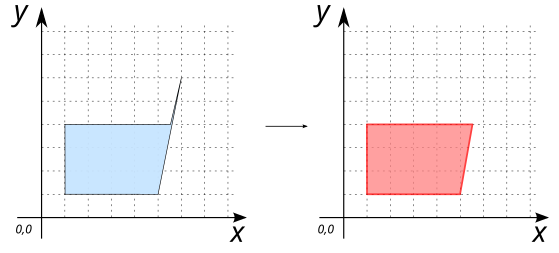

# ST_SnapToSelf

## Signature

```sql
GEOMETRY ST_SnapToSelf(GEOMETRY geom, DOUBLE snapTolerance);
GEOMETRY ST_SnapToSelf(GEOMETRY geom, DOUBLE snapTolerance, BOOLEAN clean);
```

## Description

Snap a geometry (`geom`) to itself with a given tolerance (`snapTolerance`).

Optionally, `clean` parameter allow to clean the resulting geometry making sure it is topologically valid. `TRUE` by default.

Snapping a geometry to itself can remove artifacts such as very narrow slivers, gores and spikes.

## Examples


```sql
SELECT ST_SnapToSelf('POLYGON ((1 1, 1 4, 5.5 4, 6 6, 5 1, 1 1))', 0.5);

-- Answer: POLYGON ((1 1, 1 4, 5.5 4, 5 1, 1 1))
```

{align=center}


## See also

* [`ST_Snap`](../ST_Snap)
* <a href="https://github.com/orbisgis/h2gis/blob/master/h2gis-functions/src/main/java/org/h2gis/functions/spatial/snap/ST_SnapToSelf.java" target="_blank">Source code</a>
