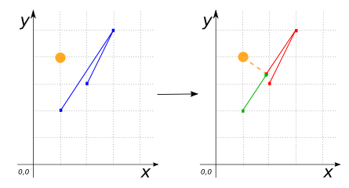
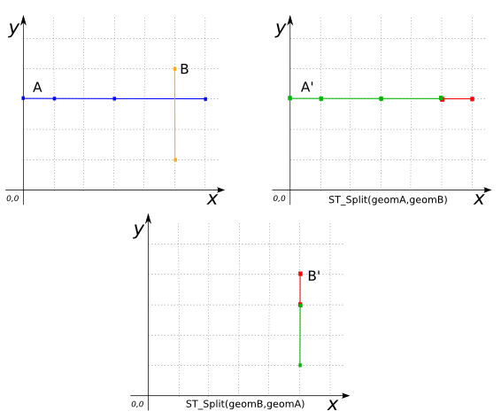
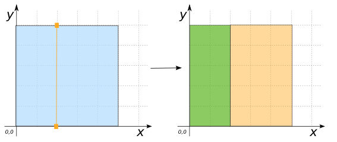

# ST_Split

## Signatures

```sql
GEOMETRY ST_Split(GEOMETRY geomA, GEOMETRY geomB);
GEOMETRY ST_Split(GEOMETRY geomA, GEOMETRY geomB,
                  DOUBLE snapTolerance);
```

## Description

Splits `geomA` by `geomB`, returning `NULL` if `geomB` does not
split `geomA`. Currently supported:

| `geomA`           | `geomB`      |
|-------------------|--------------|
| `LINESTRING`      | `POINT`      |
| `LINESTRING`      | `LINESTRING` |
| `MULTILINESTRING` | `POINT`      |
| `MULTILINESTRING` | `LINESTRING` |
| `POLYGON`         | `LINESTRING` |

When splitting a `LINESTRING` by a `POINT`, use a `snapTolerance` to
determine where the point splits the line.  If no `snapTolerance` is
defined, a default tolerance of 10E-6 is assumed.

## Examples

### LINESTRING by a POINT

The point (3 4) lies on the line, so the line is splited at exactly this point.
```sql
SELECT ST_Split('LINESTRING(4 3, 4 5, 2 3)',
                'POINT(3 4)');
-- Answer: MULTILINESTRING((4 3, 4 5, 3 4), (3 4, 2 3))
```

Here the default tolerance of 10E-6 is too small to split the line ...
```sql
SELECT ST_Split('LINESTRING(1 2, 3 5, 2 3)',
                'POINT(1 4)');
-- Answer: MULTILINESTRING EMPTY
```

But with a larger tolerance it is splited as expected.
```sql
SELECT ST_Split('LINESTRING(1 2, 3 5, 2 3)',
                'POINT(1 4)',
                2);
-- Answer: MULTILINESTRING((1 2,
--                           1.9230769230769231 3.3846153846153846),
--                          (1.9230769230769231 3.3846153846153846,
--                           3 5, 2 3))
```

{align=center}

### LINESTRING by a LINESTRING

The following two examples use the same input Geometries in reverse order:
```sql
-- 
SELECT ST_Split('LINESTRING(0 3, 1 3, 3 3, 6 3)',
                'LINESTRING(5 1, 5 4)');
-- Answer: MULTILINESTRING((0 3, 1 3, 3 3, 5 3),
--                         (5 3, 6 3))
```

```sql
SELECT ST_Split('LINESTRING(5 1, 5 4)',
                'LINESTRING(0 3, 1 3, 3 3, 6 3)');
-- Answer: MULTILINESTRING((5 1, 5 3), (5 3, 5 4))
```

{align=center}

### POLYGON by a LINESTRING

```sql
SELECT ST_Split('POLYGON((0 0, 5 0, 5 5, 0 5, 0 0))',
                'LINESTRING(2 0, 2 5)');
-- Answer: MULTIPOLYGON(((2 0, 0 0, 0 5, 2 5, 2 0)),
--                      ((5 5, 5 0, 2 0, 2 5, 5 5)))
```

{align=center}

If we split the same POLYGON with a hole, we get the expected result:
```sql
SELECT ST_Split('POLYGON((0 0, 10 0, 10 10, 0 10, 0 0),
                         (2 2, 7 2, 7 7, 2 7, 2 2))',
                'LINESTRING(5 0, 5 10)');
-- Answer: MULTIPOLYGON(((5 0, 0 0, 0 10, 5 10, 5 7,
--                        2 7, 2 2, 5 2, 5 0)),
--                      ((5 10, 10 10, 10 0, 5 0, 5 2,
--                        7 2, 7 7, 5 7, 5 10)))
```

The LINESTRING does not split the POLYGON, so the answer is NULL
```sql
SELECT ST_Split('POLYGON((0 0, 10 0, 10 10, 0 10, 0 0))',
                'LINESTRING(5 1, 5 12)');
-- Answer: NULL
```

## See also

* [`ST_Clip`](../ST_Clip), [`ST_LineIntersector`](../ST_LineIntersector), [`ST_Intersection`](../ST_Intersection)
* <a href="https://github.com/orbisgis/h2gis/blob/master/h2gis-functions/src/main/java/org/h2gis/functions/spatial/split/ST_Split.java" target="_blank">Source code</a>
