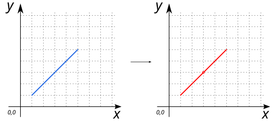
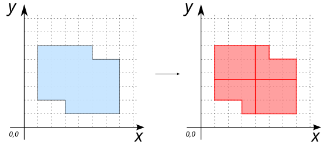
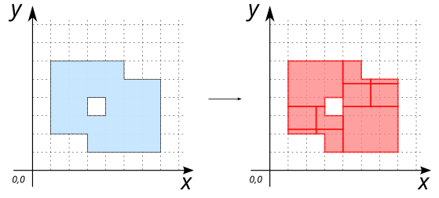

# ST_SubDivide

## Signatures

```sql
GEOMETRY ST_SubDivide(GEOMETRY geom);
GEOMETRY ST_SubDivide(GEOMETRY geom, INTEGER max_vertices);
```

## Description

Divides geometry (`geom`) into parts using its internal envelope, until each part can be represented using no more than `max_vertices`. If no vertices, apply a single recurve.

Where:

* `max_vertices` : maximum number of vertices in the resulting geometry

## Examples

### With a `LINESTRING`

```sql
SELECT ST_subdivide('LINESTRING (1 1, 5 5)');

-- Answer: GEOMETRYCOLLECTION (POINT (3 3), 
--                             LINESTRING (3 3, 5 5), 
--                             LINESTRING (1 1, 3 3), 
--                             POINT (3 3))
```
{align=center}

### With a `POLYGON`

```sql
SELECT st_SubDivide('POLYGON((1 2, 1 6, 5 6, 5 5, 7 5, 7 1, 3 1, 3 2, 1 2))',6);

-- Answer: MULTIPOLYGON (((1 3.5, 1 6, 4 6, 4 3.5, 1 3.5)), 
--                       ((4 3.5, 4 6, 5 6, 5 5, 7 5, 7 3.5, 4 3.5)), 
--                       ((1 2, 1 3.5, 4 3.5, 4 1, 3 1, 3 2, 1 2)), 
--                       ((4 1, 4 3.5, 7 3.5, 7 1, 4 1)))
```
{align=center}


### With a `POLYGON` having a hole

```sql
SELECT st_SubDivide('POLYGON((1 2, 1 6, 5 6, 5 5, 7 5, 7 1, 3 1, 3 2, 1 2), 
                             (3 3, 3 4, 4 4, 4 3, 3 3))',6);

-- Answer: GEOMETRYCOLLECTION (
--              LINESTRING (4 4, 4 3.5), 
--              POLYGON ((1 3.5, 1 6, 4 6, 4 4, 3 4, 3 3.5, 1 3.5)), 
--              LINESTRING (4 3.5, 4 3), 
--              POLYGON ((4 1, 4 3, 4 3.5, 7 3.5, 7 1, 4 1)), 
--              POLYGON ((1 2.25, 1 3.5, 2.5 3.5, 2.5 2.25, 1 2.25)), 
--              POLYGON ((2.5 2.25, 2.5 3.5, 3 3.5, 3 3, 4 3, 4 2.25, 2.5 2.25)), 
--              POLYGON ((1 2, 1 2.25, 2.5 2.25, 2.5 2, 1 2)), 
--              POLYGON ((2.5 2, 2.5 2.25, 4 2.25, 4 1, 3 1, 3 2, 2.5 2)), 
--              POLYGON ((4 4.75, 4 6, 5 6, 5 5, 5.5 5, 5.5 4.75, 4 4.75)), 
--              POLYGON ((5.5 4.75, 5.5 5, 7 5, 7 4.75, 5.5 4.75)), 
--              POLYGON ((4 3.5, 4 4, 4 4.75, 5.5 4.75, 5.5 3.5, 4 3.5)), 
--              POLYGON ((5.5 3.5, 5.5 4.75, 7 4.75, 7 3.5, 5.5 3.5)))
```
{align=center}


## See also

* [`ST_Split`](../ST_Split), [`ST_Clip`](../ST_Clip), [`ST_LineIntersector`](../ST_LineIntersector)
* <a href="https://github.com/orbisgis/h2gis/blob/master/h2gis-functions/src/main/java/org/h2gis/functions/spatial/split/ST_SubDivide.java" target="_blank">Source code</a>
