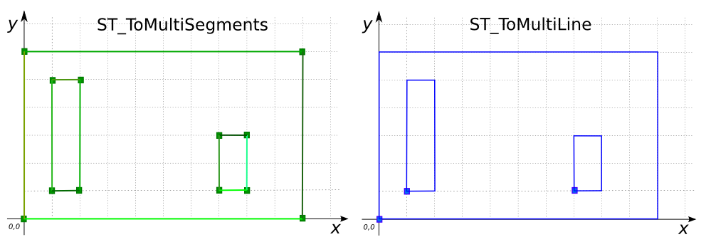

# ST_ToMultiLine

## Signatures

```sql
MULTILINESTRING ST_ToMultiLine(GEOMETRY geom);
MULTILINESTRING ST_ToMultiLine(GEOMETRYCOLLECTION geom);
```

## Description

Constructs a `MULTILINESTRING` from `geom`'s coordinates. Returns `MULTILINESTRING EMPTY` for Geometries of dimension 0.

## Examples

```sql
SELECT ST_ToMultiLine('POLYGON((0 0, 10 0, 10 6, 0 6, 0 0),
                               (1 1, 2 1, 2 5, 1 5, 1 1))');
-- Answer: MULTILINESTRING((0 0, 10 0, 10 5, 0 5, 0 0),
--                         (1 1, 2 1, 2 4, 1 4, 1 1))
```

{align=center}

```sql
SELECT ST_ToMultiLine(
    'GEOMETRYCOLLECTION(
       LINESTRING(1 4 3, 10 7 9, 12 9 22),
       POLYGON((1 1 -1, 3 1 0, 3 2 1, 1 2 2, 1 1 -1)))');
-- Answer: MULTILINESTRING((1 4, 10 7, 12 9),
--                         (1 1, 3 1, 3 2, 1 2, 1 1))
```

{align=center}

```sql
SELECT ST_ToMultiLine('POINT(2 4)');
-- Answer: MULTILINESTRING EMPTY
```

### Comparison with [`ST_ToMultiSegments`](../ST_ToMultiSegments)

```sql
CREATE TABLE input(poly GEOMETRY(POLYGON));
INSERT INTO input VALUES (
    'POLYGON((0 0, 10 0, 10 6, 0 6, 0 0),
             (1 1, 2 1, 2 5, 1 5, 1 1),
             (7 1, 8 1, 8 3, 7 3, 7 1))');
SELECT ST_ToMultiSegments(poly) SEG,
       ST_ToMultiLine(poly) LINE FROM input;
```

Answer:
|              SEG             |               LINE              |
|------------------------------|---------------------------------|
|MULTILINESTRING(<br>(0 0, 10 0), (10 0, 10 6), (10 6, 0 6), (0 6, 0 0),<br> (1 1, 2 1), (2 1, 2 5), (2 5, 1 5), (1 5, 1 1),<br> (7 1, 8 1), (8 1, 8 3), (8 3, 7 3), (7 3, 7 1)) |MULTILINESTRING ((0 0, 10 0, 10 6, 0 6, 0 0),<br> (1 1, 2 1, 2 5, 1 5, 1 1),<br> (7 1, 8 1, 8 3, 7 3, 7 1)) |

{align=center}

## See also

* [`ST_ToMultiPoint`](../ST_ToMultiPoint), [`ST_ToMultiSegments`](../ST_ToMultiSegments)
* <a href="https://github.com/orbisgis/h2gis/blob/master/h2gis-functions/src/main/java/org/h2gis/functions/spatial/convert/ST_ToMultiLine.java" target="_blank">Source code</a>
