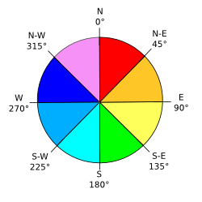

# ST_TriangleAspect

## Signature

```sql
DOUBLE ST_TriangleAspect(GEOMETRY geom);
```

## Description

Returns the aspect value of `geom` in degrees. Throws an error if
`geom` is not a triangle.

Aspect represents the main slope direction angle compared to the
north direction. It can be thought of as the slope direction.

{align=center}

## Examples

```sql
SELECT ST_TriangleAspect('POLYGON((0 0 0, 3 0 0, 0 3 0, 0 0 0))');
-- Answer: 0.0

SELECT ST_TriangleAspect('POLYGON((0 0 1, 3 0 0, 0 3 1, 0 0 1))');
-- Answer: 90.0

SELECT ST_TriangleAspect('POLYGON((0 0 1, 3 0 1, 0 3 0, 0 0 1))');
-- Answer: 0.0

SELECT ST_TriangleAspect('POLYGON((0 0 1, 3 0 0, 3 3 1, 0 0 1))');
-- Answer: 135.0

SELECT ST_TriangleAspect(
    'POLYGON((0 0 0, 3 0 0, 3 3 0, 0 3 0, 0 0 0))');
-- Exception calling user-defined function:
--     "computeAspect(POLYGON ((0 0, 3 0, 3 3, 0 3, 0 0))):
--     The geometry must be a triangle"
```

## See also

* [`ST_TriangleContouring`](../ST_TriangleContouring),
  [`ST_TriangleDirection`](../ST_TriangleDirection),
  [`ST_TriangleSlope`](../ST_TriangleSlope)
* <a href="https://github.com/orbisgis/h2gis/blob/master/h2gis-functions/src/main/java/org/h2gis/functions/spatial/topography/ST_TriangleAspect.java" target="_blank">Source code</a>
