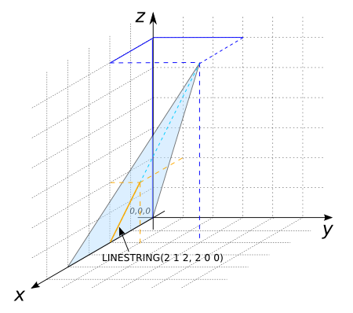

# ST_TriangleDirection

## Signature

```sql
LINESTRING ST_TriangleDirection(GEOMETRY geom);
```

## Description

Computes the direction of steepest ascent of the triangle `geom` and
represents it as a `LINESTRING`.
Returns `LINESTRING EMPTY` if all vertices of the triangle have the
same *z*-value.
Throws an error if `geom` is not a triangle.

## Examples

```sql
SELECT ST_TriangleDirection('POLYGON((0 0 0, 4 0 0, 2 3 6, 0 0 0))');
-- Answer: LINESTRING(2 1 2, 2 0 0)
```
In the next two examples, all z-values are the same.
```sql
SELECT ST_TriangleDirection('POLYGON((0 0 0, 2 0 0, 1 1 0, 0 0 0))');
-- Answer: LINESTRING EMPTY
```

```sql
SELECT ST_TriangleDirection('POLYGON((0 0 1, 2 0 1, 1 1 1, 0 0 1))');
-- Answer: LINESTRING EMPTY
```
We try the function on a square
```sql
SELECT ST_TriangleDirection('POLYGON((0 0 1, 3 0 0, 3 3 4, 0 3 1, 0 0 1))');
-- Answer: Exception calling user-defined function:
--         "computeDirection(POLYGON ((0 0, 3 0, 3 3, 0 3, 0 0))):
--         The geometry must be a triangle"
```

{align=center}

## See also

* [`ST_TriangleAspect`](../ST_TriangleAspect),
  [`ST_TriangleContouring`](../ST_TriangleContouring),
  [`ST_TriangleSlope`](../ST_TriangleSlope)
* <a href="https://github.com/orbisgis/h2gis/blob/master/h2gis-functions/src/main/java/org/h2gis/functions/spatial/topography/ST_TriangleDirection.java" target="_blank">Source code</a>
