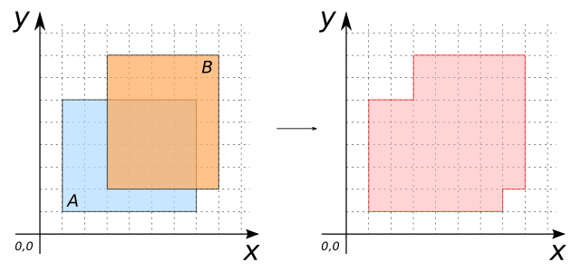
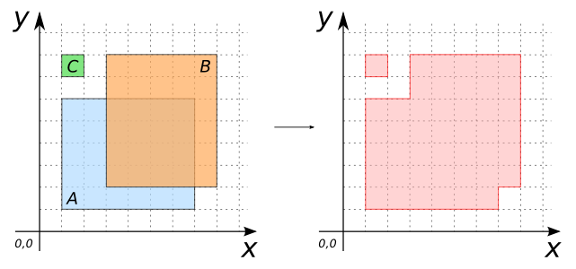

# ST_Union

## Signatures

```sql
GEOMETRY ST_Union(GEOMETRY geomA);
GEOMETRY ST_Union(GEOMETRY geomA, GEOMETRY geomB);
GEOMETRY ST_Union(GEOMETRYCOLLECTION geom);
```

## Description

`ST_Union` can be used as a scalar or an aggregate function.

### Scalar function

Computes the union of one or more Geometries.
Input Geometries can be `(MULTI)POINT`s, `(MULTI)LINESTRING`s, `(MULTI)POLYGON`s or `GEOMETRYCOLLECTION`s.

### Aggregate function
Computes the union of a set of Geometries.
`geom` is a `GEOMETRYCOLLECTION` resulting from an `ST_Accum` operation on a table.

### In both cases:
  * If no input Geometriy is given, the result is `NULL`.
  * Output Geometries can be single or multiple.

```{include} sfs-1-2-1.md
```

## Examples

### Scalar function

| geomA Polygon                      | geomB Polygon                      |
|------------------------------------|------------------------------------|
| POLYGON((1 1, 7 1, 7 6, 1 6, 1 1)) | POLYGON((3 2, 8 2, 8 8, 3 8, 3 2)) |

```sql
SELECT ST_Union(geomA, geomB) FROM input_table;
-- Answer: POLYGON((7 2, 7 1, 1 1, 1 6, 3 6, 3 8, 8 8, 8 2, 7 2))
```

{align=center}

### Aggregate function

```sql
CREATE TABLE input_table(geom GEOMETRY(POLYGON));
INSERT INTO input_table VALUES
     ('POLYGON((1 1, 7 1, 7 6, 1 6, 1 1))'),
     ('POLYGON((3 2, 8 2, 8 8, 3 8, 3 2))'),
     ('POLYGON((1 7, 2 7, 2 8, 1 8, 1 7))');
SELECT ST_Union(ST_Accum(geom)) FROM input_table;
-- Answer: MULTIPOLYGON(((7 2, 7 1, 1 1, 1 6, 3 6, 3 8, 8 8, 8 2, 7 2)),
--                       ((1 7, 2 7, 2 8, 1 8, 1 7)))
```

{align=center}

## See also

* [`ST_Accum`](../ST_Accum)
* <a href="https://github.com/orbisgis/h2gis/blob/master/h2gis-functions/src/main/java/org/h2gis/functions/spatial/operators/ST_Union.java" target="_blank">Source code</a>
