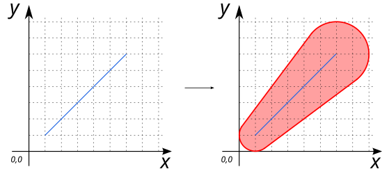

# ST_VariableBuffer

## Signatures

```sql
GEOMETRY ST_VariableBuffer(GEOMETRY geom, DOUBLE startDistance, DOUBLE endDistance);
```

## Description

Create a buffer polygon along a `LINESTRING` (`geom`) with the buffer width interpolated between a start distance (`startDistance`) and an end distance (`endDistance`), both given in projection units.

:::{warning}
This function only works with `LINESTRING`
:::

:::{warning}
This function remove `Z`, `M` or `ZM` dimension of input coordinates
:::


## Example

```sql
SELECT ST_VariableBuffer('LINESTRING (1 1, 6 6)', 1, 2);

-- Answer: POLYGON ((0.2 1.6, 4.4 7.2, 4.585786437626905 7.414213562373095, 4.888859533960796 7.662939224605091, 5.234633135269821 7.847759065022574, 5.609819355967744 7.961570560806461, 6 8, 6.390180644032257 7.961570560806461, 6.765366864730179 7.847759065022574, 7.111140466039204 7.662939224605091, 7.414213562373095 7.414213562373095, 7.662939224605091 7.111140466039204, 7.847759065022574 6.765366864730179, 7.961570560806461 6.390180644032257, 8 6, 7.961570560806461 5.609819355967743, 7.847759065022574 5.234633135269821, 7.662939224605091 4.888859533960796, 7.2 4.4, 1.6 0.2, 1.5555702330196017 0.1685303876974545, 1.38268343236509 0.0761204674887134, 1.1950903220161284 0.0192147195967696, 1 0, 0.8049096779838714 0.0192147195967697, 0.6173165676349097 0.0761204674887135, 0.4444297669803978 0.1685303876974548, 0.2928932188134523 0.2928932188134525, 0.1685303876974545 0.444429766980398, 0.0761204674887132 0.6173165676349104, 0.0192147195967696 0.8049096779838716, 0 1, 0.0192147195967696 1.1950903220161286, 0.0761204674887133 1.3826834323650898, 0.1685303876974547 1.5555702330196022, 0.2 1.6))
```
{align=center}

### Case with `Z`, `M` or `ZM` dimension

In this example, we have a `LINESTRING Z`
```sql
SELECT ST_VariableBuffer('LINESTRING Z(1 1 0, 6 6 3)', 1, 2);
```
As a result, we obtain a `2D POLYGON`
```sql
POLYGON ((0.2 1.6, 4.4 7.2, 4.585786437626905 7.414213562373095, 4.888859533960796 7.662939224605091, 5.234633135269821 7.847759065022574, 5.609819355967744 7.961570560806461, 6 8, 6.390180644032257 7.961570560806461, 6.765366864730179 7.847759065022574, 7.111140466039204 7.662939224605091, 7.414213562373095 7.414213562373095, 7.662939224605091 7.111140466039204, 7.847759065022574 6.765366864730179, 7.961570560806461 6.390180644032257, 8 6, 7.961570560806461 5.609819355967743, 7.847759065022574 5.234633135269821, 7.662939224605091 4.888859533960796, 7.2 4.4, 1.6 0.2, 1.5555702330196017 0.1685303876974545, 1.38268343236509 0.0761204674887134, 1.1950903220161284 0.0192147195967696, 1 0, 0.8049096779838714 0.0192147195967697, 0.6173165676349097 0.0761204674887135, 0.4444297669803978 0.1685303876974548, 0.2928932188134523 0.2928932188134525, 0.1685303876974545 0.444429766980398, 0.0761204674887132 0.6173165676349104, 0.0192147195967696 0.8049096779838716, 0 1, 0.0192147195967696 1.1950903220161286, 0.0761204674887133 1.3826834323650898, 0.1685303876974547 1.5555702330196022, 0.2 1.6))
```


## See also
* [`ST_Buffer`](../ST_Buffer), [`ST_SideBuffer`](../ST_SideBuffer), [`ST_RingBuffer`](../ST_RingBuffer), [`ST_RingSideBuffer`](../ST_RingSideBuffer)
* <a href="https://github.com/orbisgis/h2gis/blob/master/h2gis-functions/src/main/java/org/h2gis/functions/spatial/buffer/ST_VariableBuffer.java" target="_blank">Source code</a>
