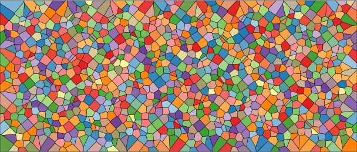

# ST_Voronoi

## Signatures

```sql
-- Return type: geometry
ST_VORONOI(THE_GEOM MULTIPOINTS)
ST_VORONOI(THE_GEOM MULTIPOINTS,OUT_DIMENSION INTEGER)
ST_VORONOI(THE_GEOM MULTIPOINTS,OUT_DIMENSION INTEGER,ENVELOPE POLYGON)

ST_VORONOI(THE_GEOM MULTIPOLYGON)
ST_VORONOI(THE_GEOM MULTIPOLYGON,OUT_DIMENSION INTEGER)
ST_VORONOI(THE_GEOM MULTIPOLYGON,OUT_DIMENSION INTEGER,ENVELOPE POLYGON)
```

## Description

Create Voronoi diagram from a set of points or a Delaunay mesh.

`OUT_DIMENSION` Geometry dimension of voronoi returned:

 - `0` for Voronoi vertex (circumcenter of delaunay triangles)
 - `1` for Voronoi edges
 - `2` (default) for Voronoi polygons

### MULTIPOINT input

If the input is a `MULTIPOINT` then a [QuadEdge delaunay graph](http://tsusiatsoftware.net/jts/javadoc/com/vividsolutions/jts/triangulate/VoronoiDiagramBuilder.html) is produced internally with a minimal envelope. At the final step the voronoi polygons/lines/vertex are produced. Z values are ignored.

### MULTIPOLYGON input

If the input is  a `MULTIPOLYGON` made of triangles mesh. Using geometry coordinates this function compute the triangle neighbors of the provided mesh.

## Examples

```sql
-- Create input data point cloud
drop table if exists pts;
create table pts as select ST_MakePoint(A.X + (COS(B.X)), B.X - (SIN(A.X)), 
	ROUND(LOG10(1 + A.X * (5 * B.X)),2)) THE_GEOM 
	from SYSTEM_RANGE(0,50) A, SYSTEM_RANGE(30,50) B;
```

Create classic voronoi polygons with default envelope. (Z values are not kept.)
```sql
drop table if exists voro;
create table voro as select ST_VORONOI(ST_ACCUM(the_geom)) the_geom from PTS;
```

Create voronoi polygons with Z values with input points as envelope. Then create a new table with one voronoi polygon per row.

```sql
drop table if exists voro;
create table voro as select ST_VORONOI(ST_DELAUNAY(
	ST_ACCUM(the_geom)), 2 , 
	ST_ACCUM(the_geom)) the_geom from PTS;
drop table if exists voroexpl;
create table voroexpl as select * from st_explode('voro');
```

{align=center}

### Use case
A specific use case, using `ST_Voronoi` function is avalaible [HERE](https://github.com/orbisgis/h2gis/wiki/3.1-Extract-central-skeleton).

## See also

* [`ST_Delaunay`](../ST_Delaunay)
* <a href="https://github.com/orbisgis/h2gis/blob/master/h2gis-functions/src/main/java/org/h2gis/functions/spatial/mesh/ST_Voronoi.java" target="_blank">Source code</a>
