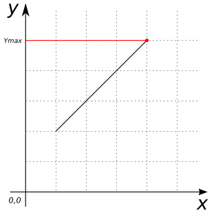

# ST_YMax

## Signature

```sql
DOUBLE ST_YMax(GEOMETRY geom);
```

## Description

Returns the maximum y-value of `geom`.

## Example

```sql
SELECT ST_YMax('LINESTRING(1 2 3, 4 5 6)');
-- Answer:    5.0
```

{align=center}

## See also

* [`ST_XMin`](../ST_XMin), [`ST_XMax`](../ST_XMax), [`ST_YMin`](../ST_YMin), [`ST_ZMax`](../ST_ZMax), [`ST_ZMin`](../ST_ZMin)
* <a href="https://github.com/orbisgis/h2gis/blob/master/h2gis-functions/src/main/java/org/h2gis/functions/spatial/properties/ST_YMax.java" target="_blank">Source code</a>
