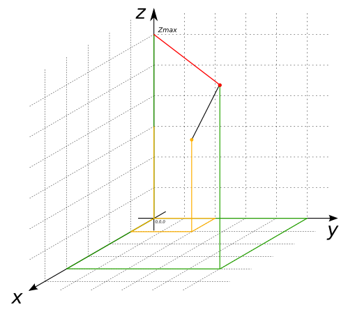

# ST_ZMax

## Signature

```sql
DOUBLE ST_ZMax(GEOMETRY geom);
```

## Description

Returns the maximum z-value of `geom`.

## Example

```sql
SELECT ST_ZMax('LINESTRING(1 2 3, 4 5 6)');
-- Answer:    6.0
```



## See also

* [`ST_XMin`](../ST_XMin), [`ST_XMax`](../ST_XMax), [`ST_YMax`](../ST_YMax), [`ST_YMin`](../ST_YMin), [`ST_ZMin`](../ST_ZMin)
* <a href="https://github.com/orbisgis/h2gis/blob/master/h2gis-functions/src/main/java/org/h2gis/functions/spatial/properties/ST_ZMax.java" target="_blank">Source code</a>
