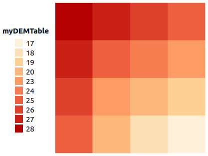

### Signatures


ASCRead(VARCHAR path);
ASCRead(VARCHAR path, BOOLEAN deleteTable);

ASCRead(VARCHAR path, VARCHAR myTable);
ASCRead(VARCHAR path, VARCHAR myTable, BOOLEAN deleteTable);

ASCRead(VARCHAR path, INTEGER type);
ASCRead(VARCHAR path, INTEGER type, BOOLEAN deleteTable);

ASCRead(VARCHAR path, VARCHAR myTable, INTEGER type);
ASCRead(VARCHAR path, VARCHAR myTable, INTEGER type, BOOLEAN deleteTable);

ASCRead(VARCHAR path, VARCHAR myTable, GEOMETRY geomFilter, 
        INTEGER downScaleInt, BOOLEAN asPolygons);
ASCRead(VARCHAR path, VARCHAR myTable, GEOMETRY geomFilter, 
        INTEGER downScaleInt, BOOLEAN asPolygons, BOOLEAN deleteTable);


### Description

Import Esri ASCII Raster file as `POINT` or `POLYGON` geometries.

Pixels are converted into `PointZ` (or `PolygonZ`) geometry with Z as the pixel value (stored as `DOUBLE`).

Where:

- `path` : adress of the `.asc` file. This file may be zipped in a `.gz` file *(in this case, the `ASCRead` driver will unzip on the fly the `.gz` file)*, 
- `myTable` : name of the output table,
- `type` : indicates whether the `z` data type will be casted to INTEGER (`1`) or left as DOUBLE (`2` - default value),
- `geomFilter` : extract only pixels that intersects the provided geometry envelope (`null` or empty argument to disable filter),
- `downScaleInt` : a coefficient used for exporting less cells (`1` all cells, `2` for size / 2, ...),
- `asPolygons` : if `true`, pixels are converted into polygons (default value = `false` return points),
- `deleteTable` : if `true` and table `tableName` already exists in the database, then table `tableName` will be removed / replaced by the new one. Else (no `deleteTable` parameter or `deleteTable` equal to `false`), throw an exception if the `tableName` already exist.

### Examples

We assume that we have the following `.asc` file, named `dem` and placed here: `/home/user/`.

```java
ncols        4
nrows        4
xllcorner    10
yllcorner    10
cellsize     5.0
NODATA_value  -9999
 28 27 26 25
 27 25 24 23
 26 23 20 19
 25 20 18 17
```


##### 1. Using the `path`


CALL ASCREAD('/home/user/dem.asc');


Returns the table `dem`, with the following values:

|   PK  | THE_GEOM |  Z  |
|:-----:|:--------:|:---:|
| 1 |    POINT Z (12.5 27.5 28)   | 28.0 |
| 2 |    POINT Z (17.5 27.5 27)   | 27.0 |
| 3 |    POINT Z (22.5 27.5 26)   | 26.0 |
| 4 |    POINT Z (27.5 27.5 25)   | 25.0 |
| 5 |    POINT Z (12.5 22.5 27)   | 27.0 |
| 6 |    POINT Z (17.5 22.5 25)   | 25.0 |
| 7 |    POINT Z (22.5 22.5 24)   | 24.0 |
| 8 |    POINT Z (27.5 22.5 23)   | 23.0 |
| 9 |    POINT Z (12.5 17.5 26)   | 26.0 |
| 10 |    POINT Z (17.5 17.5 23)   | 23.0 |
| 11 |    POINT Z (22.5 17.5 20)   | 20.0 |
| 12 |    POINT Z (27.5 17.5 19)   | 19.0 |
| 13 |    POINT Z (12.5 12.5 25)   | 25.0 |
| 14 |    POINT Z (17.5 12.5 20)   | 20.0 |
| 15 |    POINT Z (22.5 12.5 18)   | 18.0 |
| 16 |    POINT Z (27.5 12.5 17)   | 17.0 |

**Remark**: If the `dem.asc` has been zipped into a `.gz` file, execute the following instruction:


CALL ASCREAD('/home/user/dem.asc.gz');


In this case, since the `myTable` parameter has not been specified, the resuling table will be named `DEM_ASC`.

##### 2. Using `myTable`


CALL ASCREAD('/home/user/dem.asc', 'myDEMTable');


Returns the table `myDEMTable` (same as `dem` table)

|   PK  | THE_GEOM |  Z  |
|:-----:|:--------:|:---:|
| 1 |    POINT Z (12.5 27.5 28)   | 28.0 |
| 2 |    POINT Z (17.5 27.5 27)   | 27.0 |
| ... |    ...   | ... |


##### 3. Using `type`

Here we want to convert Z value into INTEGER

CALL ASCREAD('/home/user/dem.asc', 1);


Returns the table `myDEMTable`

|   PK  | THE_GEOM |  Z  |
|:-----:|:--------:|:---:|
| 1 |    POINT Z (12.5 27.5 28)   | 28 |
| 2 |    POINT Z (17.5 27.5 27)   | 27 |
| ... |    ...   | ... |


##### 4. Using `geomFilter`
Here, we want to keep only `POINT`s that intersect this geometry: `POLYGON((15 15, 15 25, 25 25, 25 15, 15 15))`


CALL ASCREAD(
  '/home/user/dem.asc', 
  'myDEMTable', 
  ST_GeomFromText('POLYGON((15 15, 15 25, 25 25, 25 15, 15 15))'),
  1, false);


Returns the table `myDEMTable`, with the following values:

| PK   |       THE_GEOM         | Z   |
|:----:|:----------------------:|:---:|
| 1    | POINT Z (17.5 22.5 25) | 25.0  |
| 2    | POINT Z (22.5 22.5 24) | 24.0  |
| 3    | POINT Z (27.5 22.5 23) | 23.0  |
| 4    | POINT Z (17.5 17.5 23) | 23.0  |
| 5    | POINT Z (22.5 17.5 20) | 20.0  |
| 6    | POINT Z (27.5 17.5 19) | 19.0  |
| 7    | POINT Z (17.5 12.5 20) | 20.0  |
| 8    | POINT Z (22.5 12.5 18) | 18.0  |
| 9    | POINT Z (27.5 12.5 17) | 17.0  |


##### 5. Using `downScaleInt`

Here we want to divide the matrix size by 2


CALL ASCREAD('/home/user/dem.asc', 'myDEMTable', null, 2, false);


Returns the table `myDEMTable`, with the following values:

| PK   |       THE_GEOM         | Z   |
|:----:|:----------------------:|:---:|
| 1    | POINT Z (12.5 27.5 28) | 28.0  |
| 2    | POINT Z (22.5 27.5 26) | 26.0  |
| 3    | POINT Z (12.5 17.5 26) | 26.0  |
| 4    | POINT Z (22.5 17.5 20) | 20.0  |


##### 6. Using `asPolygons`

Here we want to have a resulting `POLYGON` layer. 


CALL ASCREAD('/home/user/dem.asc', 'myDEMTable', null, 1, true);


Returns the table `myDEMTable`, with the following values:



| PK   |                           THE_GEOM                             | Z   |
|:----:|:--------------------------------------------------------------:|:---:|
|   <sub>1</sub>  | <sub>POLYGON Z ((10 30 28, 10 25 28, 15 25 28, 15 30 28, 10 30 28))</sub> |  <sub>28.0</sub> |
|   <sub>2</sub>  | <sub>POLYGON Z ((15 30 27, 15 25 27, 20 25 27, 20 30 27, 15 30 27))</sub> |  <sub>27.0</sub> |
|   <sub>3</sub>  | <sub>POLYGON Z ((20 30 26, 20 25 26, 25 25 26, 25 30 26, 20 30 26))</sub> |  <sub>26.0</sub> |
|   <sub>4</sub>  | <sub>POLYGON Z ((25 30 25, 25 25 25, 30 25 25, 30 30 25, 25 30 25))</sub> |  <sub>25.0</sub> |
|   <sub>5</sub>  | <sub>POLYGON Z ((10 25 27, 10 20 27, 15 20 27, 15 25 27, 10 25 27))</sub> |  <sub>27.0</sub> |
|   <sub>6</sub>  | <sub>POLYGON Z ((15 25 25, 15 20 25, 20 20 25, 20 25 25, 15 25 25))</sub> |  <sub>25.0</sub> |
|   <sub>7</sub>  | <sub>POLYGON Z ((20 25 24, 20 20 24, 25 20 24, 25 25 24, 20 25 24))</sub> |  <sub>24.0</sub> |
|   <sub>8</sub>  | <sub>POLYGON Z ((25 25 23, 25 20 23, 30 20 23, 30 25 23, 25 25 23))</sub> |  <sub>23.0</sub> |
|   <sub>9</sub>  | <sub>POLYGON Z ((10 20 26, 10 15 26, 15 15 26, 15 20 26, 10 20 26))</sub> |  <sub>26.0</sub> |
|  <sub>10</sub>  | <sub>POLYGON Z ((15 20 23, 15 15 23, 20 15 23, 20 20 23, 15 20 23))</sub> |  <sub>23.0</sub> |
|  <sub>11</sub>  | <sub>POLYGON Z ((20 20 20, 20 15 20, 25 15 20, 25 20 20, 20 20 20))</sub> |  <sub>20.0</sub> |
|  <sub>12</sub>  | <sub>POLYGON Z ((25 20 19, 25 15 19, 30 15 19, 30 20 19, 25 20 19))</sub> |  <sub>19.0</sub> |
|  <sub>13</sub>  | <sub>POLYGON Z ((10 15 25, 10 10 25, 15 10 25, 15 15 25, 10 15 25))</sub> |  <sub>25.0</sub> |
|  <sub>14</sub>  | <sub>POLYGON Z ((15 15 20, 15 10 20, 20 10 20, 20 15 20, 15 15 20))</sub> |  <sub>20.0</sub> |
|  <sub>15</sub>  | <sub>POLYGON Z ((20 15 18, 20 10 18, 25 10 18, 25 15 18, 20 15 18))</sub> |  <sub>18.0</sub> |
|  <sub>16</sub>  | <sub>POLYGON Z ((25 15 17, 25 10 17, 30 10 17, 30 15 17, 25 15 17))</sub> |  <sub>17.0</sub> |


##### See also

* [`CSVRead`](../CSVRead)
* <a href="https://github.com/orbisgis/h2gis/blob/master/h2gis-functions/src/main/java/org/h2gis/functions/io/asc/AscRead.java"
target="_blank">Source code</a>
