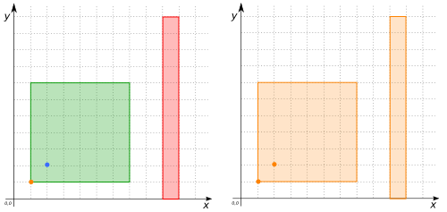

### Signatures


GEOMETRYCOLLECTION ST_Accum(GEOMETRY geom);


### Description

This aggregate function constructs a `GEOMETRYCOLLECTION` from a column of Geometries.

### Examples


CREATE TABLE input_table(geom GEOMETRY);
INSERT INTO input_table VALUES
    ('POLYGON ((9 0, 9 11, 10 11, 10 0, 9 0))'),
    ('POLYGON ((1 1, 1 7, 7 7, 7 1, 1 1))'),
    ('POINT (1 1)'),
    ('POINT (2 2)');
SELECT ST_Accum(geom) FROM input_table;
-- Answer: GEOMETRYCOLLECTION (
--    POLYGON ((9 0, 9 11, 10 11, 10 0, 9 0)),
--    POLYGON ((1 1, 1 7, 7 7, 7 1, 1 1)),
--    POINT (1 1), POINT (2 2))


##### See also

* [`ST_Union`](../ST_Union), [`ST_Explode`](../ST_Explode)
* <a href="https://github.com/irstv/H2GIS/blob/master/h2spatial/src/main/java/org/h2gis/h2spatial/internal/function/spatial/aggregate/ST_Accum.java" target="_blank">Source code</a>
