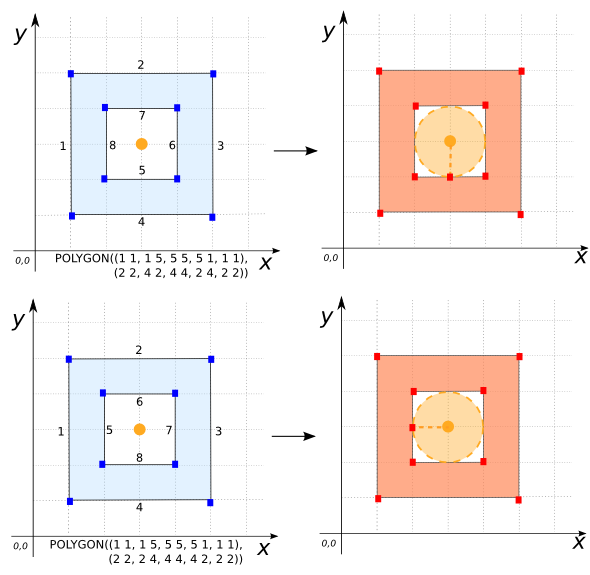
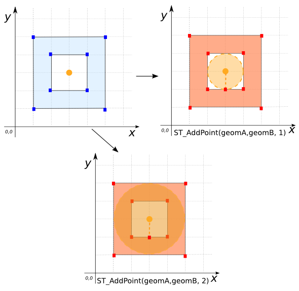

### Signature


GEOMETRY ST_AddPoint(GEOMETRY geom, POINT point);
GEOMETRY ST_AddPoint(GEOMETRY geom, POINT point, double tolerance);


### Description
Returns a new `GEOMETRY` based on an existing one, with a specific `POINT` as a new vertex.
A `tolerance` could be set to snap the POINT to the GEOMETRY. A 
default distance 10E-6 is used to snap the input `POINT`.
If the tolerance intersects several segments, the returned vertex is the closest and the first one.

### Examples


SELECT ST_AddPoint('POINT(0 0)', 'POINT(1 1)');
-- Answer: null

SELECT ST_AddPoint('MULTIPOINT((0 0), (3 3))', 'POINT(1 1)');
-- Answer: MULTIPOINT((0 0), (3 3), (1 1))

SELECT ST_AddPoint('LINESTRING(0 8, 1 8 , 3 8, 8 8, 
                               10 8, 20 8)', 
                   'POINT(1.5 4)', 
                   4);
-- Answer: LINESTRING(0 8, 1 8, 1.5 8, 3 8, 8 8, 10 8, 20 8)

SELECT ST_AddPoint('LINESTRING(1 2, 2 4, 3 4, 4 5, 5 2)', 
                   'POINT(4 3)', 
                   1);
-- Answer: LINESTRING(1 2, 2 4, 3 4, 4 5, 4.6 3.2, 5 2)



SELECT ST_AddPoint('POLYGON((1 1, 1 4, 4 4, 4 1, 1 1))', 
                   'POINT(3 8)', 
                   4);  
-- Answer: POLYGON((1 1, 1 4, 3 4, 4 4, 4 1, 1 1))

SELECT ST_AddPoint('POLYGON((1 1, 1 5, 5 5, 5 1, 1 1), 
                            (2 2, 4 2, 4 4, 2 4, 2 2))', 
                   'POINT(3 3)', 1);
 -- Answer: POLYGON((1 1, 1 5, 5 5, 5 1, 1 1), 
--                  (2 2, 3 2, 4 2, 4 4, 2 4, 2 2)) 

SELECT ST_AddPoint('POLYGON((1 1, 1 5, 5 5, 5 1, 1 1), 
                            (2 2, 2 4, 4 4, 4 2, 2 2))', 
                   'POINT(3 3)', 1);
 -- Answer: POLYGON((1 1, 1 5, 5 5, 5 1, 1 1), 
--                  (2 2, 2 3, 2 4, 4 4, 4 2, 2 2)) 


*Note*: This function creates a vertex with the first result that is returned depending to the order of segments and vertices.

|geomA POLYGON | geomB POINT|
|--|--|
| POLYGON((1 1, 1 5, 5 5, 5 1, 1 1), (2 2, 4 2, 4 4, 2 4, 2 2)) | POINT(3 3) |


SELECT ST_AddPoint(geomA,geomB, 0.5);
 -- Answer: POLYGON((1 1, 1 5, 5 5, 5 1, 1 1), (2 2, 4 2, 4 4, 2 4, 2 2))

  SELECT ST_AddPoint(geomA,geomB, 1);     
-- Answer: POLYGON((1 1, 1 5, 5 5, 5 1, 1 1), 
--                  (2 2, 3 2, 4 2, 4 4, 2 4, 2 2))       

SELECT ST_AddPoint(geomA,geomB, 2);  
-- Answer: POLYGON((1 1, 1 5, 5 5, 5 1, 1 1), 
--                 (2 2, 3 2, 4 2, 4 4, 2 4, 2 2))


*Note*: The tolerance is not the same but the result is same. 
Indeed, this function return the closest vertex which is found.

##### See also

* [`ST_RemovePoint`](../ST_RemovePoint), [`ST_Densify`](../ST_Densify)
* <a href="https://github.com/irstv/H2GIS/blob/master/h2spatial-ext/src/main/java/org/h2gis/h2spatialext/function/spatial/edit/ST_AddPoint.java" target="_blank">Source code</a>
* Added: <a href="https://github.com/irstv/H2GIS/pull/80" target="_blank">#80</a>
