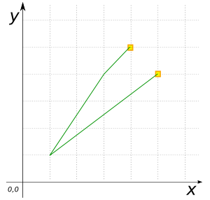

### Signatures


GEOMETRY ST_Boundary(GEOMETRY geom);
GEOMETRY ST_Boundary(GEOMETRY geom, int srid);


### Description

Returns boundary of a `GEOMETRY`.

  <h8>ST_Boundary does not support <code>GEOMETRYCOLLECTION</code> arguments.</h8>



### Examples


SELECT ST_Boundary('POINT(2 2)');
-- Answer: GEOMETRYCOLLECTION EMPTY

SELECT ST_Boundary('LINESTRING(4 6, 1 1, 5 5)');
-- Answer: MULTIPOINT((4 6), (5 5))



SELECT ST_Boundary('POLYGON((0 0, 10 0, 10 10, 0 10, 0 0))', 2154);
-- Answer: LINEARRING(0 0, 10 0, 10 10, 0 10, 0 0)



SELECT ST_Boundary('POLYGON((5 4, 1 1, 3 4, 4 5, 5 4))');
-- Answer: LINEARRING(5 4, 1 1, 3 4, 4 5, 5 4)


##### Comparison with [`ST_ExteriorRing`](../ST_ExteriorRing)



##### See also

* [`ST_ExteriorRing`](../ST_ExteriorRing)
* <a href="https://github.com/irstv/H2GIS/blob/master/h2spatial/src/main/java/org/h2gis/h2spatial/internal/function/spatial/properties/ST_Boundary.java" target="_blank">Source code</a>
