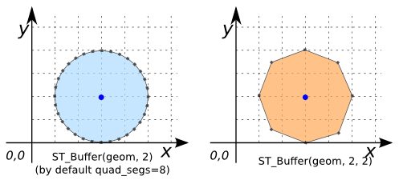
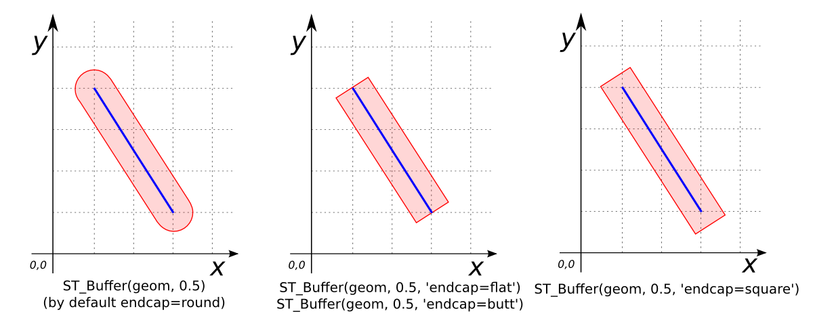
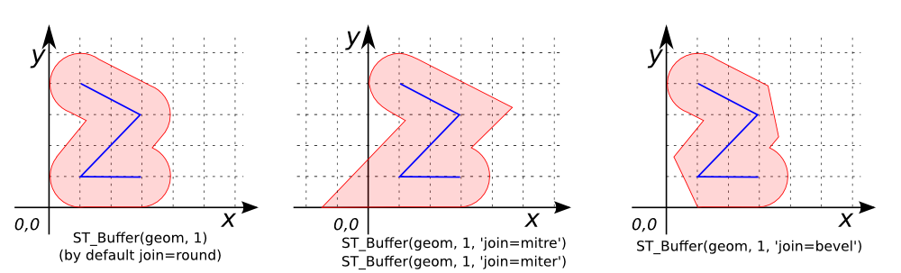
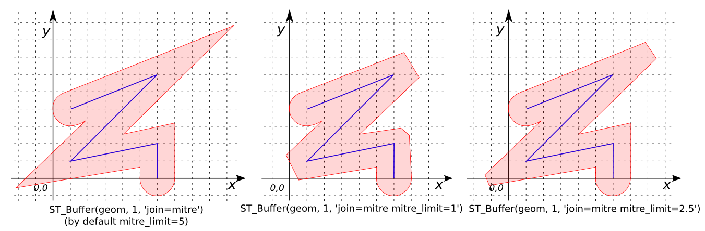

### Signatures


GEOMETRY ST_Buffer(GEOMETRY geom, double bufferSize);
GEOMETRY ST_Buffer(GEOMETRY geom, double bufferSize, varchar figureEnd);


### Description

Computes a `Buffer` around a `GEOMETRY`. Circular arcs are
approximated using 8 segments per quadrant. In particular, circles
contain 32 line segments.

The distance Buffer of width is in projection units.
ST_Buffer returns by default rounded ends.



### Examples


SELECT ST_Buffer('POINT(3 2)', 2);
-- Aswer: POLYGON((5 2, 4.961570560806461 1.6098193559677436, 4.847759065022574 1.2346331352698203, 4.662939224605091 0.8888595339607956, 4.414213562373095 0.5857864376269051, 4.111140466039204 0.3370607753949095, 3.7653668647301797 0.1522409349774265, 3.390180644032257 0.0384294391935391, 3 0, 2.6098193559677436 0.0384294391935391, 2.2346331352698208 0.1522409349774265, 1.888859533960796 0.3370607753949093, 1.585786437626905 0.5857864376269049, 1.3370607753949093 0.8888595339607956, 1.1522409349774263 1.2346331352698212, 1.038429439193539 1.6098193559677445, 1 2.0000000000000013, 1.0384294391935396 2.3901806440322586, 1.1522409349774274 2.765366864730182, 1.337060775394911 3.111140466039207, 1.5857864376269073 3.4142135623730976, 1.8888595339607985 3.6629392246050925, 2.2346331352698243 3.847759065022575, 2.609819355967748 3.9615705608064617, 3.000000000000005 4, 3.3901806440322617 3.96157056080646, 3.765366864730185 3.8477590650225713, 4.11114046603921 3.662939224605087, 4.414213562373099 3.4142135623730905, 4.662939224605094 3.1111404660391986, 4.847759065022577 2.7653668647301726, 4.961570560806463 2.390180644032249, 5 2))



SELECT ST_Buffer('LINESTRING(1 4, 3 3, 1 1, 3 1)', 1);
-- Answer: POLYGON((3.3484712476551146 1.9342576852820195, 3.3826834323650896 1.9238795325112867, 3.555570233019602 1.8314696123025453, 3.7071067811865475 1.7071067811865475, 3.8314696123025453 1.5555702330196022, 3.923879532511287 1.3826834323650898, 3.9807852804032304 1.1950903220161282, 4 1, 3.9807852804032304 0.8049096779838718, 3.923879532511287 0.6173165676349102, 3.8314696123025453 0.4444297669803979, 3.7071067811865475 0.2928932188134525, 3.555570233019602 0.1685303876974546, 3.3826834323650896 0.076120467488713, 3.1950903220161275 0.0192147195967695, 3 0, 1 0, 0.8049096779838714 0.0192147195967697, 0.6173165676349097 0.0761204674887135, 0.4444297669803978 0.1685303876974548, 0.2928932188134523 0.2928932188134525, 0.1685303876974545 0.444429766980398, 0.0761204674887132 0.6173165676349104, 0.0192147195967696 0.8049096779838716, 0 1.0000000000000002, 0.0192147195967696 1.1950903220161286, 0.0761204674887133 1.3826834323650898, 0.1685303876974546 1.5555702330196022, 0.2928932188134525 1.7071067811865475, 1.3118349659180069 2.726048528291102, 0.5527864045000421 3.1055728090000843, 0.3868853996252819 3.210006021030951, 0.2445460450042934 3.3447982586398712, 0.1312383622103311 3.504769531727891, 0.0513167019494861 3.683772233983162, 0.0078524088049996 3.8749273919438862, 0.0025157911873576 4.0708890200906795, 0.0355119323187965 4.264126422950408, 0.1055728090000841 4.447213595499958, 0.2100060210309513 4.613114600374718, 0.3447982586398712 4.755453954995707, 0.5047695317278911 4.868761637789669, 0.6837722339831622 4.948683298050514, 0.8749273919438861 4.992147591195001, 1.0708890200906798 4.997484208812643, 1.2641264229504092 4.964488067681203, 1.4472135954999579 4.894427190999916, 3.447213595499958 3.8944271909999157, 3.6074943253679908 3.7943240174171304, 3.7460810940603095 3.6658550901553366, 3.858024890773139 3.5136081062578186, 3.9393281400916322 3.3430198904320196, 3.9870874576374966 3.1601822430069673, 3.999597331544443 2.971624398345954, 3.976411027238142 2.784079862245885, 3.918356540577032 2.604245954689803, 3.827507029658416 2.4385446448150083, 3.7071067811865475 2.2928932188134525, 3.3484712476551146 1.9342576852820195))


 
SELECT ST_Buffer('LINESTRING(1 4, 3 1)', 0.5, butt); 
Answer: 
 

 

 
SELECT ST_Buffer('LINESTRING(1 4, 3 1)', 0.5, square); 
Answer: 
 

 


SELECT ST_Buffer('GEOMETRYCOLLECTION(
                      MULTIPOINT((4 4), (1 1), (1 0), (0 3)), 
                      LINESTRING(2 6, 6 2), 
                      POLYGON((1 2, 3 2, 3 6, 1 6, 1 2))))', 0.5);
  -- Answer: MULTIPOLYGON(((0.5 2, 0.5 3, 0.5 6, 0.5096073597983848 6.097545161008064, 0.5380602337443566 6.191341716182545, 0.5842651938487273 6.277785116509801, 0.6464466094067263 6.353553390593274, 0.722214883490199 6.4157348061512725, 0.8086582838174552 6.461939766255643, 0.9024548389919359 6.490392640201615, 1 6.5, 2 6.5, 3 6.5, 3.097545161008064 6.490392640201615, 3.191341716182545 6.461939766255643, 3.277785116509801 6.4157348061512725, 3.353553390593274 6.353553390593274, 3.4157348061512725 6.277785116509801, 3.4619397662556435 6.191341716182545, 3.490392640201615 6.097545161008064, 3.5 6, 3.5 5.207106781186548, 6.353553390593274 2.353553390593274, 6.4157348061512725 2.277785116509801, 6.461939766255643 2.191341716182545, 6.490392640201615 2.097545161008064, 6.5 2, 6.490392640201615 1.9024548389919358, 6.461939766255643 1.8086582838174552, 6.4157348061512725 1.722214883490199, 6.353553390593274 1.6464466094067263, 6.2777851165098015 1.5842651938487273, 6.191341716182545 1.5380602337443565, 6.097545161008064 1.5096073597983848, 6 1.5, 5.902454838991936 1.5096073597983848, 5.808658283817455 1.5380602337443567, 5.7222148834901985 1.5842651938487275, 5.646446609406726 1.6464466094067263, 3.6464466094067274 3.646446609406725, 3.646446609406726 3.646446609406726, 3.646446609406725 3.6464466094067274, 3.5 3.7928932188134525, 3.5 2, 3.490392640201615 1.9024548389919358, 3.4619397662556435 1.8086582838174552, 3.4157348061512725 1.722214883490199, 3.353553390593274 1.6464466094067263, 3.277785116509801 1.5842651938487273, 3.191341716182545 1.5380602337443565, 3.097545161008064 1.5096073597983848, 3 1.5, 1.0000000000000013 1.5, 1 1.5, 0.9024548389919359 1.5096073597983848, 0.8086582838174552 1.5380602337443565, 0.722214883490199 1.5842651938487273, 0.6464466094067263 1.6464466094067263, 0.5842651938487273 1.722214883490199, 0.5380602337443566 1.808658283817455, 0.5096073597983848 1.9024548389919358, 0.5 2)), ((1.0000000000000013 1.5, 1.0975451610080655 1.490392640201615, 1.1913417161825461 1.4619397662556428, 1.2777851165098024 1.4157348061512718, 1.3535533905932748 1.3535533905932726, 1.4157348061512736 1.2777851165097998, 1.4619397662556441 1.191341716182543, 1.4903926402016157 1.0975451610080622, 1.5 1, 1.4903926402016152 0.9024548389919359, 1.4619397662556435 0.8086582838174551, 1.4157348061512727 0.7222148834901989, 1.3535533905932737 0.6464466094067263, 1.277785116509801 0.5842651938487273, 1.1913417161825448 0.5380602337443566, 1.0975451610080642 0.5096073597983848, 1 0.5, 0.9024548389919359 0.5096073597983848, 0.8086582838174552 0.5380602337443566, 0.722214883490199 0.5842651938487273, 0.6464466094067263 0.6464466094067263, 0.5842651938487273 0.7222148834901989, 0.5380602337443565 0.8086582838174553, 0.5096073597983848 0.9024548389919361, 0.5 1.0000000000000004, 0.5096073597983849 1.0975451610080647, 0.5380602337443569 1.1913417161825455, 0.5842651938487278 1.2777851165098018, 0.6464466094067268 1.3535533905932744, 0.7222148834901996 1.4157348061512731, 0.8086582838174561 1.4619397662556437, 0.902454838991937 1.4903926402016154, 1.0000000000000013 1.5)), ((0.5 3, 0.4903926402016152 2.902454838991936, 0.4619397662556434 2.808658283817455, 0.4157348061512726 2.722214883490199, 0.3535533905932738 2.646446609406726, 0.2777851165098011 2.5842651938487275, 0.1913417161825449 2.5380602337443565, 0.0975451610080642 2.509607359798385, 0 2.5, -0.0975451610080641 2.509607359798385, -0.1913417161825449 2.5380602337443565, -0.277785116509801 2.5842651938487275, -0.3535533905932737 2.646446609406726, -0.4157348061512727 2.722214883490199, -0.4619397662556434 2.808658283817455, -0.4903926402016153 2.902454838991936, -0.5 3.0000000000000004, -0.4903926402016151 3.0975451610080644, -0.4619397662556432 3.1913417161825453, -0.4157348061512722 3.2777851165098015, -0.3535533905932732 3.3535533905932744, -0.2777851165098004 3.4157348061512733, -0.191341716182544 3.461939766255644, -0.097545161008063 3.490392640201615, 0.0000000000000012 3.5, 0.0975451610080655 3.4903926402016148, 0.1913417161825462 3.461939766255643, 0.2777851165098024 3.4157348061512716, 0.353553390593275 3.3535533905932726, 0.4157348061512736 3.2777851165097998, 0.4619397662556441 3.191341716182543, 0.4903926402016156 3.097545161008062, 0.5 3)), ((1.5 0, 1.4903926402016152 -0.0975451610080641, 1.4619397662556435 -0.1913417161825449, 1.4157348061512727 -0.2777851165098011, 1.3535533905932737 -0.3535533905932737, 1.277785116509801 -0.4157348061512726, 1.1913417161825448 -0.4619397662556434, 1.0975451610080642 -0.4903926402016152, 1 -0.5, 0.9024548389919359 -0.4903926402016152, 0.8086582838174552 -0.4619397662556434, 0.722214883490199 -0.4157348061512727, 0.6464466094067263 -0.3535533905932738, 0.5842651938487273 -0.2777851165098011, 0.5380602337443565 -0.1913417161825447, 0.5096073597983848 -0.0975451610080639, 0.5 0.0000000000000004, 0.5096073597983849 0.0975451610080646, 0.5380602337443569 0.1913417161825454, 0.5842651938487278 0.2777851165098017, 0.6464466094067268 0.3535533905932743, 0.7222148834901996 0.4157348061512731, 0.8086582838174561 0.4619397662556438, 0.902454838991937 0.4903926402016154, 1.0000000000000013 0.5, 1.0975451610080655 0.4903926402016149, 1.1913417161825461 0.4619397662556428, 1.2777851165098024 0.4157348061512717, 1.3535533905932748 0.3535533905932726, 1.4157348061512736 0.2777851165097996, 1.4619397662556441 0.1913417161825431, 1.4903926402016157 0.0975451610080622, 1.5 0)))


##### Comparison with [`ST_MakeEllipse`](../ST_MakeEllipse)



##### See also
* [`ST_MakeEllipse`](../ST_MakeEllipse)
* <a href="https://github.com/irstv/H2GIS/blob/master/h2spatial/src/main/java/org/h2gis/h2spatial/internal/function/spatial/operators/ST_Buffer.java" target="_blank">Source code</a>