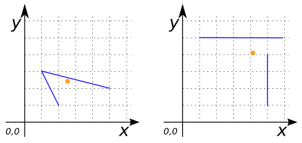

### Signature


POINT ST_Centroid(GEOMETRY geom);
POINT ST_Centroid(GEOMETRYCOLLECTION geom);


### Description

Returns the centroid of `geom` as a `POINT`.

  <h5>Only the highest-dimension Geometries of a
  <code>GEOMETRYCOLLECTION</code> are considered.</h5>
  
The lower-dimension Geometries contribute zero weight to the centroid.

 


### Examples


SELECT ST_Centroid('MULTIPOINT((4 4), (1 1), (1 0), (0 3)))');
-- Answer: POINT(1.25 2.25)



SELECT ST_Centroid('LINESTRING(2 1, 1 3, 5 2)');
-- Answer: POINT(2.472556942838389 2.3241856476127962)

SELECT ST_Centroid('MULTILINESTRING((1 5, 6 5), (5 1, 5 4))');
-- Answer: POINT(4.0625 4.0625)



SELECT ST_Centroid('POLYGON((1 5, 1 2, 6 2, 3 3, 3 4, 5 6, 1 5))');
-- Answer: POINT(2.5964912280701755 3.666666666666667)

SELECT ST_Centroid('MULTIPOLYGON(((0 2, 3 2, 3 6, 0 6, 0 2)), 
                                 ((5 0, 7 0, 7 1, 5 1, 5 0)))');
-- Answer: POINT(2.142857142857143 3.5)



SELECT ST_Centroid('GEOMETRYCOLLECTION(
                      POLYGON((1 2, 4 2, 4 6, 1 6, 1 2)), 
                      LINESTRING(2 6, 6 2), 
                      MULTIPOINT((4 4), (1 1), (1 0), (0 3)))');
-- Answer: POINT(2.5 4)


##### See also

* <a href="https://github.com/irstv/H2GIS/blob/master/h2spatial/src/main/java/org/h2gis/h2spatial/internal/function/spatial/properties/ST_Centroid.java" target="_blank">Source code</a>
